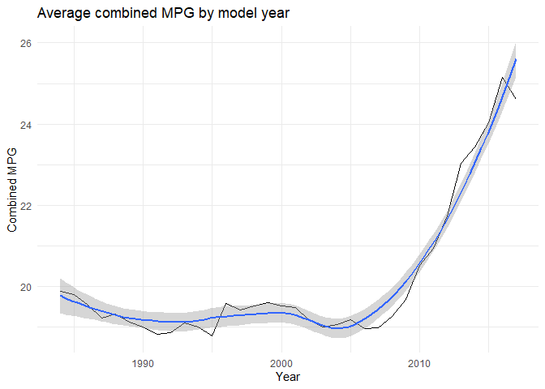

# Motivations

I work with fuel data weekly, and I get a report from the EIA that had the diesel prices of the week. Working in transportation, fuel is a big part of the business, and clients always want to see how the market is responding to the recent geopolitical events. There were big spikes in response to it, and I would like to see if the fuel market's spikes as per the 1984-2017 fuel economy data produced during vehicle testing at the Environmental Protection Agency’s (EPA) National Vehicle and Fuel Emissions Laboratory also has spikes related to important events. I would imagine so, but: even though that was my original motivation, instead I found that this data does not answer that kind of curiosity, which is *okay*. 

# The Data


``` r
library(tidyverse) # loading library
```

```
## ── Attaching core tidyverse packages ──────────────────────── tidyverse 2.0.0 ──
## ✔ dplyr     1.2.0     ✔ readr     2.1.6
## ✔ forcats   1.0.1     ✔ stringr   1.6.0
## ✔ ggplot2   4.0.2     ✔ tibble    3.3.1
## ✔ lubridate 1.9.5     ✔ tidyr     1.3.2
## ✔ purrr     1.2.1     
## ── Conflicts ────────────────────────────────────────── tidyverse_conflicts() ──
## ✖ dplyr::filter() masks stats::filter()
## ✖ dplyr::lag()    masks stats::lag()
## ℹ Use the conflicted package (<http://conflicted.r-lib.org/>) to force all conflicts to become errors
```

``` r
fuel <- read_csv("https://raw.githubusercontent.com/aalhamadani/datasets/refs/heads/main/fuel.csv", col_types = cols()) # reading the data
```

## Question 1: What is the combined miles per gallon by model year? (BEFORE)


``` r
fuel %>%
  group_by(year) %>% # grouping by make year
  summarise(avg_mpg = mean(combined_mpg_ft1, na.rm = TRUE)) %>% #calculating average of combined MPG, and removing NAs
  ggplot(aes(x = year, y = avg_mpg)) + #placing year on x axis and average combined MPG on y axis
  geom_line() + #line graph
  theme_minimal()+ #theme
  geom_smooth() + #creating a trend line to minimize noise in variation
  labs(title = "Average combined MPG by model year", x = "Year", y = "Combined MPG") #labels
```

```
## `geom_smooth()` using method = 'loess' and formula = 'y ~ x'
```

<!-- -->
I chose to be more interested in the combined MPG metric because gas prices will fluctuate and inflate over time. I wanted to see the MPG increase over the years that cars were made, and you can see that barely right before 2005, there turning point like right half of a "U" shape that you see in a graph of an exponential function, marking it the point exponential increase of cars' gas efficiency. 


## Question 1: What is the combined miles per gallon by model year? (AFTER)


> The changes I made to this graph post feedbacks included easy edits like making the graph interactive, fixing up some messy writing, and adding annotations to the graph. The most latter of those three changes were as per the feedback. The more involved challenge was the statisitcal work to produce meaningful annotations and to give my interpretation more quantative support. Although these changes may seem small, it gave the graph more context to tell a more informed story.


``` r
year_summary <- fuel %>%
  group_by(year) %>% # group the dataset by year
  summarise(
    avg_mpg = mean(combined_mpg_ft1, na.rm = TRUE) # calculate the average of the combined miles per gallon that reflects a weighted average of both city and highway fuel economy ratings as avg_mpg
  ) %>%
  mutate( # make some new columns to calculate
    prev_mpg = lag(avg_mpg), # a column that returns the previous year's avg_mpg
    mpg_change = avg_mpg - prev_mpg, # a column that has the difference of the current year and previous year avg_mpg
    pct_change = (avg_mpg / prev_mpg - 1) * 100 # the percent change of that difference
  )

year_summary
```

```
## # A tibble: 34 × 5
##     year avg_mpg prev_mpg mpg_change pct_change
##    <dbl>   <dbl>    <dbl>      <dbl>      <dbl>
##  1  1984    19.9     NA      NA          NA    
##  2  1985    19.8     19.9    -0.0735     -0.370
##  3  1986    19.6     19.8    -0.258      -1.30 
##  4  1987    19.2     19.6    -0.322      -1.65 
##  5  1988    19.3     19.2     0.0998      0.519
##  6  1989    19.1     19.3    -0.203      -1.05 
##  7  1990    19.0     19.1    -0.125      -0.653
##  8  1991    18.8     19.0    -0.175      -0.921
##  9  1992    18.9     18.8     0.0367      0.195
## 10  1993    19.1     18.9     0.242       1.28 
## # ℹ 24 more rows
```

``` r
year_summary %>%
  filter(year > 2005) #noticing that 2008 is the start of an explosive trend of larger percent increases
```

```
## # A tibble: 12 × 5
##     year avg_mpg prev_mpg mpg_change pct_change
##    <dbl>   <dbl>    <dbl>      <dbl>      <dbl>
##  1  2006    19.0     19.2    -0.235      -1.22 
##  2  2007    19.0     19.0     0.0194      0.103
##  3  2008    19.3     19.0     0.298       1.57 
##  4  2009    19.7     19.3     0.417       2.16 
##  5  2010    20.5     19.7     0.824       4.18 
##  6  2011    20.9     20.5     0.426       2.07 
##  7  2012    21.7     20.9     0.805       3.84 
##  8  2013    23.0     21.7     1.29        5.93 
##  9  2014    23.4     23.0     0.406       1.76 
## 10  2015    24.0     23.4     0.594       2.53 
## 11  2016    25.2     24.0     1.12        4.67 
## 12  2017    24.6     25.2    -0.539      -2.14
```

``` r
mean_pct_change <- year_summary %>%
  filter(year > 2007) %>%
  summarise(mean_pct_change = mean(pct_change, na.rm = TRUE))

mean_pct_change
```

```
## # A tibble: 1 × 1
##   mean_pct_change
##             <dbl>
## 1            2.66
```

``` r
sd_pct_change <- year_summary %>%
  filter(year > 2007) %>%
  summarise(std_pct_change = sd(pct_change, na.rm = TRUE))

sd_pct_change
```

```
## # A tibble: 1 × 1
##   std_pct_change
##            <dbl>
## 1           2.21
```

``` r
sd_pct_change/mean_pct_change # tells us that the standard deviation of percent change of mpg after 2007 is 83% of the mean suggesting unstable rate of growth, not exactly exponential because it was otherwise be closer to 0% 
```

```
##   std_pct_change
## 1      0.8329427
```


``` r
# Pull specific values for annotations
start_val <- year_summary %>% filter(year == min(year)) # the first point of the graph's data, the earliest year's avg_mpg
end_val   <- year_summary %>% filter(year == max(year)) # the second point of the graph's data, the latest year's avg_mpg
```


``` r
start_val
```

```
## # A tibble: 1 × 5
##    year avg_mpg prev_mpg mpg_change pct_change
##   <dbl>   <dbl>    <dbl>      <dbl>      <dbl>
## 1  1984    19.9       NA         NA         NA
```


``` r
end_val
```

```
## # A tibble: 1 × 5
##    year avg_mpg prev_mpg mpg_change pct_change
##   <dbl>   <dbl>    <dbl>      <dbl>      <dbl>
## 1  2017    24.6     25.2     -0.539      -2.14
```


``` r
library(ggplot2)
library(plotly)
```

```
## Warning: package 'plotly' was built under R version 4.5.3
```

```
## 
## Attaching package: 'plotly'
```

```
## The following object is masked from 'package:ggplot2':
## 
##     last_plot
```

```
## The following object is masked from 'package:stats':
## 
##     filter
```

```
## The following object is masked from 'package:graphics':
## 
##     layout
```

``` r
p <- year_summary %>%
  ggplot(aes(x = year, y = avg_mpg)) + # year on x, average combined mpg on y
  geom_line() + # line graph in black
  geom_smooth(se = FALSE) + # smoothed trend line in blue and removing the confidence interval
  geom_vline(xintercept = 2008, linetype = "dashed", color = "red") + # a dashed, red, vertical line at the year 2008
  annotate("text", x = 2003.5, y = 20.8, label = "Efficiency upturn of 2008 →", # an annotation of the vline
           hjust = -0.05, size = 3, color = "gray30") +
  annotate("text", x = start_val$year, y = start_val$avg_mpg + 0.4, #annotation at starting value with some adjustments
           label = paste0(round(start_val$avg_mpg, 1), " MPG"), size = 3) + #making label the rounded starting value and " MPG"
  annotate("text", x = end_val$year + 1, y = end_val$avg_mpg - .25, #making label the rounded ending value and " MPG"
           label = paste0(round(end_val$avg_mpg, 1), " MPG"), size = 3) +
  theme_minimal() +
  labs(title = "Average combined MPG by model year",
       x = "Year",
       y = "Combined MPG")

ggplotly(p)
```

```
## `geom_smooth()` using method = 'loess' and formula = 'y ~ x'
```

```{=html}
<div class="plotly html-widget html-fill-item" id="htmlwidget-6abca5293cb4b8b5390d" style="width:672px;height:480px;"></div>
<script type="application/json" data-for="htmlwidget-6abca5293cb4b8b5390d">{"x":{"data":[{"x":[1984,1985,1986,1987,1988,1989,1990,1991,1992,1993,1994,1995,1996,1997,1998,1999,2000,2001,2002,2003,2004,2005,2006,2007,2008,2009,2010,2011,2012,2013,2014,2015,2016,2017],"y":[19.881873727087576,19.808348030570254,19.550413223140495,19.228548516439453,19.328318584070797,19.125758889852559,19.000927643784788,18.825971731448764,18.862622658340769,19.104300091491307,19.012219959266801,18.797311271975182,19.584734799482536,19.429133858267715,19.51847290640394,19.61150234741784,19.526190476190475,19.479692645444565,19.168205128205127,19.000957854406131,19.067736185383243,19.193825042881645,18.959239130434781,18.978685612788631,19.276326874473462,19.693548387096776,20.517272727272726,20.942908117752008,21.747810858143609,23.037639007698889,23.443890274314214,24.03779527559055,25.16,24.620521172638437],"text":["year: 1984<br />avg_mpg: 19.88187","year: 1985<br />avg_mpg: 19.80835","year: 1986<br />avg_mpg: 19.55041","year: 1987<br />avg_mpg: 19.22855","year: 1988<br />avg_mpg: 19.32832","year: 1989<br />avg_mpg: 19.12576","year: 1990<br />avg_mpg: 19.00093","year: 1991<br />avg_mpg: 18.82597","year: 1992<br />avg_mpg: 18.86262","year: 1993<br />avg_mpg: 19.10430","year: 1994<br />avg_mpg: 19.01222","year: 1995<br />avg_mpg: 18.79731","year: 1996<br />avg_mpg: 19.58473","year: 1997<br />avg_mpg: 19.42913","year: 1998<br />avg_mpg: 19.51847","year: 1999<br />avg_mpg: 19.61150","year: 2000<br />avg_mpg: 19.52619","year: 2001<br />avg_mpg: 19.47969","year: 2002<br />avg_mpg: 19.16821","year: 2003<br />avg_mpg: 19.00096","year: 2004<br />avg_mpg: 19.06774","year: 2005<br />avg_mpg: 19.19383","year: 2006<br />avg_mpg: 18.95924","year: 2007<br />avg_mpg: 18.97869","year: 2008<br />avg_mpg: 19.27633","year: 2009<br />avg_mpg: 19.69355","year: 2010<br />avg_mpg: 20.51727","year: 2011<br />avg_mpg: 20.94291","year: 2012<br />avg_mpg: 21.74781","year: 2013<br />avg_mpg: 23.03764","year: 2014<br />avg_mpg: 23.44389","year: 2015<br />avg_mpg: 24.03780","year: 2016<br />avg_mpg: 25.16000","year: 2017<br />avg_mpg: 24.62052"],"type":"scatter","mode":"lines","line":{"width":1.8897637795275593,"color":"rgba(0,0,0,1)","dash":"solid"},"hoveron":"points","showlegend":false,"xaxis":"x","yaxis":"y","hoverinfo":"text","frame":null},{"x":[1984,1984.4177215189873,1984.8354430379748,1985.253164556962,1985.6708860759493,1986.0886075949368,1986.506329113924,1986.9240506329113,1987.3417721518988,1987.7594936708861,1988.1772151898733,1988.5949367088608,1989.0126582278481,1989.4303797468353,1989.8481012658228,1990.2658227848101,1990.6835443037974,1991.1012658227849,1991.5189873417721,1991.9367088607594,1992.3544303797469,1992.7721518987341,1993.1898734177216,1993.6075949367089,1994.0253164556962,1994.4430379746836,1994.8607594936709,1995.2784810126582,1995.6962025316457,1996.1139240506329,1996.5316455696202,1996.9493670886077,1997.367088607595,1997.7848101265822,1998.2025316455697,1998.620253164557,1999.0379746835442,1999.4556962025317,1999.873417721519,2000.2911392405063,2000.7088607594937,2001.126582278481,2001.5443037974683,2001.9620253164558,2002.379746835443,2002.7974683544303,2003.2151898734178,2003.632911392405,2004.0506329113923,2004.4683544303798,2004.8860759493671,2005.3037974683543,2005.7215189873418,2006.1392405063291,2006.5569620253164,2006.9746835443038,2007.3924050632911,2007.8101265822784,2008.2278481012659,2008.6455696202531,2009.0632911392404,2009.4810126582279,2009.8987341772151,2010.3164556962026,2010.7341772151899,2011.1518987341772,2011.5696202531647,2011.9873417721519,2012.4050632911392,2012.8227848101267,2013.2405063291139,2013.6582278481012,2014.0759493670887,2014.493670886076,2014.9113924050632,2015.3291139240507,2015.746835443038,2016.1645569620252,2016.5822784810127,2017],"y":[19.777909431900127,19.715158564608291,19.65520493891157,19.598140302546781,19.544056403250632,19.49304498875982,19.445197806811169,19.40060660514137,19.359363131487161,19.321559133585318,19.287374151643199,19.257451552934743,19.231557260032549,19.209266985441594,19.190156441666865,19.173801341213377,19.159777396586101,19.147660320290033,19.137025824830175,19.127449622711513,19.122047043458082,19.125769355022719,19.136896583160492,19.153590473149002,19.17401277026584,19.196325219788605,19.218689566994883,19.239267557162258,19.256220935568344,19.268002937116989,19.278643849131868,19.289712414041404,19.300833543519321,19.311632149239351,19.321733142875249,19.330761436100723,19.338341940589522,19.344099568015373,19.347659230052013,19.343882712330728,19.320886673780496,19.282399562347063,19.23312800123745,19.177778613658642,19.121058022817735,19.067672851921721,19.022329724177599,18.989735262792447,18.974596090973264,18.981618831927076,19.015510108860916,19.074978371243468,19.146636714208572,19.22987029384467,19.324851550544398,19.43175292470044,19.550746856705285,19.682005786951592,19.825702155832058,19.982008403739126,20.151074624181131,20.331848835296167,20.523799864441976,20.727096953486342,20.94190934429659,21.168406278740388,21.406756998685427,21.657130745999005,21.919696762548813,22.194624290202547,22.481985396561868,22.781430762627132,23.092884155303864,23.416316141285073,23.75169728726425,24.098998159934926,24.458189325990059,24.829241352123166,25.212124805027806,25.606810251396876],"text":["year: 1984.000<br />avg_mpg: 19.77791","year: 1984.418<br />avg_mpg: 19.71516","year: 1984.835<br />avg_mpg: 19.65520","year: 1985.253<br />avg_mpg: 19.59814","year: 1985.671<br />avg_mpg: 19.54406","year: 1986.089<br />avg_mpg: 19.49304","year: 1986.506<br />avg_mpg: 19.44520","year: 1986.924<br />avg_mpg: 19.40061","year: 1987.342<br />avg_mpg: 19.35936","year: 1987.759<br />avg_mpg: 19.32156","year: 1988.177<br />avg_mpg: 19.28737","year: 1988.595<br />avg_mpg: 19.25745","year: 1989.013<br />avg_mpg: 19.23156","year: 1989.430<br />avg_mpg: 19.20927","year: 1989.848<br />avg_mpg: 19.19016","year: 1990.266<br />avg_mpg: 19.17380","year: 1990.684<br />avg_mpg: 19.15978","year: 1991.101<br />avg_mpg: 19.14766","year: 1991.519<br />avg_mpg: 19.13703","year: 1991.937<br />avg_mpg: 19.12745","year: 1992.354<br />avg_mpg: 19.12205","year: 1992.772<br />avg_mpg: 19.12577","year: 1993.190<br />avg_mpg: 19.13690","year: 1993.608<br />avg_mpg: 19.15359","year: 1994.025<br />avg_mpg: 19.17401","year: 1994.443<br />avg_mpg: 19.19633","year: 1994.861<br />avg_mpg: 19.21869","year: 1995.278<br />avg_mpg: 19.23927","year: 1995.696<br />avg_mpg: 19.25622","year: 1996.114<br />avg_mpg: 19.26800","year: 1996.532<br />avg_mpg: 19.27864","year: 1996.949<br />avg_mpg: 19.28971","year: 1997.367<br />avg_mpg: 19.30083","year: 1997.785<br />avg_mpg: 19.31163","year: 1998.203<br />avg_mpg: 19.32173","year: 1998.620<br />avg_mpg: 19.33076","year: 1999.038<br />avg_mpg: 19.33834","year: 1999.456<br />avg_mpg: 19.34410","year: 1999.873<br />avg_mpg: 19.34766","year: 2000.291<br />avg_mpg: 19.34388","year: 2000.709<br />avg_mpg: 19.32089","year: 2001.127<br />avg_mpg: 19.28240","year: 2001.544<br />avg_mpg: 19.23313","year: 2001.962<br />avg_mpg: 19.17778","year: 2002.380<br />avg_mpg: 19.12106","year: 2002.797<br />avg_mpg: 19.06767","year: 2003.215<br />avg_mpg: 19.02233","year: 2003.633<br />avg_mpg: 18.98974","year: 2004.051<br />avg_mpg: 18.97460","year: 2004.468<br />avg_mpg: 18.98162","year: 2004.886<br />avg_mpg: 19.01551","year: 2005.304<br />avg_mpg: 19.07498","year: 2005.722<br />avg_mpg: 19.14664","year: 2006.139<br />avg_mpg: 19.22987","year: 2006.557<br />avg_mpg: 19.32485","year: 2006.975<br />avg_mpg: 19.43175","year: 2007.392<br />avg_mpg: 19.55075","year: 2007.810<br />avg_mpg: 19.68201","year: 2008.228<br />avg_mpg: 19.82570","year: 2008.646<br />avg_mpg: 19.98201","year: 2009.063<br />avg_mpg: 20.15107","year: 2009.481<br />avg_mpg: 20.33185","year: 2009.899<br />avg_mpg: 20.52380","year: 2010.316<br />avg_mpg: 20.72710","year: 2010.734<br />avg_mpg: 20.94191","year: 2011.152<br />avg_mpg: 21.16841","year: 2011.570<br />avg_mpg: 21.40676","year: 2011.987<br />avg_mpg: 21.65713","year: 2012.405<br />avg_mpg: 21.91970","year: 2012.823<br />avg_mpg: 22.19462","year: 2013.241<br />avg_mpg: 22.48199","year: 2013.658<br />avg_mpg: 22.78143","year: 2014.076<br />avg_mpg: 23.09288","year: 2014.494<br />avg_mpg: 23.41632","year: 2014.911<br />avg_mpg: 23.75170","year: 2015.329<br />avg_mpg: 24.09900","year: 2015.747<br />avg_mpg: 24.45819","year: 2016.165<br />avg_mpg: 24.82924","year: 2016.582<br />avg_mpg: 25.21212","year: 2017.000<br />avg_mpg: 25.60681"],"type":"scatter","mode":"lines","name":"fitted values","line":{"width":3.7795275590551185,"color":"rgba(51,102,255,1)","dash":"solid"},"hoveron":"points","showlegend":false,"xaxis":"x","yaxis":"y","hoverinfo":"text","frame":null},{"x":[2008,2008],"y":[18.456836323004097,25.947285200367961],"text":"xintercept: 2008","type":"scatter","mode":"lines","line":{"width":1.8897637795275593,"color":"rgba(255,0,0,1)","dash":"dash"},"hoveron":"points","showlegend":false,"xaxis":"x","yaxis":"y","hoverinfo":"text","frame":null},{"x":[2003.5],"y":[20.800000000000001],"text":"Efficiency upturn of 2008 →","hovertext":"x: 2003.5<br />y: 20.8","textfont":{"size":11.338582677165356,"color":"rgba(77,77,77,1)"},"type":"scatter","mode":"text","hoveron":"points","showlegend":false,"xaxis":"x","yaxis":"y","hoverinfo":"text","frame":null},{"x":[1984],"y":[20.281873727087575],"text":"19.9 MPG","hovertext":"x: 1984<br />y: 20.28187","textfont":{"size":11.338582677165356,"color":"rgba(0,0,0,1)"},"type":"scatter","mode":"text","hoveron":"points","showlegend":false,"xaxis":"x","yaxis":"y","hoverinfo":"text","frame":null},{"x":[2018],"y":[24.370521172638437],"text":"24.6 MPG","hovertext":"x: 2018<br />y: 24.37052","textfont":{"size":11.338582677165356,"color":"rgba(0,0,0,1)"},"type":"scatter","mode":"text","hoveron":"points","showlegend":false,"xaxis":"x","yaxis":"y","hoverinfo":"text","frame":null}],"layout":{"margin":{"t":40.840182648401829,"r":7.3059360730593621,"b":37.260273972602747,"l":37.260273972602747},"paper_bgcolor":"rgba(255,255,255,1)","font":{"color":"rgba(0,0,0,1)","family":"","size":14.611872146118724},"title":{"text":"Average combined MPG by model year","font":{"color":"rgba(0,0,0,1)","family":"","size":17.534246575342465},"x":0,"xref":"paper"},"xaxis":{"domain":[0,1],"automargin":true,"type":"linear","autorange":false,"range":[1982.3,2019.7],"tickmode":"array","ticktext":["1990","2000","2010"],"tickvals":[1990,2000,2010],"categoryorder":"array","categoryarray":["1990","2000","2010"],"nticks":null,"ticks":"","tickcolor":null,"ticklen":3.6529680365296811,"tickwidth":0,"showticklabels":true,"tickfont":{"color":"rgba(77,77,77,1)","family":"","size":11.68949771689498},"tickangle":-0,"showline":false,"linecolor":null,"linewidth":0,"showgrid":true,"gridcolor":"rgba(235,235,235,1)","gridwidth":0.66417600664176002,"zeroline":false,"anchor":"y","title":{"text":"Year","font":{"color":"rgba(0,0,0,1)","family":"","size":14.611872146118724}},"hoverformat":".2f"},"yaxis":{"domain":[0,1],"automargin":true,"type":"linear","autorange":false,"range":[18.456836323004097,25.947285200367961],"tickmode":"array","ticktext":["20","22","24"],"tickvals":[20,22,24],"categoryorder":"array","categoryarray":["20","22","24"],"nticks":null,"ticks":"","tickcolor":null,"ticklen":3.6529680365296811,"tickwidth":0,"showticklabels":true,"tickfont":{"color":"rgba(77,77,77,1)","family":"","size":11.68949771689498},"tickangle":-0,"showline":false,"linecolor":null,"linewidth":0,"showgrid":true,"gridcolor":"rgba(235,235,235,1)","gridwidth":0.66417600664176002,"zeroline":false,"anchor":"x","title":{"text":"Combined MPG","font":{"color":"rgba(0,0,0,1)","family":"","size":14.611872146118724}},"hoverformat":".2f"},"shapes":[],"showlegend":false,"legend":{"bgcolor":null,"bordercolor":null,"borderwidth":0,"font":{"color":"rgba(0,0,0,1)","family":"","size":11.68949771689498}},"hovermode":"closest","barmode":"relative"},"config":{"doubleClick":"reset","modeBarButtonsToAdd":["hoverclosest","hovercompare"],"showSendToCloud":false},"source":"A","attrs":{"12686b7b4325":{"x":{},"y":{},"type":"scatter"},"126831573f60":{"x":{},"y":{}},"126822d84969":{"xintercept":{}},"126835bd17d9":{"x":{},"y":{}},"126866ac1b6a":{"x":{},"y":{}},"1268577d1a91":{"x":{},"y":{}}},"cur_data":"12686b7b4325","visdat":{"12686b7b4325":["function (y) ","x"],"126831573f60":["function (y) ","x"],"126822d84969":["function (y) ","x"],"126835bd17d9":["function (y) ","x"],"126866ac1b6a":["function (y) ","x"],"1268577d1a91":["function (y) ","x"]},"highlight":{"on":"plotly_click","persistent":false,"dynamic":false,"selectize":false,"opacityDim":0.20000000000000001,"selected":{"opacity":1},"debounce":0},"shinyEvents":["plotly_hover","plotly_click","plotly_selected","plotly_relayout","plotly_brushed","plotly_brushing","plotly_clickannotation","plotly_doubleclick","plotly_deselect","plotly_afterplot","plotly_sunburstclick"],"base_url":"https://plot.ly"},"evals":[],"jsHooks":[]}</script>
```

I chose to be more interested in the combined MPG metric because gas prices will fluctuate and inflate over time. I wanted to see the MPG increase over the years that cars were made, and you can see that right at 2008 of both lines. More easily seen in the smoothed blue line, at 2008 there is a turning point in the as the right half of a "U" shape that you see in a graph of an exponential function would have, marking it as the point of the beginning of a positive trend of cars' gas efficiency. After 2007, there was an average yearly percentage increase of 2.65% with a standard deviation of 2.2%. The standard deviation being 83% of the average indicates an unstable rate of positive growth, though we cannot call it exponential growth because the standard deviation of the rate is not close enough to zero.


