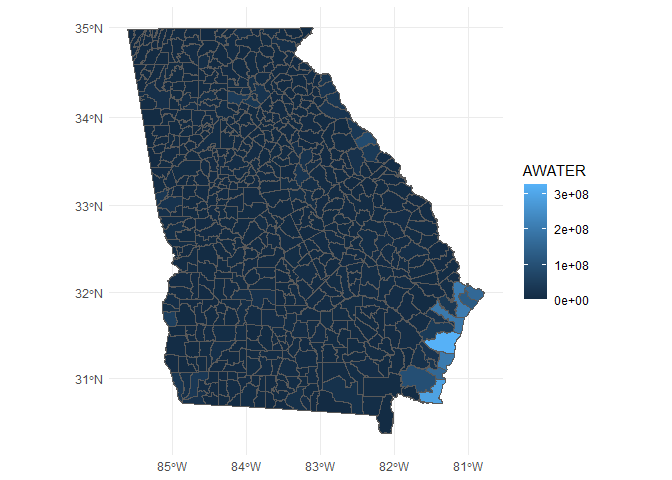

# Data Visualization Project 02

# Introduction and Learning The Data

The original motivation of this analysis was me thinking about the fact that in Florida, it tends to rain in the hottest days of the year which would be during the Summer. The main question is: Do high temperatures cause precipitation in Atlanta? If it is not high temperatures, what are some other factors? Using a dataset of Atlanta's daily wetaher in 2019, what questions could we answer?


``` r
library(tidyverse)
```

```
## ── Attaching core tidyverse packages ──────────────────────── tidyverse 2.0.0 ──
## ✔ dplyr     1.2.0     ✔ readr     2.1.6
## ✔ forcats   1.0.1     ✔ stringr   1.6.0
## ✔ ggplot2   4.0.2     ✔ tibble    3.3.1
## ✔ lubridate 1.9.5     ✔ tidyr     1.3.2
## ✔ purrr     1.2.1     
## ── Conflicts ────────────────────────────────────────── tidyverse_conflicts() ──
## ✖ dplyr::filter() masks stats::filter()
## ✖ dplyr::lag()    masks stats::lag()
## ℹ Use the conflicted package (<http://conflicted.r-lib.org/>) to force all conflicts to become errors
```

``` r
library(readr)

atl_weather <- read_csv("https://raw.githubusercontent.com/iesarria1/data_viz_project/refs/heads/main/atl-weather.csv") # Reading the csv from the data folder in my Git because I did not see the file in the professor's Git
```

```
## Rows: 365 Columns: 40
## ── Column specification ────────────────────────────────────────────────────────
## Delimiter: ","
## chr   (3): summary, icon, precipType
## dbl  (29): moonPhase, precipIntensity, precipIntensityMax, precipProbability...
## dttm  (8): time, sunriseTime, sunsetTime, precipIntensityMaxTime, temperatur...
## 
## ℹ Use `spec()` to retrieve the full column specification for this data.
## ℹ Specify the column types or set `show_col_types = FALSE` to quiet this message.
```


``` r
colnames(atl_weather) # Looking at column names
```

```
##  [1] "time"                        "summary"                    
##  [3] "icon"                        "sunriseTime"                
##  [5] "sunsetTime"                  "moonPhase"                  
##  [7] "precipIntensity"             "precipIntensityMax"         
##  [9] "precipIntensityMaxTime"      "precipProbability"          
## [11] "precipType"                  "temperatureHigh"            
## [13] "temperatureHighTime"         "temperatureLow"             
## [15] "temperatureLowTime"          "apparentTemperatureHigh"    
## [17] "apparentTemperatureHighTime" "apparentTemperatureLow"     
## [19] "apparentTemperatureLowTime"  "dewPoint"                   
## [21] "humidity"                    "pressure"                   
## [23] "windSpeed"                   "windGust"                   
## [25] "windGustTime"                "windBearing"                
## [27] "cloudCover"                  "uvIndex"                    
## [29] "uvIndexTime"                 "visibility"                 
## [31] "ozone"                       "temperatureMin"             
## [33] "temperatureMinTime"          "temperatureMax"             
## [35] "temperatureMaxTime"          "apparentTemperatureMin"     
## [37] "apparentTemperatureMinTime"  "apparentTemperatureMax"     
## [39] "apparentTemperatureMaxTime"  "precipAccumulation"
```


``` r
head(atl_weather) # Looking at the first six rows
```

```
## # A tibble: 6 × 40
##   time                summary      icon  sunriseTime         sunsetTime         
##   <dttm>              <chr>        <chr> <dttm>              <dttm>             
## 1 2019-01-01 05:00:00 Light rain … rain  2019-01-01 12:44:00 2019-01-01 22:41:00
## 2 2019-01-02 05:00:00 Rain starti… rain  2019-01-02 12:44:00 2019-01-02 22:42:00
## 3 2019-01-03 05:00:00 Rain throug… rain  2019-01-03 12:44:00 2019-01-03 22:42:00
## 4 2019-01-04 05:00:00 Heavy rain … rain  2019-01-04 12:44:00 2019-01-04 22:43:00
## 5 2019-01-05 05:00:00 Clear throu… part… 2019-01-05 12:44:00 2019-01-05 22:44:00
## 6 2019-01-06 05:00:00 Clear throu… clea… 2019-01-06 12:44:00 2019-01-06 22:45:00
## # ℹ 35 more variables: moonPhase <dbl>, precipIntensity <dbl>,
## #   precipIntensityMax <dbl>, precipIntensityMaxTime <dttm>,
## #   precipProbability <dbl>, precipType <chr>, temperatureHigh <dbl>,
## #   temperatureHighTime <dbl>, temperatureLow <dbl>, temperatureLowTime <dbl>,
## #   apparentTemperatureHigh <dbl>, apparentTemperatureHighTime <dbl>,
## #   apparentTemperatureLow <dbl>, apparentTemperatureLowTime <dbl>,
## #   dewPoint <dbl>, humidity <dbl>, pressure <dbl>, windSpeed <dbl>, …
```

``` r
glimpse(atl_weather) # Glimpse of data
```

```
## Rows: 365
## Columns: 40
## $ time                        <dttm> 2019-01-01 05:00:00, 2019-01-02 05:00:00,…
## $ summary                     <chr> "Light rain in the morning and afternoon."…
## $ icon                        <chr> "rain", "rain", "rain", "rain", "partly-cl…
## $ sunriseTime                 <dttm> 2019-01-01 12:44:00, 2019-01-02 12:44:00,…
## $ sunsetTime                  <dttm> 2019-01-01 22:41:00, 2019-01-02 22:42:00,…
## $ moonPhase                   <dbl> 0.87, 0.91, 0.94, 0.97, 0.00, 0.03, 0.06, …
## $ precipIntensity             <dbl> 0.0190, 0.0150, 0.0124, 0.0480, 0.0001, 0.…
## $ precipIntensityMax          <dbl> 0.2586, 0.0787, 0.0845, 0.2716, 0.0003, 0.…
## $ precipIntensityMaxTime      <dttm> 2019-01-01 06:02:00, 2019-01-03 01:57:00,…
## $ precipProbability           <dbl> 0.99, 0.96, 0.99, 0.99, 0.05, 0.04, 0.01, …
## $ precipType                  <chr> "rain", "rain", "rain", "rain", "rain", "r…
## $ temperatureHigh             <dbl> 63.90, 57.37, 55.30, 64.98, 58.64, 69.61, …
## $ temperatureHighTime         <dbl> 1546374000, 1546454280, 1546552680, 154663…
## $ temperatureLow              <dbl> 50.58, 49.03, 53.08, 42.95, 42.52, 42.00, …
## $ temperatureLowTime          <dbl> 1546432500, 1546474680, 1546563780, 154668…
## $ apparentTemperatureHigh     <dbl> 63.40, 56.87, 54.80, 64.48, 58.14, 69.11, …
## $ apparentTemperatureHighTime <dbl> 1546374000, 1546454280, 1546552680, 154663…
## $ apparentTemperatureLow      <dbl> 51.07, 49.52, 53.57, 38.67, 41.13, 42.49, …
## $ apparentTemperatureLowTime  <dbl> 1546432500, 1546474680, 1546563780, 154668…
## $ dewPoint                    <dbl> 58.08, 48.94, 50.41, 49.99, 36.50, 38.65, …
## $ humidity                    <dbl> 0.89, 0.86, 0.92, 0.85, 0.63, 0.59, 0.63, …
## $ pressure                    <dbl> 1019.1, 1021.4, 1017.1, 1009.4, 1016.1, 10…
## $ windSpeed                   <dbl> 2.88, 2.79, 2.85, 6.94, 7.43, 3.46, 3.61, …
## $ windGust                    <dbl> 14.77, 8.09, 8.71, 23.05, 21.95, 10.39, 12…
## $ windGustTime                <dbl> 1546318800, 1546469340, 1546538880, 154663…
## $ windBearing                 <dbl> 316, 12, 355, 214, 291, 315, 146, 240, 320…
## $ cloudCover                  <dbl> 0.72, 0.75, 0.97, 0.79, 0.35, 0.04, 0.26, …
## $ uvIndex                     <dbl> 3, 3, 3, 3, 4, 4, 4, 3, 4, 4, 4, 3, 3, 3, …
## $ uvIndexTime                 <dbl> 1546363800, 1546451400, 1546537620, 154662…
## $ visibility                  <dbl> 5.998, 6.080, 5.418, 5.967, 8.409, 8.853, …
## $ ozone                       <dbl> 213.1, 220.6, 240.2, 256.7, 269.1, 226.4, …
## $ temperatureMin              <dbl> 55.94, 49.03, 50.05, 45.02, 42.95, 42.52, …
## $ temperatureMinTime          <dttm> 2019-01-02 04:00:00, 2019-01-03 00:18:00,…
## $ temperatureMax              <dbl> 65.76, 57.37, 55.30, 64.98, 58.64, 69.61, …
## $ temperatureMaxTime          <dttm> 2019-01-01 05:00:00, 2019-01-02 18:38:00,…
## $ apparentTemperatureMin      <dbl> 56.43, 49.52, 50.54, 41.26, 38.67, 41.13, …
## $ apparentTemperatureMinTime  <dttm> 2019-01-02 04:00:00, 2019-01-03 00:18:00,…
## $ apparentTemperatureMax      <dbl> 65.92, 56.87, 54.80, 64.48, 58.14, 69.11, …
## $ apparentTemperatureMaxTime  <dttm> 2019-01-01 05:00:00, 2019-01-02 18:38:00,…
## $ precipAccumulation          <dbl> NA, NA, NA, NA, NA, NA, NA, NA, NA, NA, NA…
```
As of the start of this project, I am planning on seeing if there is a relationship between average temperatures and precipitation probability in Atlanta using an scatterplot. I would also like to make two spatial visualizations of the average temperatures and chances of precipitation throughout the Atlanta area. Finally, I would like to do a regression model to see what are the predictors of precipitation. The wrangling I will need to do here to get that result is create a new column that takes the temperatureHigh and the temperatureLow of each day and find the daily average temperature, as I think that will be a more balanced approach in this analysis.


``` r
atl_weather <- atl_weather %>%
  mutate( 
    avgTemp = (temperatureLow + temperatureHigh) / 2 #making a new column in the data, avgTemp 
  )
```


# Average Temperature and Probability of Precipitation


``` r
atl_weather %>% # I wanted to break up the average temperatures into different intervals
  mutate(
    temp_bin = cut( # This creates a new column called temp_bin, that cuts the avgTemp into intervals, or bins
      avgTemp, # Defining avgTemp as the data to cut
      breaks = seq(20, 100, by = 10) # starts the cutting sequence at 20 and end it at 100 with a moving peg of 10
    )
  ) %>%
  group_by(temp_bin) %>%  # Now grouping by the bins 
  summarise(
    avg_precip_probability = mean(precipProbability, na.rm = TRUE),# Calculates and displays the average of the precipitation probability in each bin 
    avg_temp = mean(avgTemp, na.rm = TRUE), # Calculates and displays the average of the temperature midpoints in each bin
    n = n() # Counts the number of observations in the bin
  )
```

```
## # A tibble: 6 × 4
##   temp_bin avg_precip_probability avg_temp     n
##   <fct>                     <dbl>    <dbl> <int>
## 1 (30,40]                   0.359     36.9    17
## 2 (40,50]                   0.494     45.3    44
## 3 (50,60]                   0.441     55.0    80
## 4 (60,70]                   0.434     64.7    55
## 5 (70,80]                   0.417     75.5    86
## 6 (80,90]                   0.350     82.9    83
```

It is already starting to look like the 40-50 degrees range is associated with the strongest probability of precipitation, but not much in comparison to the other intervals. I want to say that this could be due to snow more so than it has to do with rain, but the 30-40 degrees range has an average probability of 13% less, and I would be guessing that it is definitely snowing then. Let's continue.


``` r
library(plotly)
```

```
## Warning: package 'plotly' was built under R version 4.5.3
```

```
## 
## Attaching package: 'plotly'
```

```
## The following object is masked from 'package:ggplot2':
## 
##     last_plot
```

```
## The following object is masked from 'package:stats':
## 
##     filter
```

```
## The following object is masked from 'package:graphics':
## 
##     layout
```

``` r
plot_ly(atl_weather, x = ~avgTemp, y = ~precipProbability, type = "scatter", mode = "markers") # makes an interactive scatterplot with markets that has avgTemp on the Y axis and precipProbability on the X axis
```

```{=html}
<div class="plotly html-widget html-fill-item" id="htmlwidget-0e4268f84f55fdae8ad0" style="width:672px;height:480px;"></div>
<script type="application/json" data-for="htmlwidget-0e4268f84f55fdae8ad0">{"x":{"visdat":{"a24851b17b9f":["function () ","plotlyVisDat"]},"cur_data":"a24851b17b9f","attrs":{"a24851b17b9f":{"x":{},"y":{},"mode":"markers","alpha_stroke":1,"sizes":[10,100],"spans":[1,20],"type":"scatter"}},"layout":{"margin":{"b":40,"l":60,"t":25,"r":10},"xaxis":{"domain":[0,1],"automargin":true,"title":"avgTemp"},"yaxis":{"domain":[0,1],"automargin":true,"title":"precipProbability"},"hovermode":"closest","showlegend":false},"source":"A","config":{"modeBarButtonsToAdd":["hoverclosest","hovercompare"],"showSendToCloud":false},"data":[{"x":[57.239999999999995,53.200000000000003,54.189999999999998,53.965000000000003,50.579999999999998,55.805,58.359999999999999,53.079999999999998,40.670000000000002,37.170000000000002,47.134999999999998,39.310000000000002,43.799999999999997,39.850000000000001,38.625,42.625,47.075000000000003,52.045000000000002,48.259999999999998,30.130000000000003,36.495000000000005,42.810000000000002,53.990000000000002,37.685000000000002,37.484999999999999,41.045000000000002,41.710000000000001,51.870000000000005,35.689999999999998,35.335000000000001,40.704999999999998,48.420000000000002,58.890000000000001,52.259999999999998,60.140000000000001,64.060000000000002,66.280000000000001,65.775000000000006,46.524999999999999,48.244999999999997,39.745000000000005,52.090000000000003,52.230000000000004,44.549999999999997,56.810000000000002,57.329999999999998,53.765000000000001,47.590000000000003,51.384999999999998,42.68,43.399999999999999,57.575000000000003,53.655000000000001,49.890000000000001,51.515000000000001,51.745000000000005,60.710000000000001,60.875,61.57,58.670000000000002,58.799999999999997,48.479999999999997,34.829999999999998,35.634999999999998,37.590000000000003,53.605000000000004,58.870000000000005,63.465000000000003,62.439999999999998,56.030000000000001,61.625,63.170000000000002,70.055000000000007,54.189999999999998,46.634999999999998,52.454999999999998,47.805,46.744999999999997,52.590000000000003,49.920000000000002,53.545000000000002,56.925000000000004,63.395000000000003,58.490000000000002,54.265000000000001,50.515000000000001,57.085000000000001,62.555,61.145000000000003,45.394999999999996,52.859999999999999,51.840000000000003,59.730000000000004,63.269999999999996,66.269999999999996,67.340000000000003,71.870000000000005,68.990000000000009,65.965000000000003,70.759999999999991,74.379999999999995,69.180000000000007,74.650000000000006,61.189999999999998,55.280000000000001,63.700000000000003,71.269999999999996,70.709999999999994,55.935000000000002,47.310000000000002,58.829999999999998,67.425000000000011,71.074999999999989,71.805000000000007,67.634999999999991,60.594999999999999,68.194999999999993,71.400000000000006,72.950000000000003,76.099999999999994,74.52000000000001,74.034999999999997,75.424999999999997,73.015000000000001,67.719999999999999,69.855000000000004,73.944999999999993,74.829999999999998,72.60499999999999,75.594999999999999,72.674999999999997,67.430000000000007,62.619999999999997,61.649999999999999,68.469999999999999,74.634999999999991,76.074999999999989,76.840000000000003,78.204999999999998,75.415000000000006,80.204999999999998,81.375,79.85499999999999,82.02000000000001,81.495000000000005,82.055000000000007,82.435000000000002,81.495000000000005,83.480000000000004,81.564999999999998,76.564999999999998,77.14500000000001,78.25,78.870000000000005,76.885000000000005,78.680000000000007,73.294999999999987,78.444999999999993,70.914999999999992,75.659999999999997,73.784999999999997,75.409999999999997,68.680000000000007,67.780000000000001,71.340000000000003,75.799999999999997,79.465000000000003,81.599999999999994,76.365000000000009,80.055000000000007,78.170000000000002,80.905000000000001,79.245000000000005,79.939999999999998,78.995000000000005,77.969999999999999,79.390000000000001,79.955000000000013,79.715000000000003,79.460000000000008,82.384999999999991,83.210000000000008,85.670000000000002,84.240000000000009,84.129999999999995,82.284999999999997,83.590000000000003,80.674999999999997,83.370000000000005,83.004999999999995,82.835000000000008,82.449999999999989,82.944999999999993,80.734999999999999,80.894999999999996,82.995000000000005,84.659999999999997,83.689999999999998,82.775000000000006,80.280000000000001,79.715000000000003,81.504999999999995,81.930000000000007,74.579999999999998,74.359999999999999,75.224999999999994,76.925000000000011,78.305000000000007,79.72999999999999,78.27000000000001,81.424999999999997,80.599999999999994,80.424999999999997,77.990000000000009,79.105000000000004,79.204999999999998,80.039999999999992,81.875,83.055000000000007,82.984999999999999,84.300000000000011,85.140000000000001,85.215000000000003,86.939999999999998,85.930000000000007,83.210000000000008,82.439999999999998,83.219999999999999,84.944999999999993,84.870000000000005,81.480000000000004,81.615000000000009,83.359999999999999,84.389999999999986,82.905000000000001,79.120000000000005,72.114999999999995,74.659999999999997,75.865000000000009,78.265000000000001,78.185000000000002,77.984999999999999,80.259999999999991,78.64500000000001,82.305000000000007,83.620000000000005,85.504999999999995,80.699999999999989,82.969999999999999,82.224999999999994,83.544999999999987,86.680000000000007,84.915000000000006,84.039999999999992,85.460000000000008,83.754999999999995,78.269999999999996,82.314999999999998,84.090000000000003,84.39500000000001,76.674999999999997,71.635000000000005,73.060000000000002,74.200000000000003,75.594999999999999,81.204999999999998,78.295000000000002,82.189999999999998,83.045000000000002,84.090000000000003,81.444999999999993,82.640000000000001,84.009999999999991,83.859999999999999,85.045000000000002,85.495000000000005,85.039999999999992,70.454999999999998,72.015000000000001,72.265000000000001,72.474999999999994,68.245000000000005,68.754999999999995,71.224999999999994,70.980000000000004,58.850000000000001,71.139999999999986,66.594999999999999,58.415000000000006,56.380000000000003,60.989999999999995,54.939999999999998,64.745000000000005,66.969999999999999,59.094999999999999,57.980000000000004,65.430000000000007,68.120000000000005,66.245000000000005,60.969999999999999,67.609999999999999,68.47999999999999,71.664999999999992,55.679999999999993,47.215000000000003,48.935000000000002,51.439999999999998,57.435000000000002,57.974999999999994,63.790000000000006,56.140000000000001,44.365000000000002,46.539999999999999,54.329999999999998,52.575000000000003,32.935000000000002,40.340000000000003,42.510000000000005,44.575000000000003,55.469999999999999,57.75,53.340000000000003,54.085000000000001,53.664999999999999,57.965000000000003,62.700000000000003,53.984999999999999,46.114999999999995,51.085000000000001,60.984999999999999,59.630000000000003,55.594999999999999,60.370000000000005,66.510000000000005,53.530000000000001,39.57,41.390000000000001,50.740000000000002,55.234999999999999,55.504999999999995,54.125,51.475000000000001,54.670000000000002,51.109999999999999,43.549999999999997,43.950000000000003,43.159999999999997,48.719999999999999,55.769999999999996,65.194999999999993,46.82,38.539999999999999,43.465000000000003,50.364999999999995,44.644999999999996,42.685000000000002,54.144999999999996,58.600000000000001,53.799999999999997,59.344999999999999,60.094999999999999,64.390000000000001,61.125,49.939999999999998,46.229999999999997],"y":[0.98999999999999999,0.95999999999999996,0.98999999999999999,0.98999999999999999,0.050000000000000003,0.040000000000000001,0.01,0.17999999999999999,0,0.02,0.040000000000000001,0.97999999999999998,0.98999999999999999,0.080000000000000002,0.12,0,1,0.17999999999999999,1,0.27000000000000002,0.01,0.040000000000000001,1,1,0.040000000000000001,0.059999999999999998,0.14999999999999999,0.14000000000000001,0.97999999999999998,0.089999999999999997,0.02,0.029999999999999999,0.080000000000000002,0.48999999999999999,0.14999999999999999,0.19,0.93000000000000005,0.14000000000000001,0.75,0.02,0.94999999999999996,0.93999999999999995,0.98999999999999999,0.029999999999999999,0,1,0.98999999999999999,0.92000000000000004,0.90000000000000002,1,1,1,0.92000000000000004,0.71999999999999997,0.97999999999999998,0.02,0.10000000000000001,0.40000000000000002,1,0.80000000000000004,0.14000000000000001,1,0.14000000000000001,0.080000000000000002,0.050000000000000003,0.040000000000000001,0.41999999999999998,0.52000000000000002,0.64000000000000001,0.98999999999999999,0.059999999999999998,0.089999999999999997,0.40999999999999998,0.96999999999999997,0.059999999999999998,0,0.040000000000000001,0.070000000000000007,0.040000000000000001,0.080000000000000002,0,0.01,0,0.81000000000000005,0.58999999999999997,0.53000000000000003,0.12,0.059999999999999998,0.16,0.81999999999999995,0.11,0.17999999999999999,0.12,0.84999999999999998,0.97999999999999998,0.26000000000000001,1,0.95999999999999996,0.81999999999999995,0.14999999999999999,0.14999999999999999,0.51000000000000001,0.23000000000000001,0.97999999999999998,0.20999999999999999,0.10000000000000001,0.029999999999999999,0.16,1,0.94999999999999996,0.16,0.14000000000000001,0.11,0.12,0.82999999999999996,0.81000000000000005,0.12,0.17999999999999999,0,0.050000000000000003,0.17000000000000001,0,0.40000000000000002,0.93999999999999995,0.84999999999999998,0.16,0.059999999999999998,0.12,0.97999999999999998,0.56999999999999995,1,1,0.34999999999999998,0.050000000000000003,0.19,0.20999999999999999,0.11,0.20999999999999999,0.14999999999999999,0.16,0.17999999999999999,0.11,0.26000000000000001,0.17000000000000001,0.16,0.11,0.12,0.14999999999999999,0.13,0.14000000000000001,0.14000000000000001,0.11,0.71999999999999997,0.17000000000000001,0.14000000000000001,0.70999999999999996,0.94999999999999996,1,1,0.98999999999999999,0.94999999999999996,0.69999999999999996,0.93000000000000005,0.11,0.13,0.13,0.23000000000000001,0.63,0.80000000000000004,0.62,0.55000000000000004,0.13,0.64000000000000001,0.54000000000000004,0.92000000000000004,0.25,0.25,0.22,0.14000000000000001,0.56999999999999995,0.33000000000000002,0.28000000000000003,0.23000000000000001,0.38,0.47999999999999998,0.94999999999999996,0.90000000000000002,0.70999999999999996,0.46000000000000002,0.56000000000000005,0.38,0.46999999999999997,0.66000000000000003,0.59999999999999998,0.37,0.22,0.16,0.76000000000000001,0.71999999999999997,0.81999999999999995,0.84999999999999998,0.20999999999999999,0.40000000000000002,0.89000000000000001,0.050000000000000003,0.12,0.13,0.14000000000000001,0.14000000000000001,0.26000000000000001,0.82999999999999996,0.78000000000000003,0.85999999999999999,0.97999999999999998,0.82999999999999996,0.93999999999999995,0.76000000000000001,0.40000000000000002,0.29999999999999999,0.17000000000000001,0,0.81000000000000005,0.20000000000000001,0.37,0.47999999999999998,0.95999999999999996,0.31,0.14000000000000001,0.11,0.34000000000000002,0.5,0.64000000000000001,0.26000000000000001,0.27000000000000002,0.84999999999999998,0.79000000000000004,0.81999999999999995,0.95999999999999996,0.96999999999999997,0.14999999999999999,0.13,0.13,0.17000000000000001,0.28000000000000003,0.14000000000000001,0.12,0.13,0.12,0.13,0.14999999999999999,0.12,0.13,0.46000000000000002,0.17999999999999999,0.13,0.32000000000000001,0.72999999999999998,0.20999999999999999,0.14999999999999999,0.17000000000000001,0.17000000000000001,0.14999999999999999,0.13,0.12,0.13,0.13,0.12,0.12,0.22,0.34999999999999998,0.47999999999999998,0.17000000000000001,0.13,0.20999999999999999,0.14999999999999999,0.13,0.12,0.41999999999999998,0.45000000000000001,0.57999999999999996,0.64000000000000001,0.13,0.14000000000000001,0.13,0.20999999999999999,0.87,0.46000000000000002,0.98999999999999999,1,0.13,0.01,1,0.28000000000000003,0.31,0.82999999999999996,0.16,0.13,0.81999999999999995,0.98999999999999999,0.93000000000000005,0.19,0.39000000000000001,0.98999999999999999,0.96999999999999997,0.14999999999999999,0.040000000000000001,0.11,0.14999999999999999,0.32000000000000001,0.20999999999999999,0.93999999999999995,0.93000000000000005,0.16,0.12,0.27000000000000002,0.97999999999999998,0.17999999999999999,1,1,0.20000000000000001,0.12,0.14000000000000001,0.12,0.14000000000000001,0.14000000000000001,0.39000000000000001,1,0.16,0.13,0.16,0.85999999999999999,0.16,0.12,0.23999999999999999,0.85999999999999999,0.14000000000000001,0.16,0,0.13,0.29999999999999999,0.12,0.14000000000000001,0.34000000000000002,0.96999999999999997,0.73999999999999999,0.92000000000000004,1,0.92000000000000004,0.089999999999999997,0.40999999999999998,0.98999999999999999,0.17000000000000001,0.02,0.059999999999999998,0.72999999999999998,1,1,0.14999999999999999,0.059999999999999998,0.089999999999999997,0.14999999999999999,0.60999999999999999,0.81999999999999995,0.79000000000000004,0.059999999999999998],"mode":"markers","type":"scatter","marker":{"color":"rgba(31,119,180,1)","line":{"color":"rgba(31,119,180,1)"}},"error_y":{"color":"rgba(31,119,180,1)"},"error_x":{"color":"rgba(31,119,180,1)"},"line":{"color":"rgba(31,119,180,1)"},"xaxis":"x","yaxis":"y","frame":null}],"highlight":{"on":"plotly_click","persistent":false,"dynamic":false,"selectize":false,"opacityDim":0.20000000000000001,"selected":{"opacity":1},"debounce":0},"shinyEvents":["plotly_hover","plotly_click","plotly_selected","plotly_relayout","plotly_brushed","plotly_brushing","plotly_clickannotation","plotly_doubleclick","plotly_deselect","plotly_afterplot","plotly_sunburstclick"],"base_url":"https://plot.ly"},"evals":[],"jsHooks":[]}</script>
```
We are not really seeing much of a story here. Let's add some context, but we are going to have to wrangle a bit more here. This will help me later using colors to create meaning encodings of the seasons.


``` r
library(dplyr)

atl_weather <- atl_weather %>%
  mutate(
    season = case_when( # making a new column that returns a season base on IFS statements of the month in the time field
      format(as.Date(time), "%m") %in% c("12", "01", "02") ~ "Winter",
      format(as.Date(time), "%m") %in% c("03", "04", "05") ~ "Spring",
      format(as.Date(time), "%m") %in% c("06", "07", "08") ~ "Summer",
      format(as.Date(time), "%m") %in% c("09", "10", "11") ~ "Fall"
    )
  )
```


``` r
library(ggplot2)


plot <- ggplotly(ggplot(atl_weather, aes(x = avgTemp, y = precipProbability, color = season)) +
  geom_point() +
  geom_smooth( method = "loess", se = FALSE, color = "black") + theme_minimal())
```

```
## `geom_smooth()` using formula = 'y ~ x'
```

``` r
plot %>%
  layout(
    annotations = list(

      list(
        x = 55,
        y = 0.45,
        text = "Start of decline towards flattening",
        showarrow = TRUE,
        arrowhead = 2,
        ax = -40,
        ay = -40
      ),

      list(
        x = 73,
        y = 0.44,
        text = "End of flattening, start of decrease",
        showarrow = TRUE,
        arrowhead = 2,
        ax = 30,
        ay = 30
      )

    )
  )
```

```{=html}
<div class="plotly html-widget html-fill-item" id="htmlwidget-461549cfc511f6c37354" style="width:672px;height:480px;"></div>
<script type="application/json" data-for="htmlwidget-461549cfc511f6c37354">{"x":{"data":[{"x":[78.64500000000001,82.305000000000007,83.620000000000005,85.504999999999995,80.699999999999989,82.969999999999999,82.224999999999994,83.544999999999987,86.680000000000007,84.915000000000006,84.039999999999992,85.460000000000008,83.754999999999995,78.269999999999996,82.314999999999998,84.090000000000003,84.39500000000001,76.674999999999997,71.635000000000005,73.060000000000002,74.200000000000003,75.594999999999999,81.204999999999998,78.295000000000002,82.189999999999998,83.045000000000002,84.090000000000003,81.444999999999993,82.640000000000001,84.009999999999991,83.859999999999999,85.045000000000002,85.495000000000005,85.039999999999992,70.454999999999998,72.015000000000001,72.265000000000001,72.474999999999994,68.245000000000005,68.754999999999995,71.224999999999994,70.980000000000004,58.850000000000001,71.139999999999986,66.594999999999999,58.415000000000006,56.380000000000003,60.989999999999995,54.939999999999998,64.745000000000005,66.969999999999999,59.094999999999999,57.980000000000004,65.430000000000007,68.120000000000005,66.245000000000005,60.969999999999999,67.609999999999999,68.47999999999999,71.664999999999992,55.679999999999993,47.215000000000003,48.935000000000002,51.439999999999998,57.435000000000002,57.974999999999994,63.790000000000006,56.140000000000001,44.365000000000002,46.539999999999999,54.329999999999998,52.575000000000003,32.935000000000002,40.340000000000003,42.510000000000005,44.575000000000003,55.469999999999999,57.75,53.340000000000003,54.085000000000001,53.664999999999999,57.965000000000003,62.700000000000003,53.984999999999999,46.114999999999995,51.085000000000001,60.984999999999999,59.630000000000003,55.594999999999999,60.370000000000005,66.510000000000005],"y":[0.28000000000000003,0.14000000000000001,0.12,0.13,0.12,0.13,0.14999999999999999,0.12,0.13,0.46000000000000002,0.17999999999999999,0.13,0.32000000000000001,0.72999999999999998,0.20999999999999999,0.14999999999999999,0.17000000000000001,0.17000000000000001,0.14999999999999999,0.13,0.12,0.13,0.13,0.12,0.12,0.22,0.34999999999999998,0.47999999999999998,0.17000000000000001,0.13,0.20999999999999999,0.14999999999999999,0.13,0.12,0.41999999999999998,0.45000000000000001,0.57999999999999996,0.64000000000000001,0.13,0.14000000000000001,0.13,0.20999999999999999,0.87,0.46000000000000002,0.98999999999999999,1,0.13,0.01,1,0.28000000000000003,0.31,0.82999999999999996,0.16,0.13,0.81999999999999995,0.98999999999999999,0.93000000000000005,0.19,0.39000000000000001,0.98999999999999999,0.96999999999999997,0.14999999999999999,0.040000000000000001,0.11,0.14999999999999999,0.32000000000000001,0.20999999999999999,0.93999999999999995,0.93000000000000005,0.16,0.12,0.27000000000000002,0.97999999999999998,0.17999999999999999,1,1,0.20000000000000001,0.12,0.14000000000000001,0.12,0.14000000000000001,0.14000000000000001,0.39000000000000001,1,0.16,0.13,0.16,0.85999999999999999,0.16,0.12,0.23999999999999999],"text":["avgTemp: 78.645<br />precipProbability: 0.28<br />season: Fall","avgTemp: 82.305<br />precipProbability: 0.14<br />season: Fall","avgTemp: 83.620<br />precipProbability: 0.12<br />season: Fall","avgTemp: 85.505<br />precipProbability: 0.13<br />season: Fall","avgTemp: 80.700<br />precipProbability: 0.12<br />season: Fall","avgTemp: 82.970<br />precipProbability: 0.13<br />season: Fall","avgTemp: 82.225<br />precipProbability: 0.15<br />season: Fall","avgTemp: 83.545<br />precipProbability: 0.12<br />season: Fall","avgTemp: 86.680<br />precipProbability: 0.13<br />season: Fall","avgTemp: 84.915<br />precipProbability: 0.46<br />season: Fall","avgTemp: 84.040<br />precipProbability: 0.18<br />season: Fall","avgTemp: 85.460<br />precipProbability: 0.13<br />season: Fall","avgTemp: 83.755<br />precipProbability: 0.32<br />season: Fall","avgTemp: 78.270<br />precipProbability: 0.73<br />season: Fall","avgTemp: 82.315<br />precipProbability: 0.21<br />season: Fall","avgTemp: 84.090<br />precipProbability: 0.15<br />season: Fall","avgTemp: 84.395<br />precipProbability: 0.17<br />season: Fall","avgTemp: 76.675<br />precipProbability: 0.17<br />season: Fall","avgTemp: 71.635<br />precipProbability: 0.15<br />season: Fall","avgTemp: 73.060<br />precipProbability: 0.13<br />season: Fall","avgTemp: 74.200<br />precipProbability: 0.12<br />season: Fall","avgTemp: 75.595<br />precipProbability: 0.13<br />season: Fall","avgTemp: 81.205<br />precipProbability: 0.13<br />season: Fall","avgTemp: 78.295<br />precipProbability: 0.12<br />season: Fall","avgTemp: 82.190<br />precipProbability: 0.12<br />season: Fall","avgTemp: 83.045<br />precipProbability: 0.22<br />season: Fall","avgTemp: 84.090<br />precipProbability: 0.35<br />season: Fall","avgTemp: 81.445<br />precipProbability: 0.48<br />season: Fall","avgTemp: 82.640<br />precipProbability: 0.17<br />season: Fall","avgTemp: 84.010<br />precipProbability: 0.13<br />season: Fall","avgTemp: 83.860<br />precipProbability: 0.21<br />season: Fall","avgTemp: 85.045<br />precipProbability: 0.15<br />season: Fall","avgTemp: 85.495<br />precipProbability: 0.13<br />season: Fall","avgTemp: 85.040<br />precipProbability: 0.12<br />season: Fall","avgTemp: 70.455<br />precipProbability: 0.42<br />season: Fall","avgTemp: 72.015<br />precipProbability: 0.45<br />season: Fall","avgTemp: 72.265<br />precipProbability: 0.58<br />season: Fall","avgTemp: 72.475<br />precipProbability: 0.64<br />season: Fall","avgTemp: 68.245<br />precipProbability: 0.13<br />season: Fall","avgTemp: 68.755<br />precipProbability: 0.14<br />season: Fall","avgTemp: 71.225<br />precipProbability: 0.13<br />season: Fall","avgTemp: 70.980<br />precipProbability: 0.21<br />season: Fall","avgTemp: 58.850<br />precipProbability: 0.87<br />season: Fall","avgTemp: 71.140<br />precipProbability: 0.46<br />season: Fall","avgTemp: 66.595<br />precipProbability: 0.99<br />season: Fall","avgTemp: 58.415<br />precipProbability: 1.00<br />season: Fall","avgTemp: 56.380<br />precipProbability: 0.13<br />season: Fall","avgTemp: 60.990<br />precipProbability: 0.01<br />season: Fall","avgTemp: 54.940<br />precipProbability: 1.00<br />season: Fall","avgTemp: 64.745<br />precipProbability: 0.28<br />season: Fall","avgTemp: 66.970<br />precipProbability: 0.31<br />season: Fall","avgTemp: 59.095<br />precipProbability: 0.83<br />season: Fall","avgTemp: 57.980<br />precipProbability: 0.16<br />season: Fall","avgTemp: 65.430<br />precipProbability: 0.13<br />season: Fall","avgTemp: 68.120<br />precipProbability: 0.82<br />season: Fall","avgTemp: 66.245<br />precipProbability: 0.99<br />season: Fall","avgTemp: 60.970<br />precipProbability: 0.93<br />season: Fall","avgTemp: 67.610<br />precipProbability: 0.19<br />season: Fall","avgTemp: 68.480<br />precipProbability: 0.39<br />season: Fall","avgTemp: 71.665<br />precipProbability: 0.99<br />season: Fall","avgTemp: 55.680<br />precipProbability: 0.97<br />season: Fall","avgTemp: 47.215<br />precipProbability: 0.15<br />season: Fall","avgTemp: 48.935<br />precipProbability: 0.04<br />season: Fall","avgTemp: 51.440<br />precipProbability: 0.11<br />season: Fall","avgTemp: 57.435<br />precipProbability: 0.15<br />season: Fall","avgTemp: 57.975<br />precipProbability: 0.32<br />season: Fall","avgTemp: 63.790<br />precipProbability: 0.21<br />season: Fall","avgTemp: 56.140<br />precipProbability: 0.94<br />season: Fall","avgTemp: 44.365<br />precipProbability: 0.93<br />season: Fall","avgTemp: 46.540<br />precipProbability: 0.16<br />season: Fall","avgTemp: 54.330<br />precipProbability: 0.12<br />season: Fall","avgTemp: 52.575<br />precipProbability: 0.27<br />season: Fall","avgTemp: 32.935<br />precipProbability: 0.98<br />season: Fall","avgTemp: 40.340<br />precipProbability: 0.18<br />season: Fall","avgTemp: 42.510<br />precipProbability: 1.00<br />season: Fall","avgTemp: 44.575<br />precipProbability: 1.00<br />season: Fall","avgTemp: 55.470<br />precipProbability: 0.20<br />season: Fall","avgTemp: 57.750<br />precipProbability: 0.12<br />season: Fall","avgTemp: 53.340<br />precipProbability: 0.14<br />season: Fall","avgTemp: 54.085<br />precipProbability: 0.12<br />season: Fall","avgTemp: 53.665<br />precipProbability: 0.14<br />season: Fall","avgTemp: 57.965<br />precipProbability: 0.14<br />season: Fall","avgTemp: 62.700<br />precipProbability: 0.39<br />season: Fall","avgTemp: 53.985<br />precipProbability: 1.00<br />season: Fall","avgTemp: 46.115<br />precipProbability: 0.16<br />season: Fall","avgTemp: 51.085<br />precipProbability: 0.13<br />season: Fall","avgTemp: 60.985<br />precipProbability: 0.16<br />season: Fall","avgTemp: 59.630<br />precipProbability: 0.86<br />season: Fall","avgTemp: 55.595<br />precipProbability: 0.16<br />season: Fall","avgTemp: 60.370<br />precipProbability: 0.12<br />season: Fall","avgTemp: 66.510<br />precipProbability: 0.24<br />season: Fall"],"type":"scatter","mode":"markers","marker":{"autocolorscale":false,"color":"rgba(248,118,109,1)","opacity":1,"size":5.6692913385826778,"symbol":"circle","line":{"width":1.8897637795275593,"color":"rgba(248,118,109,1)"}},"hoveron":"points","name":"Fall","legendgroup":"Fall","showlegend":true,"xaxis":"x","yaxis":"y","hoverinfo":"text","frame":null},{"x":[58.670000000000002,58.799999999999997,48.479999999999997,34.829999999999998,35.634999999999998,37.590000000000003,53.605000000000004,58.870000000000005,63.465000000000003,62.439999999999998,56.030000000000001,61.625,63.170000000000002,70.055000000000007,54.189999999999998,46.634999999999998,52.454999999999998,47.805,46.744999999999997,52.590000000000003,49.920000000000002,53.545000000000002,56.925000000000004,63.395000000000003,58.490000000000002,54.265000000000001,50.515000000000001,57.085000000000001,62.555,61.145000000000003,45.394999999999996,52.859999999999999,51.840000000000003,59.730000000000004,63.269999999999996,66.269999999999996,67.340000000000003,71.870000000000005,68.990000000000009,65.965000000000003,70.759999999999991,74.379999999999995,69.180000000000007,74.650000000000006,61.189999999999998,55.280000000000001,63.700000000000003,71.269999999999996,70.709999999999994,55.935000000000002,47.310000000000002,58.829999999999998,67.425000000000011,71.074999999999989,71.805000000000007,67.634999999999991,60.594999999999999,68.194999999999993,71.400000000000006,72.950000000000003,76.099999999999994,74.52000000000001,74.034999999999997,75.424999999999997,73.015000000000001,67.719999999999999,69.855000000000004,73.944999999999993,74.829999999999998,72.60499999999999,75.594999999999999,72.674999999999997,67.430000000000007,62.619999999999997,61.649999999999999,68.469999999999999,74.634999999999991,76.074999999999989,76.840000000000003,78.204999999999998,75.415000000000006,80.204999999999998,81.375,79.85499999999999,82.02000000000001,81.495000000000005,82.055000000000007,82.435000000000002,81.495000000000005,83.480000000000004,81.564999999999998,76.564999999999998],"y":[0.80000000000000004,0.14000000000000001,1,0.14000000000000001,0.080000000000000002,0.050000000000000003,0.040000000000000001,0.41999999999999998,0.52000000000000002,0.64000000000000001,0.98999999999999999,0.059999999999999998,0.089999999999999997,0.40999999999999998,0.96999999999999997,0.059999999999999998,0,0.040000000000000001,0.070000000000000007,0.040000000000000001,0.080000000000000002,0,0.01,0,0.81000000000000005,0.58999999999999997,0.53000000000000003,0.12,0.059999999999999998,0.16,0.81999999999999995,0.11,0.17999999999999999,0.12,0.84999999999999998,0.97999999999999998,0.26000000000000001,1,0.95999999999999996,0.81999999999999995,0.14999999999999999,0.14999999999999999,0.51000000000000001,0.23000000000000001,0.97999999999999998,0.20999999999999999,0.10000000000000001,0.029999999999999999,0.16,1,0.94999999999999996,0.16,0.14000000000000001,0.11,0.12,0.82999999999999996,0.81000000000000005,0.12,0.17999999999999999,0,0.050000000000000003,0.17000000000000001,0,0.40000000000000002,0.93999999999999995,0.84999999999999998,0.16,0.059999999999999998,0.12,0.97999999999999998,0.56999999999999995,1,1,0.34999999999999998,0.050000000000000003,0.19,0.20999999999999999,0.11,0.20999999999999999,0.14999999999999999,0.16,0.17999999999999999,0.11,0.26000000000000001,0.17000000000000001,0.16,0.11,0.12,0.14999999999999999,0.13,0.14000000000000001,0.14000000000000001],"text":["avgTemp: 58.670<br />precipProbability: 0.80<br />season: Spring","avgTemp: 58.800<br />precipProbability: 0.14<br />season: Spring","avgTemp: 48.480<br />precipProbability: 1.00<br />season: Spring","avgTemp: 34.830<br />precipProbability: 0.14<br />season: Spring","avgTemp: 35.635<br />precipProbability: 0.08<br />season: Spring","avgTemp: 37.590<br />precipProbability: 0.05<br />season: Spring","avgTemp: 53.605<br />precipProbability: 0.04<br />season: Spring","avgTemp: 58.870<br />precipProbability: 0.42<br />season: Spring","avgTemp: 63.465<br />precipProbability: 0.52<br />season: Spring","avgTemp: 62.440<br />precipProbability: 0.64<br />season: Spring","avgTemp: 56.030<br />precipProbability: 0.99<br />season: Spring","avgTemp: 61.625<br />precipProbability: 0.06<br />season: Spring","avgTemp: 63.170<br />precipProbability: 0.09<br />season: Spring","avgTemp: 70.055<br />precipProbability: 0.41<br />season: Spring","avgTemp: 54.190<br />precipProbability: 0.97<br />season: Spring","avgTemp: 46.635<br />precipProbability: 0.06<br />season: Spring","avgTemp: 52.455<br />precipProbability: 0.00<br />season: Spring","avgTemp: 47.805<br />precipProbability: 0.04<br />season: Spring","avgTemp: 46.745<br />precipProbability: 0.07<br />season: Spring","avgTemp: 52.590<br />precipProbability: 0.04<br />season: Spring","avgTemp: 49.920<br />precipProbability: 0.08<br />season: Spring","avgTemp: 53.545<br />precipProbability: 0.00<br />season: Spring","avgTemp: 56.925<br />precipProbability: 0.01<br />season: Spring","avgTemp: 63.395<br />precipProbability: 0.00<br />season: Spring","avgTemp: 58.490<br />precipProbability: 0.81<br />season: Spring","avgTemp: 54.265<br />precipProbability: 0.59<br />season: Spring","avgTemp: 50.515<br />precipProbability: 0.53<br />season: Spring","avgTemp: 57.085<br />precipProbability: 0.12<br />season: Spring","avgTemp: 62.555<br />precipProbability: 0.06<br />season: Spring","avgTemp: 61.145<br />precipProbability: 0.16<br />season: Spring","avgTemp: 45.395<br />precipProbability: 0.82<br />season: Spring","avgTemp: 52.860<br />precipProbability: 0.11<br />season: Spring","avgTemp: 51.840<br />precipProbability: 0.18<br />season: Spring","avgTemp: 59.730<br />precipProbability: 0.12<br />season: Spring","avgTemp: 63.270<br />precipProbability: 0.85<br />season: Spring","avgTemp: 66.270<br />precipProbability: 0.98<br />season: Spring","avgTemp: 67.340<br />precipProbability: 0.26<br />season: Spring","avgTemp: 71.870<br />precipProbability: 1.00<br />season: Spring","avgTemp: 68.990<br />precipProbability: 0.96<br />season: Spring","avgTemp: 65.965<br />precipProbability: 0.82<br />season: Spring","avgTemp: 70.760<br />precipProbability: 0.15<br />season: Spring","avgTemp: 74.380<br />precipProbability: 0.15<br />season: Spring","avgTemp: 69.180<br />precipProbability: 0.51<br />season: Spring","avgTemp: 74.650<br />precipProbability: 0.23<br />season: Spring","avgTemp: 61.190<br />precipProbability: 0.98<br />season: Spring","avgTemp: 55.280<br />precipProbability: 0.21<br />season: Spring","avgTemp: 63.700<br />precipProbability: 0.10<br />season: Spring","avgTemp: 71.270<br />precipProbability: 0.03<br />season: Spring","avgTemp: 70.710<br />precipProbability: 0.16<br />season: Spring","avgTemp: 55.935<br />precipProbability: 1.00<br />season: Spring","avgTemp: 47.310<br />precipProbability: 0.95<br />season: Spring","avgTemp: 58.830<br />precipProbability: 0.16<br />season: Spring","avgTemp: 67.425<br />precipProbability: 0.14<br />season: Spring","avgTemp: 71.075<br />precipProbability: 0.11<br />season: Spring","avgTemp: 71.805<br />precipProbability: 0.12<br />season: Spring","avgTemp: 67.635<br />precipProbability: 0.83<br />season: Spring","avgTemp: 60.595<br />precipProbability: 0.81<br />season: Spring","avgTemp: 68.195<br />precipProbability: 0.12<br />season: Spring","avgTemp: 71.400<br />precipProbability: 0.18<br />season: Spring","avgTemp: 72.950<br />precipProbability: 0.00<br />season: Spring","avgTemp: 76.100<br />precipProbability: 0.05<br />season: Spring","avgTemp: 74.520<br />precipProbability: 0.17<br />season: Spring","avgTemp: 74.035<br />precipProbability: 0.00<br />season: Spring","avgTemp: 75.425<br />precipProbability: 0.40<br />season: Spring","avgTemp: 73.015<br />precipProbability: 0.94<br />season: Spring","avgTemp: 67.720<br />precipProbability: 0.85<br />season: Spring","avgTemp: 69.855<br />precipProbability: 0.16<br />season: Spring","avgTemp: 73.945<br />precipProbability: 0.06<br />season: Spring","avgTemp: 74.830<br />precipProbability: 0.12<br />season: Spring","avgTemp: 72.605<br />precipProbability: 0.98<br />season: Spring","avgTemp: 75.595<br />precipProbability: 0.57<br />season: Spring","avgTemp: 72.675<br />precipProbability: 1.00<br />season: Spring","avgTemp: 67.430<br />precipProbability: 1.00<br />season: Spring","avgTemp: 62.620<br />precipProbability: 0.35<br />season: Spring","avgTemp: 61.650<br />precipProbability: 0.05<br />season: Spring","avgTemp: 68.470<br />precipProbability: 0.19<br />season: Spring","avgTemp: 74.635<br />precipProbability: 0.21<br />season: Spring","avgTemp: 76.075<br />precipProbability: 0.11<br />season: Spring","avgTemp: 76.840<br />precipProbability: 0.21<br />season: Spring","avgTemp: 78.205<br />precipProbability: 0.15<br />season: Spring","avgTemp: 75.415<br />precipProbability: 0.16<br />season: Spring","avgTemp: 80.205<br />precipProbability: 0.18<br />season: Spring","avgTemp: 81.375<br />precipProbability: 0.11<br />season: Spring","avgTemp: 79.855<br />precipProbability: 0.26<br />season: Spring","avgTemp: 82.020<br />precipProbability: 0.17<br />season: Spring","avgTemp: 81.495<br />precipProbability: 0.16<br />season: Spring","avgTemp: 82.055<br />precipProbability: 0.11<br />season: Spring","avgTemp: 82.435<br />precipProbability: 0.12<br />season: Spring","avgTemp: 81.495<br />precipProbability: 0.15<br />season: Spring","avgTemp: 83.480<br />precipProbability: 0.13<br />season: Spring","avgTemp: 81.565<br />precipProbability: 0.14<br />season: Spring","avgTemp: 76.565<br />precipProbability: 0.14<br />season: Spring"],"type":"scatter","mode":"markers","marker":{"autocolorscale":false,"color":"rgba(124,174,0,1)","opacity":1,"size":5.6692913385826778,"symbol":"circle","line":{"width":1.8897637795275593,"color":"rgba(124,174,0,1)"}},"hoveron":"points","name":"Spring","legendgroup":"Spring","showlegend":true,"xaxis":"x","yaxis":"y","hoverinfo":"text","frame":null},{"x":[77.14500000000001,78.25,78.870000000000005,76.885000000000005,78.680000000000007,73.294999999999987,78.444999999999993,70.914999999999992,75.659999999999997,73.784999999999997,75.409999999999997,68.680000000000007,67.780000000000001,71.340000000000003,75.799999999999997,79.465000000000003,81.599999999999994,76.365000000000009,80.055000000000007,78.170000000000002,80.905000000000001,79.245000000000005,79.939999999999998,78.995000000000005,77.969999999999999,79.390000000000001,79.955000000000013,79.715000000000003,79.460000000000008,82.384999999999991,83.210000000000008,85.670000000000002,84.240000000000009,84.129999999999995,82.284999999999997,83.590000000000003,80.674999999999997,83.370000000000005,83.004999999999995,82.835000000000008,82.449999999999989,82.944999999999993,80.734999999999999,80.894999999999996,82.995000000000005,84.659999999999997,83.689999999999998,82.775000000000006,80.280000000000001,79.715000000000003,81.504999999999995,81.930000000000007,74.579999999999998,74.359999999999999,75.224999999999994,76.925000000000011,78.305000000000007,79.72999999999999,78.27000000000001,81.424999999999997,80.599999999999994,80.424999999999997,77.990000000000009,79.105000000000004,79.204999999999998,80.039999999999992,81.875,83.055000000000007,82.984999999999999,84.300000000000011,85.140000000000001,85.215000000000003,86.939999999999998,85.930000000000007,83.210000000000008,82.439999999999998,83.219999999999999,84.944999999999993,84.870000000000005,81.480000000000004,81.615000000000009,83.359999999999999,84.389999999999986,82.905000000000001,79.120000000000005,72.114999999999995,74.659999999999997,75.865000000000009,78.265000000000001,78.185000000000002,77.984999999999999,80.259999999999991],"y":[0.11,0.71999999999999997,0.17000000000000001,0.14000000000000001,0.70999999999999996,0.94999999999999996,1,1,0.98999999999999999,0.94999999999999996,0.69999999999999996,0.93000000000000005,0.11,0.13,0.13,0.23000000000000001,0.63,0.80000000000000004,0.62,0.55000000000000004,0.13,0.64000000000000001,0.54000000000000004,0.92000000000000004,0.25,0.25,0.22,0.14000000000000001,0.56999999999999995,0.33000000000000002,0.28000000000000003,0.23000000000000001,0.38,0.47999999999999998,0.94999999999999996,0.90000000000000002,0.70999999999999996,0.46000000000000002,0.56000000000000005,0.38,0.46999999999999997,0.66000000000000003,0.59999999999999998,0.37,0.22,0.16,0.76000000000000001,0.71999999999999997,0.81999999999999995,0.84999999999999998,0.20999999999999999,0.40000000000000002,0.89000000000000001,0.050000000000000003,0.12,0.13,0.14000000000000001,0.14000000000000001,0.26000000000000001,0.82999999999999996,0.78000000000000003,0.85999999999999999,0.97999999999999998,0.82999999999999996,0.93999999999999995,0.76000000000000001,0.40000000000000002,0.29999999999999999,0.17000000000000001,0,0.81000000000000005,0.20000000000000001,0.37,0.47999999999999998,0.95999999999999996,0.31,0.14000000000000001,0.11,0.34000000000000002,0.5,0.64000000000000001,0.26000000000000001,0.27000000000000002,0.84999999999999998,0.79000000000000004,0.81999999999999995,0.95999999999999996,0.96999999999999997,0.14999999999999999,0.13,0.13,0.17000000000000001],"text":["avgTemp: 77.145<br />precipProbability: 0.11<br />season: Summer","avgTemp: 78.250<br />precipProbability: 0.72<br />season: Summer","avgTemp: 78.870<br />precipProbability: 0.17<br />season: Summer","avgTemp: 76.885<br />precipProbability: 0.14<br />season: Summer","avgTemp: 78.680<br />precipProbability: 0.71<br />season: Summer","avgTemp: 73.295<br />precipProbability: 0.95<br />season: Summer","avgTemp: 78.445<br />precipProbability: 1.00<br />season: Summer","avgTemp: 70.915<br />precipProbability: 1.00<br />season: Summer","avgTemp: 75.660<br />precipProbability: 0.99<br />season: Summer","avgTemp: 73.785<br />precipProbability: 0.95<br />season: Summer","avgTemp: 75.410<br />precipProbability: 0.70<br />season: Summer","avgTemp: 68.680<br />precipProbability: 0.93<br />season: Summer","avgTemp: 67.780<br />precipProbability: 0.11<br />season: Summer","avgTemp: 71.340<br />precipProbability: 0.13<br />season: Summer","avgTemp: 75.800<br />precipProbability: 0.13<br />season: Summer","avgTemp: 79.465<br />precipProbability: 0.23<br />season: Summer","avgTemp: 81.600<br />precipProbability: 0.63<br />season: Summer","avgTemp: 76.365<br />precipProbability: 0.80<br />season: Summer","avgTemp: 80.055<br />precipProbability: 0.62<br />season: Summer","avgTemp: 78.170<br />precipProbability: 0.55<br />season: Summer","avgTemp: 80.905<br />precipProbability: 0.13<br />season: Summer","avgTemp: 79.245<br />precipProbability: 0.64<br />season: Summer","avgTemp: 79.940<br />precipProbability: 0.54<br />season: Summer","avgTemp: 78.995<br />precipProbability: 0.92<br />season: Summer","avgTemp: 77.970<br />precipProbability: 0.25<br />season: Summer","avgTemp: 79.390<br />precipProbability: 0.25<br />season: Summer","avgTemp: 79.955<br />precipProbability: 0.22<br />season: Summer","avgTemp: 79.715<br />precipProbability: 0.14<br />season: Summer","avgTemp: 79.460<br />precipProbability: 0.57<br />season: Summer","avgTemp: 82.385<br />precipProbability: 0.33<br />season: Summer","avgTemp: 83.210<br />precipProbability: 0.28<br />season: Summer","avgTemp: 85.670<br />precipProbability: 0.23<br />season: Summer","avgTemp: 84.240<br />precipProbability: 0.38<br />season: Summer","avgTemp: 84.130<br />precipProbability: 0.48<br />season: Summer","avgTemp: 82.285<br />precipProbability: 0.95<br />season: Summer","avgTemp: 83.590<br />precipProbability: 0.90<br />season: Summer","avgTemp: 80.675<br />precipProbability: 0.71<br />season: Summer","avgTemp: 83.370<br />precipProbability: 0.46<br />season: Summer","avgTemp: 83.005<br />precipProbability: 0.56<br />season: Summer","avgTemp: 82.835<br />precipProbability: 0.38<br />season: Summer","avgTemp: 82.450<br />precipProbability: 0.47<br />season: Summer","avgTemp: 82.945<br />precipProbability: 0.66<br />season: Summer","avgTemp: 80.735<br />precipProbability: 0.60<br />season: Summer","avgTemp: 80.895<br />precipProbability: 0.37<br />season: Summer","avgTemp: 82.995<br />precipProbability: 0.22<br />season: Summer","avgTemp: 84.660<br />precipProbability: 0.16<br />season: Summer","avgTemp: 83.690<br />precipProbability: 0.76<br />season: Summer","avgTemp: 82.775<br />precipProbability: 0.72<br />season: Summer","avgTemp: 80.280<br />precipProbability: 0.82<br />season: Summer","avgTemp: 79.715<br />precipProbability: 0.85<br />season: Summer","avgTemp: 81.505<br />precipProbability: 0.21<br />season: Summer","avgTemp: 81.930<br />precipProbability: 0.40<br />season: Summer","avgTemp: 74.580<br />precipProbability: 0.89<br />season: Summer","avgTemp: 74.360<br />precipProbability: 0.05<br />season: Summer","avgTemp: 75.225<br />precipProbability: 0.12<br />season: Summer","avgTemp: 76.925<br />precipProbability: 0.13<br />season: Summer","avgTemp: 78.305<br />precipProbability: 0.14<br />season: Summer","avgTemp: 79.730<br />precipProbability: 0.14<br />season: Summer","avgTemp: 78.270<br />precipProbability: 0.26<br />season: Summer","avgTemp: 81.425<br />precipProbability: 0.83<br />season: Summer","avgTemp: 80.600<br />precipProbability: 0.78<br />season: Summer","avgTemp: 80.425<br />precipProbability: 0.86<br />season: Summer","avgTemp: 77.990<br />precipProbability: 0.98<br />season: Summer","avgTemp: 79.105<br />precipProbability: 0.83<br />season: Summer","avgTemp: 79.205<br />precipProbability: 0.94<br />season: Summer","avgTemp: 80.040<br />precipProbability: 0.76<br />season: Summer","avgTemp: 81.875<br />precipProbability: 0.40<br />season: Summer","avgTemp: 83.055<br />precipProbability: 0.30<br />season: Summer","avgTemp: 82.985<br />precipProbability: 0.17<br />season: Summer","avgTemp: 84.300<br />precipProbability: 0.00<br />season: Summer","avgTemp: 85.140<br />precipProbability: 0.81<br />season: Summer","avgTemp: 85.215<br />precipProbability: 0.20<br />season: Summer","avgTemp: 86.940<br />precipProbability: 0.37<br />season: Summer","avgTemp: 85.930<br />precipProbability: 0.48<br />season: Summer","avgTemp: 83.210<br />precipProbability: 0.96<br />season: Summer","avgTemp: 82.440<br />precipProbability: 0.31<br />season: Summer","avgTemp: 83.220<br />precipProbability: 0.14<br />season: Summer","avgTemp: 84.945<br />precipProbability: 0.11<br />season: Summer","avgTemp: 84.870<br />precipProbability: 0.34<br />season: Summer","avgTemp: 81.480<br />precipProbability: 0.50<br />season: Summer","avgTemp: 81.615<br />precipProbability: 0.64<br />season: Summer","avgTemp: 83.360<br />precipProbability: 0.26<br />season: Summer","avgTemp: 84.390<br />precipProbability: 0.27<br />season: Summer","avgTemp: 82.905<br />precipProbability: 0.85<br />season: Summer","avgTemp: 79.120<br />precipProbability: 0.79<br />season: Summer","avgTemp: 72.115<br />precipProbability: 0.82<br />season: Summer","avgTemp: 74.660<br />precipProbability: 0.96<br />season: Summer","avgTemp: 75.865<br />precipProbability: 0.97<br />season: Summer","avgTemp: 78.265<br />precipProbability: 0.15<br />season: Summer","avgTemp: 78.185<br />precipProbability: 0.13<br />season: Summer","avgTemp: 77.985<br />precipProbability: 0.13<br />season: Summer","avgTemp: 80.260<br />precipProbability: 0.17<br />season: Summer"],"type":"scatter","mode":"markers","marker":{"autocolorscale":false,"color":"rgba(0,191,196,1)","opacity":1,"size":5.6692913385826778,"symbol":"circle","line":{"width":1.8897637795275593,"color":"rgba(0,191,196,1)"}},"hoveron":"points","name":"Summer","legendgroup":"Summer","showlegend":true,"xaxis":"x","yaxis":"y","hoverinfo":"text","frame":null},{"x":[57.239999999999995,53.200000000000003,54.189999999999998,53.965000000000003,50.579999999999998,55.805,58.359999999999999,53.079999999999998,40.670000000000002,37.170000000000002,47.134999999999998,39.310000000000002,43.799999999999997,39.850000000000001,38.625,42.625,47.075000000000003,52.045000000000002,48.259999999999998,30.130000000000003,36.495000000000005,42.810000000000002,53.990000000000002,37.685000000000002,37.484999999999999,41.045000000000002,41.710000000000001,51.870000000000005,35.689999999999998,35.335000000000001,40.704999999999998,48.420000000000002,58.890000000000001,52.259999999999998,60.140000000000001,64.060000000000002,66.280000000000001,65.775000000000006,46.524999999999999,48.244999999999997,39.745000000000005,52.090000000000003,52.230000000000004,44.549999999999997,56.810000000000002,57.329999999999998,53.765000000000001,47.590000000000003,51.384999999999998,42.68,43.399999999999999,57.575000000000003,53.655000000000001,49.890000000000001,51.515000000000001,51.745000000000005,60.710000000000001,60.875,61.57,53.530000000000001,39.57,41.390000000000001,50.740000000000002,55.234999999999999,55.504999999999995,54.125,51.475000000000001,54.670000000000002,51.109999999999999,43.549999999999997,43.950000000000003,43.159999999999997,48.719999999999999,55.769999999999996,65.194999999999993,46.82,38.539999999999999,43.465000000000003,50.364999999999995,44.644999999999996,42.685000000000002,54.144999999999996,58.600000000000001,53.799999999999997,59.344999999999999,60.094999999999999,64.390000000000001,61.125,49.939999999999998,46.229999999999997],"y":[0.98999999999999999,0.95999999999999996,0.98999999999999999,0.98999999999999999,0.050000000000000003,0.040000000000000001,0.01,0.17999999999999999,0,0.02,0.040000000000000001,0.97999999999999998,0.98999999999999999,0.080000000000000002,0.12,0,1,0.17999999999999999,1,0.27000000000000002,0.01,0.040000000000000001,1,1,0.040000000000000001,0.059999999999999998,0.14999999999999999,0.14000000000000001,0.97999999999999998,0.089999999999999997,0.02,0.029999999999999999,0.080000000000000002,0.48999999999999999,0.14999999999999999,0.19,0.93000000000000005,0.14000000000000001,0.75,0.02,0.94999999999999996,0.93999999999999995,0.98999999999999999,0.029999999999999999,0,1,0.98999999999999999,0.92000000000000004,0.90000000000000002,1,1,1,0.92000000000000004,0.71999999999999997,0.97999999999999998,0.02,0.10000000000000001,0.40000000000000002,1,0.85999999999999999,0.14000000000000001,0.16,0,0.13,0.29999999999999999,0.12,0.14000000000000001,0.34000000000000002,0.96999999999999997,0.73999999999999999,0.92000000000000004,1,0.92000000000000004,0.089999999999999997,0.40999999999999998,0.98999999999999999,0.17000000000000001,0.02,0.059999999999999998,0.72999999999999998,1,1,0.14999999999999999,0.059999999999999998,0.089999999999999997,0.14999999999999999,0.60999999999999999,0.81999999999999995,0.79000000000000004,0.059999999999999998],"text":["avgTemp: 57.240<br />precipProbability: 0.99<br />season: Winter","avgTemp: 53.200<br />precipProbability: 0.96<br />season: Winter","avgTemp: 54.190<br />precipProbability: 0.99<br />season: Winter","avgTemp: 53.965<br />precipProbability: 0.99<br />season: Winter","avgTemp: 50.580<br />precipProbability: 0.05<br />season: Winter","avgTemp: 55.805<br />precipProbability: 0.04<br />season: Winter","avgTemp: 58.360<br />precipProbability: 0.01<br />season: Winter","avgTemp: 53.080<br />precipProbability: 0.18<br />season: Winter","avgTemp: 40.670<br />precipProbability: 0.00<br />season: Winter","avgTemp: 37.170<br />precipProbability: 0.02<br />season: Winter","avgTemp: 47.135<br />precipProbability: 0.04<br />season: Winter","avgTemp: 39.310<br />precipProbability: 0.98<br />season: Winter","avgTemp: 43.800<br />precipProbability: 0.99<br />season: Winter","avgTemp: 39.850<br />precipProbability: 0.08<br />season: Winter","avgTemp: 38.625<br />precipProbability: 0.12<br />season: Winter","avgTemp: 42.625<br />precipProbability: 0.00<br />season: Winter","avgTemp: 47.075<br />precipProbability: 1.00<br />season: Winter","avgTemp: 52.045<br />precipProbability: 0.18<br />season: Winter","avgTemp: 48.260<br />precipProbability: 1.00<br />season: Winter","avgTemp: 30.130<br />precipProbability: 0.27<br />season: Winter","avgTemp: 36.495<br />precipProbability: 0.01<br />season: Winter","avgTemp: 42.810<br />precipProbability: 0.04<br />season: Winter","avgTemp: 53.990<br />precipProbability: 1.00<br />season: Winter","avgTemp: 37.685<br />precipProbability: 1.00<br />season: Winter","avgTemp: 37.485<br />precipProbability: 0.04<br />season: Winter","avgTemp: 41.045<br />precipProbability: 0.06<br />season: Winter","avgTemp: 41.710<br />precipProbability: 0.15<br />season: Winter","avgTemp: 51.870<br />precipProbability: 0.14<br />season: Winter","avgTemp: 35.690<br />precipProbability: 0.98<br />season: Winter","avgTemp: 35.335<br />precipProbability: 0.09<br />season: Winter","avgTemp: 40.705<br />precipProbability: 0.02<br />season: Winter","avgTemp: 48.420<br />precipProbability: 0.03<br />season: Winter","avgTemp: 58.890<br />precipProbability: 0.08<br />season: Winter","avgTemp: 52.260<br />precipProbability: 0.49<br />season: Winter","avgTemp: 60.140<br />precipProbability: 0.15<br />season: Winter","avgTemp: 64.060<br />precipProbability: 0.19<br />season: Winter","avgTemp: 66.280<br />precipProbability: 0.93<br />season: Winter","avgTemp: 65.775<br />precipProbability: 0.14<br />season: Winter","avgTemp: 46.525<br />precipProbability: 0.75<br />season: Winter","avgTemp: 48.245<br />precipProbability: 0.02<br />season: Winter","avgTemp: 39.745<br />precipProbability: 0.95<br />season: Winter","avgTemp: 52.090<br />precipProbability: 0.94<br />season: Winter","avgTemp: 52.230<br />precipProbability: 0.99<br />season: Winter","avgTemp: 44.550<br />precipProbability: 0.03<br />season: Winter","avgTemp: 56.810<br />precipProbability: 0.00<br />season: Winter","avgTemp: 57.330<br />precipProbability: 1.00<br />season: Winter","avgTemp: 53.765<br />precipProbability: 0.99<br />season: Winter","avgTemp: 47.590<br />precipProbability: 0.92<br />season: Winter","avgTemp: 51.385<br />precipProbability: 0.90<br />season: Winter","avgTemp: 42.680<br />precipProbability: 1.00<br />season: Winter","avgTemp: 43.400<br />precipProbability: 1.00<br />season: Winter","avgTemp: 57.575<br />precipProbability: 1.00<br />season: Winter","avgTemp: 53.655<br />precipProbability: 0.92<br />season: Winter","avgTemp: 49.890<br />precipProbability: 0.72<br />season: Winter","avgTemp: 51.515<br />precipProbability: 0.98<br />season: Winter","avgTemp: 51.745<br />precipProbability: 0.02<br />season: Winter","avgTemp: 60.710<br />precipProbability: 0.10<br />season: Winter","avgTemp: 60.875<br />precipProbability: 0.40<br />season: Winter","avgTemp: 61.570<br />precipProbability: 1.00<br />season: Winter","avgTemp: 53.530<br />precipProbability: 0.86<br />season: Winter","avgTemp: 39.570<br />precipProbability: 0.14<br />season: Winter","avgTemp: 41.390<br />precipProbability: 0.16<br />season: Winter","avgTemp: 50.740<br />precipProbability: 0.00<br />season: Winter","avgTemp: 55.235<br />precipProbability: 0.13<br />season: Winter","avgTemp: 55.505<br />precipProbability: 0.30<br />season: Winter","avgTemp: 54.125<br />precipProbability: 0.12<br />season: Winter","avgTemp: 51.475<br />precipProbability: 0.14<br />season: Winter","avgTemp: 54.670<br />precipProbability: 0.34<br />season: Winter","avgTemp: 51.110<br />precipProbability: 0.97<br />season: Winter","avgTemp: 43.550<br />precipProbability: 0.74<br />season: Winter","avgTemp: 43.950<br />precipProbability: 0.92<br />season: Winter","avgTemp: 43.160<br />precipProbability: 1.00<br />season: Winter","avgTemp: 48.720<br />precipProbability: 0.92<br />season: Winter","avgTemp: 55.770<br />precipProbability: 0.09<br />season: Winter","avgTemp: 65.195<br />precipProbability: 0.41<br />season: Winter","avgTemp: 46.820<br />precipProbability: 0.99<br />season: Winter","avgTemp: 38.540<br />precipProbability: 0.17<br />season: Winter","avgTemp: 43.465<br />precipProbability: 0.02<br />season: Winter","avgTemp: 50.365<br />precipProbability: 0.06<br />season: Winter","avgTemp: 44.645<br />precipProbability: 0.73<br />season: Winter","avgTemp: 42.685<br />precipProbability: 1.00<br />season: Winter","avgTemp: 54.145<br />precipProbability: 1.00<br />season: Winter","avgTemp: 58.600<br />precipProbability: 0.15<br />season: Winter","avgTemp: 53.800<br />precipProbability: 0.06<br />season: Winter","avgTemp: 59.345<br />precipProbability: 0.09<br />season: Winter","avgTemp: 60.095<br />precipProbability: 0.15<br />season: Winter","avgTemp: 64.390<br />precipProbability: 0.61<br />season: Winter","avgTemp: 61.125<br />precipProbability: 0.82<br />season: Winter","avgTemp: 49.940<br />precipProbability: 0.79<br />season: Winter","avgTemp: 46.230<br />precipProbability: 0.06<br />season: Winter"],"type":"scatter","mode":"markers","marker":{"autocolorscale":false,"color":"rgba(199,124,255,1)","opacity":1,"size":5.6692913385826778,"symbol":"circle","line":{"width":1.8897637795275593,"color":"rgba(199,124,255,1)"}},"hoveron":"points","name":"Winter","legendgroup":"Winter","showlegend":true,"xaxis":"x","yaxis":"y","hoverinfo":"text","frame":null},{"x":[30.130000000000003,30.849113924050634,31.568227848101269,32.287341772151905,33.006455696202536,33.725569620253168,34.4446835443038,35.163797468354431,35.882911392405063,36.602025316455695,37.321139240506334,38.040253164556965,38.759367088607597,39.478481012658229,40.197594936708867,40.916708860759499,41.635822784810131,42.354936708860762,43.074050632911394,43.793164556962026,44.512278481012657,45.231392405063289,45.950506329113928,46.66962025316456,47.388734177215191,48.10784810126583,48.826962025316462,49.546075949367093,50.265189873417725,50.984303797468357,51.703417721518989,52.42253164556962,53.141645569620252,53.860759493670884,54.579873417721522,55.298987341772154,56.018101265822786,56.737215189873424,57.456329113924056,58.175443037974688,58.89455696202532,59.613670886075951,60.332784810126583,61.051898734177215,61.771012658227846,62.490126582278485,63.209240506329117,63.928354430379748,64.647468354430373,65.366582278481019,66.085696202531651,66.804810126582282,67.523924050632914,68.243037974683546,68.962151898734177,69.681265822784809,70.400379746835455,71.119493670886072,71.838607594936718,72.557721518987336,73.276835443037982,73.995949367088599,74.715063291139245,75.434177215189877,76.153291139240508,76.87240506329114,77.591518987341772,78.310632911392418,79.029746835443035,79.748860759493681,80.467974683544298,81.187088607594944,81.906202531645562,82.625316455696208,83.344430379746839,84.063544303797471,84.782658227848103,85.501772151898734,86.220886075949366,86.939999999999998],"y":[0.32327071970203042,0.33191193930469726,0.34025767363952292,0.3483079987074979,0.35606299050961276,0.36352272504685829,0.37068727832022508,0.37755672633070397,0.38413114507928542,0.39041061056695997,0.39639519879471868,0.40208498576355184,0.40748004747445044,0.4125804599284047,0.41738629912640551,0.42189764106944372,0.42611456175850954,0.43003713719459402,0.43366544337868773,0.43699955631178111,0.44003955199486511,0.44278550642893016,0.44523749561496712,0.44739559555396652,0.44921723671867986,0.45063310414979457,0.45167992315442823,0.45239769149664988,0.452826406940529,0.45300606725013476,0.45297667018953636,0.45277821352280317,0.45245069501400437,0.45202805217020769,0.45064953937103713,0.44799251570349991,0.44450250064372115,0.44062501366782569,0.43680557425193889,0.43348970187218577,0.43112291600469133,0.42990405862326397,0.42934338669740069,0.42930902011121813,0.42969882792854519,0.43041067921321041,0.43134244302904279,0.43239198843987076,0.43345718450952297,0.43443590030182838,0.43522600488061541,0.4357253673097129,0.43583185665294949,0.43608052935462621,0.43722799667018453,0.43895232856658811,0.44091925999160975,0.44279452589302198,0.44424386121859794,0.44493300091611043,0.4445276799333322,0.44269363321803606,0.43915374193091489,0.43472975749147036,0.42974454525873695,0.4241322686342241,0.41782709101944115,0.41076317581589766,0.40287468642510327,0.39413030907767738,0.38468598171191676,0.37454605055219409,0.36368161556111506,0.35206377670128375,0.33962833740225301,0.32631276490680006,0.31216218531473733,0.29722471982908266,0.28154848965285395,0.26518161598906914],"text":["avgTemp: 30.13000<br />precipProbability: 0.3232707<br />season: black","avgTemp: 30.84911<br />precipProbability: 0.3319119<br />season: black","avgTemp: 31.56823<br />precipProbability: 0.3402577<br />season: black","avgTemp: 32.28734<br />precipProbability: 0.3483080<br />season: black","avgTemp: 33.00646<br />precipProbability: 0.3560630<br />season: black","avgTemp: 33.72557<br />precipProbability: 0.3635227<br />season: black","avgTemp: 34.44468<br />precipProbability: 0.3706873<br />season: black","avgTemp: 35.16380<br />precipProbability: 0.3775567<br />season: black","avgTemp: 35.88291<br />precipProbability: 0.3841311<br />season: black","avgTemp: 36.60203<br />precipProbability: 0.3904106<br />season: black","avgTemp: 37.32114<br />precipProbability: 0.3963952<br />season: black","avgTemp: 38.04025<br />precipProbability: 0.4020850<br />season: black","avgTemp: 38.75937<br />precipProbability: 0.4074800<br />season: black","avgTemp: 39.47848<br />precipProbability: 0.4125805<br />season: black","avgTemp: 40.19759<br />precipProbability: 0.4173863<br />season: black","avgTemp: 40.91671<br />precipProbability: 0.4218976<br />season: black","avgTemp: 41.63582<br />precipProbability: 0.4261146<br />season: black","avgTemp: 42.35494<br />precipProbability: 0.4300371<br />season: black","avgTemp: 43.07405<br />precipProbability: 0.4336654<br />season: black","avgTemp: 43.79316<br />precipProbability: 0.4369996<br />season: black","avgTemp: 44.51228<br />precipProbability: 0.4400396<br />season: black","avgTemp: 45.23139<br />precipProbability: 0.4427855<br />season: black","avgTemp: 45.95051<br />precipProbability: 0.4452375<br />season: black","avgTemp: 46.66962<br />precipProbability: 0.4473956<br />season: black","avgTemp: 47.38873<br />precipProbability: 0.4492172<br />season: black","avgTemp: 48.10785<br />precipProbability: 0.4506331<br />season: black","avgTemp: 48.82696<br />precipProbability: 0.4516799<br />season: black","avgTemp: 49.54608<br />precipProbability: 0.4523977<br />season: black","avgTemp: 50.26519<br />precipProbability: 0.4528264<br />season: black","avgTemp: 50.98430<br />precipProbability: 0.4530061<br />season: black","avgTemp: 51.70342<br />precipProbability: 0.4529767<br />season: black","avgTemp: 52.42253<br />precipProbability: 0.4527782<br />season: black","avgTemp: 53.14165<br />precipProbability: 0.4524507<br />season: black","avgTemp: 53.86076<br />precipProbability: 0.4520281<br />season: black","avgTemp: 54.57987<br />precipProbability: 0.4506495<br />season: black","avgTemp: 55.29899<br />precipProbability: 0.4479925<br />season: black","avgTemp: 56.01810<br />precipProbability: 0.4445025<br />season: black","avgTemp: 56.73722<br />precipProbability: 0.4406250<br />season: black","avgTemp: 57.45633<br />precipProbability: 0.4368056<br />season: black","avgTemp: 58.17544<br />precipProbability: 0.4334897<br />season: black","avgTemp: 58.89456<br />precipProbability: 0.4311229<br />season: black","avgTemp: 59.61367<br />precipProbability: 0.4299041<br />season: black","avgTemp: 60.33278<br />precipProbability: 0.4293434<br />season: black","avgTemp: 61.05190<br />precipProbability: 0.4293090<br />season: black","avgTemp: 61.77101<br />precipProbability: 0.4296988<br />season: black","avgTemp: 62.49013<br />precipProbability: 0.4304107<br />season: black","avgTemp: 63.20924<br />precipProbability: 0.4313424<br />season: black","avgTemp: 63.92835<br />precipProbability: 0.4323920<br />season: black","avgTemp: 64.64747<br />precipProbability: 0.4334572<br />season: black","avgTemp: 65.36658<br />precipProbability: 0.4344359<br />season: black","avgTemp: 66.08570<br />precipProbability: 0.4352260<br />season: black","avgTemp: 66.80481<br />precipProbability: 0.4357254<br />season: black","avgTemp: 67.52392<br />precipProbability: 0.4358319<br />season: black","avgTemp: 68.24304<br />precipProbability: 0.4360805<br />season: black","avgTemp: 68.96215<br />precipProbability: 0.4372280<br />season: black","avgTemp: 69.68127<br />precipProbability: 0.4389523<br />season: black","avgTemp: 70.40038<br />precipProbability: 0.4409193<br />season: black","avgTemp: 71.11949<br />precipProbability: 0.4427945<br />season: black","avgTemp: 71.83861<br />precipProbability: 0.4442439<br />season: black","avgTemp: 72.55772<br />precipProbability: 0.4449330<br />season: black","avgTemp: 73.27684<br />precipProbability: 0.4445277<br />season: black","avgTemp: 73.99595<br />precipProbability: 0.4426936<br />season: black","avgTemp: 74.71506<br />precipProbability: 0.4391537<br />season: black","avgTemp: 75.43418<br />precipProbability: 0.4347298<br />season: black","avgTemp: 76.15329<br />precipProbability: 0.4297445<br />season: black","avgTemp: 76.87241<br />precipProbability: 0.4241323<br />season: black","avgTemp: 77.59152<br />precipProbability: 0.4178271<br />season: black","avgTemp: 78.31063<br />precipProbability: 0.4107632<br />season: black","avgTemp: 79.02975<br />precipProbability: 0.4028747<br />season: black","avgTemp: 79.74886<br />precipProbability: 0.3941303<br />season: black","avgTemp: 80.46797<br />precipProbability: 0.3846860<br />season: black","avgTemp: 81.18709<br />precipProbability: 0.3745461<br />season: black","avgTemp: 81.90620<br />precipProbability: 0.3636816<br />season: black","avgTemp: 82.62532<br />precipProbability: 0.3520638<br />season: black","avgTemp: 83.34443<br />precipProbability: 0.3396283<br />season: black","avgTemp: 84.06354<br />precipProbability: 0.3263128<br />season: black","avgTemp: 84.78266<br />precipProbability: 0.3121622<br />season: black","avgTemp: 85.50177<br />precipProbability: 0.2972247<br />season: black","avgTemp: 86.22089<br />precipProbability: 0.2815485<br />season: black","avgTemp: 86.94000<br />precipProbability: 0.2651816<br />season: black"],"type":"scatter","mode":"lines","name":"fitted values","line":{"width":3.7795275590551185,"color":"rgba(0,0,0,1)","dash":"solid"},"hoveron":"points","showlegend":false,"xaxis":"x","yaxis":"y","hoverinfo":"text","frame":null}],"layout":{"margin":{"t":23.305936073059364,"r":7.3059360730593621,"b":37.260273972602747,"l":48.949771689497723},"paper_bgcolor":"rgba(255,255,255,1)","font":{"color":"rgba(0,0,0,1)","family":"","size":14.611872146118724},"xaxis":{"domain":[0,1],"automargin":true,"type":"linear","autorange":false,"range":[27.289500000000004,89.780500000000004],"tickmode":"array","ticktext":["30","40","50","60","70","80"],"tickvals":[30,40,50,60,70,80],"categoryorder":"array","categoryarray":["30","40","50","60","70","80"],"nticks":null,"ticks":"","tickcolor":null,"ticklen":3.6529680365296811,"tickwidth":0,"showticklabels":true,"tickfont":{"color":"rgba(77,77,77,1)","family":"","size":11.68949771689498},"tickangle":-0,"showline":false,"linecolor":null,"linewidth":0,"showgrid":true,"gridcolor":"rgba(235,235,235,1)","gridwidth":0.66417600664176002,"zeroline":false,"anchor":"y","title":{"text":"avgTemp","font":{"color":"rgba(0,0,0,1)","family":"","size":14.611872146118724}},"hoverformat":".2f"},"yaxis":{"domain":[0,1],"automargin":true,"type":"linear","autorange":false,"range":[-0.050000000000000003,1.05],"tickmode":"array","ticktext":["0.00","0.25","0.50","0.75","1.00"],"tickvals":[0,0.25,0.5,0.75,1],"categoryorder":"array","categoryarray":["0.00","0.25","0.50","0.75","1.00"],"nticks":null,"ticks":"","tickcolor":null,"ticklen":3.6529680365296811,"tickwidth":0,"showticklabels":true,"tickfont":{"color":"rgba(77,77,77,1)","family":"","size":11.68949771689498},"tickangle":-0,"showline":false,"linecolor":null,"linewidth":0,"showgrid":true,"gridcolor":"rgba(235,235,235,1)","gridwidth":0.66417600664176002,"zeroline":false,"anchor":"x","title":{"text":"precipProbability","font":{"color":"rgba(0,0,0,1)","family":"","size":14.611872146118724}},"hoverformat":".2f"},"shapes":[],"showlegend":true,"legend":{"bgcolor":null,"bordercolor":null,"borderwidth":0,"font":{"color":"rgba(0,0,0,1)","family":"","size":11.68949771689498},"title":{"text":"season","font":{"color":"rgba(0,0,0,1)","family":"","size":14.611872146118724}}},"hovermode":"closest","barmode":"relative","annotations":[{"x":55,"y":0.45000000000000001,"text":"Start of decline towards flattening","showarrow":true,"arrowhead":2,"ax":-40,"ay":-40},{"x":73,"y":0.44,"text":"End of flattening, start of decrease","showarrow":true,"arrowhead":2,"ax":30,"ay":30}]},"config":{"doubleClick":"reset","modeBarButtonsToAdd":["hoverclosest","hovercompare"],"showSendToCloud":false},"source":"A","attrs":{"a2486efa201d":{"x":{},"y":{},"colour":{},"type":"scatter"},"a24836b362a2":{"x":{},"y":{},"colour":{}}},"cur_data":"a2486efa201d","visdat":{"a2486efa201d":["function (y) ","x"],"a24836b362a2":["function (y) ","x"]},"highlight":{"on":"plotly_click","persistent":false,"dynamic":false,"selectize":false,"opacityDim":0.20000000000000001,"selected":{"opacity":1},"debounce":0},"shinyEvents":["plotly_hover","plotly_click","plotly_selected","plotly_relayout","plotly_brushed","plotly_brushing","plotly_clickannotation","plotly_doubleclick","plotly_deselect","plotly_afterplot","plotly_sunburstclick"],"base_url":"https://plot.ly"},"evals":[],"jsHooks":[]}</script>
```

We can now see this a lot better. Still no strong relationship between the two variables, but we can see the relationship with context of which season each data point belongs to. Summer is tight around 80 degrees, Fall and Spring blend in together in a large range from 50-75 degrees, and then the Winter is mostly under 60 degrees. The smoothed line also helps see the small relationship that does exist. We observe similar troughs on the coldest days, and more so on the hottest days. Stray from the 50-73 degrees range, and the chances of rain begin to decline, as that range holds mostly flat of about 43% chance of precipitation. The two annotated points on the trend line, are actually peaks of the chance of rain and they respectively mark the start and end of the flattened. Regardless, it doesn't tell a great story. Despite what we experience in Florida, the state with a similar client doesn't show more favorable chances of the rain in the summer. Precipitation on average is most prevalent during the days of Fall, Spring, and Winter.

These next two graphs I believe is another way to see what I am trying to say when you compare the two with each other.


``` r
ggplotly(
  ggplot(atl_weather, aes(y = precipProbability, x = time,color = season)) +
    geom_point() +
    geom_smooth(method = "loess", se = FALSE, color = "black") +
    theme_minimal()
)
```

```
## `geom_smooth()` using formula = 'y ~ x'
```

```{=html}
<div class="plotly html-widget html-fill-item" id="htmlwidget-56a990174f216e7b5efa" style="width:672px;height:480px;"></div>
<script type="application/json" data-for="htmlwidget-56a990174f216e7b5efa">{"x":{"data":[{"x":[1567310400,1567396800,1567483200,1567569600,1567656000,1567742400,1567828800,1567915200,1568001600,1568088000,1568174400,1568260800,1568347200,1568433600,1568520000,1568606400,1568692800,1568779200,1568865600,1568952000,1569038400,1569124800,1569211200,1569297600,1569384000,1569470400,1569556800,1569643200,1569729600,1569816000,1569902400,1569988800,1570075200,1570161600,1570248000,1570334400,1570420800,1570507200,1570593600,1570680000,1570766400,1570852800,1570939200,1571025600,1571112000,1571198400,1571284800,1571371200,1571457600,1571544000,1571630400,1571716800,1571803200,1571889600,1571976000,1572062400,1572148800,1572235200,1572321600,1572408000,1572494400,1572580800,1572667200,1572753600,1572843600,1572930000,1573016400,1573102800,1573189200,1573275600,1573362000,1573448400,1573534800,1573621200,1573707600,1573794000,1573880400,1573966800,1574053200,1574139600,1574226000,1574312400,1574398800,1574485200,1574571600,1574658000,1574744400,1574830800,1574917200,1575003600,1575090000],"y":[0.28000000000000003,0.14000000000000001,0.12,0.13,0.12,0.13,0.14999999999999999,0.12,0.13,0.46000000000000002,0.17999999999999999,0.13,0.32000000000000001,0.72999999999999998,0.20999999999999999,0.14999999999999999,0.17000000000000001,0.17000000000000001,0.14999999999999999,0.13,0.12,0.13,0.13,0.12,0.12,0.22,0.34999999999999998,0.47999999999999998,0.17000000000000001,0.13,0.20999999999999999,0.14999999999999999,0.13,0.12,0.41999999999999998,0.45000000000000001,0.57999999999999996,0.64000000000000001,0.13,0.14000000000000001,0.13,0.20999999999999999,0.87,0.46000000000000002,0.98999999999999999,1,0.13,0.01,1,0.28000000000000003,0.31,0.82999999999999996,0.16,0.13,0.81999999999999995,0.98999999999999999,0.93000000000000005,0.19,0.39000000000000001,0.98999999999999999,0.96999999999999997,0.14999999999999999,0.040000000000000001,0.11,0.14999999999999999,0.32000000000000001,0.20999999999999999,0.93999999999999995,0.93000000000000005,0.16,0.12,0.27000000000000002,0.97999999999999998,0.17999999999999999,1,1,0.20000000000000001,0.12,0.14000000000000001,0.12,0.14000000000000001,0.14000000000000001,0.39000000000000001,1,0.16,0.13,0.16,0.85999999999999999,0.16,0.12,0.23999999999999999],"text":["time: 2019-09-01 04:00:00<br />precipProbability: 0.28<br />season: Fall","time: 2019-09-02 04:00:00<br />precipProbability: 0.14<br />season: Fall","time: 2019-09-03 04:00:00<br />precipProbability: 0.12<br />season: Fall","time: 2019-09-04 04:00:00<br />precipProbability: 0.13<br />season: Fall","time: 2019-09-05 04:00:00<br />precipProbability: 0.12<br />season: Fall","time: 2019-09-06 04:00:00<br />precipProbability: 0.13<br />season: Fall","time: 2019-09-07 04:00:00<br />precipProbability: 0.15<br />season: Fall","time: 2019-09-08 04:00:00<br />precipProbability: 0.12<br />season: Fall","time: 2019-09-09 04:00:00<br />precipProbability: 0.13<br />season: Fall","time: 2019-09-10 04:00:00<br />precipProbability: 0.46<br />season: Fall","time: 2019-09-11 04:00:00<br />precipProbability: 0.18<br />season: Fall","time: 2019-09-12 04:00:00<br />precipProbability: 0.13<br />season: Fall","time: 2019-09-13 04:00:00<br />precipProbability: 0.32<br />season: Fall","time: 2019-09-14 04:00:00<br />precipProbability: 0.73<br />season: Fall","time: 2019-09-15 04:00:00<br />precipProbability: 0.21<br />season: Fall","time: 2019-09-16 04:00:00<br />precipProbability: 0.15<br />season: Fall","time: 2019-09-17 04:00:00<br />precipProbability: 0.17<br />season: Fall","time: 2019-09-18 04:00:00<br />precipProbability: 0.17<br />season: Fall","time: 2019-09-19 04:00:00<br />precipProbability: 0.15<br />season: Fall","time: 2019-09-20 04:00:00<br />precipProbability: 0.13<br />season: Fall","time: 2019-09-21 04:00:00<br />precipProbability: 0.12<br />season: Fall","time: 2019-09-22 04:00:00<br />precipProbability: 0.13<br />season: Fall","time: 2019-09-23 04:00:00<br />precipProbability: 0.13<br />season: Fall","time: 2019-09-24 04:00:00<br />precipProbability: 0.12<br />season: Fall","time: 2019-09-25 04:00:00<br />precipProbability: 0.12<br />season: Fall","time: 2019-09-26 04:00:00<br />precipProbability: 0.22<br />season: Fall","time: 2019-09-27 04:00:00<br />precipProbability: 0.35<br />season: Fall","time: 2019-09-28 04:00:00<br />precipProbability: 0.48<br />season: Fall","time: 2019-09-29 04:00:00<br />precipProbability: 0.17<br />season: Fall","time: 2019-09-30 04:00:00<br />precipProbability: 0.13<br />season: Fall","time: 2019-10-01 04:00:00<br />precipProbability: 0.21<br />season: Fall","time: 2019-10-02 04:00:00<br />precipProbability: 0.15<br />season: Fall","time: 2019-10-03 04:00:00<br />precipProbability: 0.13<br />season: Fall","time: 2019-10-04 04:00:00<br />precipProbability: 0.12<br />season: Fall","time: 2019-10-05 04:00:00<br />precipProbability: 0.42<br />season: Fall","time: 2019-10-06 04:00:00<br />precipProbability: 0.45<br />season: Fall","time: 2019-10-07 04:00:00<br />precipProbability: 0.58<br />season: Fall","time: 2019-10-08 04:00:00<br />precipProbability: 0.64<br />season: Fall","time: 2019-10-09 04:00:00<br />precipProbability: 0.13<br />season: Fall","time: 2019-10-10 04:00:00<br />precipProbability: 0.14<br />season: Fall","time: 2019-10-11 04:00:00<br />precipProbability: 0.13<br />season: Fall","time: 2019-10-12 04:00:00<br />precipProbability: 0.21<br />season: Fall","time: 2019-10-13 04:00:00<br />precipProbability: 0.87<br />season: Fall","time: 2019-10-14 04:00:00<br />precipProbability: 0.46<br />season: Fall","time: 2019-10-15 04:00:00<br />precipProbability: 0.99<br />season: Fall","time: 2019-10-16 04:00:00<br />precipProbability: 1.00<br />season: Fall","time: 2019-10-17 04:00:00<br />precipProbability: 0.13<br />season: Fall","time: 2019-10-18 04:00:00<br />precipProbability: 0.01<br />season: Fall","time: 2019-10-19 04:00:00<br />precipProbability: 1.00<br />season: Fall","time: 2019-10-20 04:00:00<br />precipProbability: 0.28<br />season: Fall","time: 2019-10-21 04:00:00<br />precipProbability: 0.31<br />season: Fall","time: 2019-10-22 04:00:00<br />precipProbability: 0.83<br />season: Fall","time: 2019-10-23 04:00:00<br />precipProbability: 0.16<br />season: Fall","time: 2019-10-24 04:00:00<br />precipProbability: 0.13<br />season: Fall","time: 2019-10-25 04:00:00<br />precipProbability: 0.82<br />season: Fall","time: 2019-10-26 04:00:00<br />precipProbability: 0.99<br />season: Fall","time: 2019-10-27 04:00:00<br />precipProbability: 0.93<br />season: Fall","time: 2019-10-28 04:00:00<br />precipProbability: 0.19<br />season: Fall","time: 2019-10-29 04:00:00<br />precipProbability: 0.39<br />season: Fall","time: 2019-10-30 04:00:00<br />precipProbability: 0.99<br />season: Fall","time: 2019-10-31 04:00:00<br />precipProbability: 0.97<br />season: Fall","time: 2019-11-01 04:00:00<br />precipProbability: 0.15<br />season: Fall","time: 2019-11-02 04:00:00<br />precipProbability: 0.04<br />season: Fall","time: 2019-11-03 04:00:00<br />precipProbability: 0.11<br />season: Fall","time: 2019-11-04 05:00:00<br />precipProbability: 0.15<br />season: Fall","time: 2019-11-05 05:00:00<br />precipProbability: 0.32<br />season: Fall","time: 2019-11-06 05:00:00<br />precipProbability: 0.21<br />season: Fall","time: 2019-11-07 05:00:00<br />precipProbability: 0.94<br />season: Fall","time: 2019-11-08 05:00:00<br />precipProbability: 0.93<br />season: Fall","time: 2019-11-09 05:00:00<br />precipProbability: 0.16<br />season: Fall","time: 2019-11-10 05:00:00<br />precipProbability: 0.12<br />season: Fall","time: 2019-11-11 05:00:00<br />precipProbability: 0.27<br />season: Fall","time: 2019-11-12 05:00:00<br />precipProbability: 0.98<br />season: Fall","time: 2019-11-13 05:00:00<br />precipProbability: 0.18<br />season: Fall","time: 2019-11-14 05:00:00<br />precipProbability: 1.00<br />season: Fall","time: 2019-11-15 05:00:00<br />precipProbability: 1.00<br />season: Fall","time: 2019-11-16 05:00:00<br />precipProbability: 0.20<br />season: Fall","time: 2019-11-17 05:00:00<br />precipProbability: 0.12<br />season: Fall","time: 2019-11-18 05:00:00<br />precipProbability: 0.14<br />season: Fall","time: 2019-11-19 05:00:00<br />precipProbability: 0.12<br />season: Fall","time: 2019-11-20 05:00:00<br />precipProbability: 0.14<br />season: Fall","time: 2019-11-21 05:00:00<br />precipProbability: 0.14<br />season: Fall","time: 2019-11-22 05:00:00<br />precipProbability: 0.39<br />season: Fall","time: 2019-11-23 05:00:00<br />precipProbability: 1.00<br />season: Fall","time: 2019-11-24 05:00:00<br />precipProbability: 0.16<br />season: Fall","time: 2019-11-25 05:00:00<br />precipProbability: 0.13<br />season: Fall","time: 2019-11-26 05:00:00<br />precipProbability: 0.16<br />season: Fall","time: 2019-11-27 05:00:00<br />precipProbability: 0.86<br />season: Fall","time: 2019-11-28 05:00:00<br />precipProbability: 0.16<br />season: Fall","time: 2019-11-29 05:00:00<br />precipProbability: 0.12<br />season: Fall","time: 2019-11-30 05:00:00<br />precipProbability: 0.24<br />season: Fall"],"type":"scatter","mode":"markers","marker":{"autocolorscale":false,"color":"rgba(248,118,109,1)","opacity":1,"size":5.6692913385826778,"symbol":"circle","line":{"width":1.8897637795275593,"color":"rgba(248,118,109,1)"}},"hoveron":"points","name":"Fall","legendgroup":"Fall","showlegend":true,"xaxis":"x","yaxis":"y","hoverinfo":"text","frame":null},{"x":[1551416400,1551502800,1551589200,1551675600,1551762000,1551848400,1551934800,1552021200,1552107600,1552194000,1552276800,1552363200,1552449600,1552536000,1552622400,1552708800,1552795200,1552881600,1552968000,1553054400,1553140800,1553227200,1553313600,1553400000,1553486400,1553572800,1553659200,1553745600,1553832000,1553918400,1554004800,1554091200,1554177600,1554264000,1554350400,1554436800,1554523200,1554609600,1554696000,1554782400,1554868800,1554955200,1555041600,1555128000,1555214400,1555300800,1555387200,1555473600,1555560000,1555646400,1555732800,1555819200,1555905600,1555992000,1556078400,1556164800,1556251200,1556337600,1556424000,1556510400,1556596800,1556683200,1556769600,1556856000,1556942400,1557028800,1557115200,1557201600,1557288000,1557374400,1557460800,1557547200,1557633600,1557720000,1557806400,1557892800,1557979200,1558065600,1558152000,1558238400,1558324800,1558411200,1558497600,1558584000,1558670400,1558756800,1558843200,1558929600,1559016000,1559102400,1559188800,1559275200],"y":[0.80000000000000004,0.14000000000000001,1,0.14000000000000001,0.080000000000000002,0.050000000000000003,0.040000000000000001,0.41999999999999998,0.52000000000000002,0.64000000000000001,0.98999999999999999,0.059999999999999998,0.089999999999999997,0.40999999999999998,0.96999999999999997,0.059999999999999998,0,0.040000000000000001,0.070000000000000007,0.040000000000000001,0.080000000000000002,0,0.01,0,0.81000000000000005,0.58999999999999997,0.53000000000000003,0.12,0.059999999999999998,0.16,0.81999999999999995,0.11,0.17999999999999999,0.12,0.84999999999999998,0.97999999999999998,0.26000000000000001,1,0.95999999999999996,0.81999999999999995,0.14999999999999999,0.14999999999999999,0.51000000000000001,0.23000000000000001,0.97999999999999998,0.20999999999999999,0.10000000000000001,0.029999999999999999,0.16,1,0.94999999999999996,0.16,0.14000000000000001,0.11,0.12,0.82999999999999996,0.81000000000000005,0.12,0.17999999999999999,0,0.050000000000000003,0.17000000000000001,0,0.40000000000000002,0.93999999999999995,0.84999999999999998,0.16,0.059999999999999998,0.12,0.97999999999999998,0.56999999999999995,1,1,0.34999999999999998,0.050000000000000003,0.19,0.20999999999999999,0.11,0.20999999999999999,0.14999999999999999,0.16,0.17999999999999999,0.11,0.26000000000000001,0.17000000000000001,0.16,0.11,0.12,0.14999999999999999,0.13,0.14000000000000001,0.14000000000000001],"text":["time: 2019-03-01 05:00:00<br />precipProbability: 0.80<br />season: Spring","time: 2019-03-02 05:00:00<br />precipProbability: 0.14<br />season: Spring","time: 2019-03-03 05:00:00<br />precipProbability: 1.00<br />season: Spring","time: 2019-03-04 05:00:00<br />precipProbability: 0.14<br />season: Spring","time: 2019-03-05 05:00:00<br />precipProbability: 0.08<br />season: Spring","time: 2019-03-06 05:00:00<br />precipProbability: 0.05<br />season: Spring","time: 2019-03-07 05:00:00<br />precipProbability: 0.04<br />season: Spring","time: 2019-03-08 05:00:00<br />precipProbability: 0.42<br />season: Spring","time: 2019-03-09 05:00:00<br />precipProbability: 0.52<br />season: Spring","time: 2019-03-10 05:00:00<br />precipProbability: 0.64<br />season: Spring","time: 2019-03-11 04:00:00<br />precipProbability: 0.99<br />season: Spring","time: 2019-03-12 04:00:00<br />precipProbability: 0.06<br />season: Spring","time: 2019-03-13 04:00:00<br />precipProbability: 0.09<br />season: Spring","time: 2019-03-14 04:00:00<br />precipProbability: 0.41<br />season: Spring","time: 2019-03-15 04:00:00<br />precipProbability: 0.97<br />season: Spring","time: 2019-03-16 04:00:00<br />precipProbability: 0.06<br />season: Spring","time: 2019-03-17 04:00:00<br />precipProbability: 0.00<br />season: Spring","time: 2019-03-18 04:00:00<br />precipProbability: 0.04<br />season: Spring","time: 2019-03-19 04:00:00<br />precipProbability: 0.07<br />season: Spring","time: 2019-03-20 04:00:00<br />precipProbability: 0.04<br />season: Spring","time: 2019-03-21 04:00:00<br />precipProbability: 0.08<br />season: Spring","time: 2019-03-22 04:00:00<br />precipProbability: 0.00<br />season: Spring","time: 2019-03-23 04:00:00<br />precipProbability: 0.01<br />season: Spring","time: 2019-03-24 04:00:00<br />precipProbability: 0.00<br />season: Spring","time: 2019-03-25 04:00:00<br />precipProbability: 0.81<br />season: Spring","time: 2019-03-26 04:00:00<br />precipProbability: 0.59<br />season: Spring","time: 2019-03-27 04:00:00<br />precipProbability: 0.53<br />season: Spring","time: 2019-03-28 04:00:00<br />precipProbability: 0.12<br />season: Spring","time: 2019-03-29 04:00:00<br />precipProbability: 0.06<br />season: Spring","time: 2019-03-30 04:00:00<br />precipProbability: 0.16<br />season: Spring","time: 2019-03-31 04:00:00<br />precipProbability: 0.82<br />season: Spring","time: 2019-04-01 04:00:00<br />precipProbability: 0.11<br />season: Spring","time: 2019-04-02 04:00:00<br />precipProbability: 0.18<br />season: Spring","time: 2019-04-03 04:00:00<br />precipProbability: 0.12<br />season: Spring","time: 2019-04-04 04:00:00<br />precipProbability: 0.85<br />season: Spring","time: 2019-04-05 04:00:00<br />precipProbability: 0.98<br />season: Spring","time: 2019-04-06 04:00:00<br />precipProbability: 0.26<br />season: Spring","time: 2019-04-07 04:00:00<br />precipProbability: 1.00<br />season: Spring","time: 2019-04-08 04:00:00<br />precipProbability: 0.96<br />season: Spring","time: 2019-04-09 04:00:00<br />precipProbability: 0.82<br />season: Spring","time: 2019-04-10 04:00:00<br />precipProbability: 0.15<br />season: Spring","time: 2019-04-11 04:00:00<br />precipProbability: 0.15<br />season: Spring","time: 2019-04-12 04:00:00<br />precipProbability: 0.51<br />season: Spring","time: 2019-04-13 04:00:00<br />precipProbability: 0.23<br />season: Spring","time: 2019-04-14 04:00:00<br />precipProbability: 0.98<br />season: Spring","time: 2019-04-15 04:00:00<br />precipProbability: 0.21<br />season: Spring","time: 2019-04-16 04:00:00<br />precipProbability: 0.10<br />season: Spring","time: 2019-04-17 04:00:00<br />precipProbability: 0.03<br />season: Spring","time: 2019-04-18 04:00:00<br />precipProbability: 0.16<br />season: Spring","time: 2019-04-19 04:00:00<br />precipProbability: 1.00<br />season: Spring","time: 2019-04-20 04:00:00<br />precipProbability: 0.95<br />season: Spring","time: 2019-04-21 04:00:00<br />precipProbability: 0.16<br />season: Spring","time: 2019-04-22 04:00:00<br />precipProbability: 0.14<br />season: Spring","time: 2019-04-23 04:00:00<br />precipProbability: 0.11<br />season: Spring","time: 2019-04-24 04:00:00<br />precipProbability: 0.12<br />season: Spring","time: 2019-04-25 04:00:00<br />precipProbability: 0.83<br />season: Spring","time: 2019-04-26 04:00:00<br />precipProbability: 0.81<br />season: Spring","time: 2019-04-27 04:00:00<br />precipProbability: 0.12<br />season: Spring","time: 2019-04-28 04:00:00<br />precipProbability: 0.18<br />season: Spring","time: 2019-04-29 04:00:00<br />precipProbability: 0.00<br />season: Spring","time: 2019-04-30 04:00:00<br />precipProbability: 0.05<br />season: Spring","time: 2019-05-01 04:00:00<br />precipProbability: 0.17<br />season: Spring","time: 2019-05-02 04:00:00<br />precipProbability: 0.00<br />season: Spring","time: 2019-05-03 04:00:00<br />precipProbability: 0.40<br />season: Spring","time: 2019-05-04 04:00:00<br />precipProbability: 0.94<br />season: Spring","time: 2019-05-05 04:00:00<br />precipProbability: 0.85<br />season: Spring","time: 2019-05-06 04:00:00<br />precipProbability: 0.16<br />season: Spring","time: 2019-05-07 04:00:00<br />precipProbability: 0.06<br />season: Spring","time: 2019-05-08 04:00:00<br />precipProbability: 0.12<br />season: Spring","time: 2019-05-09 04:00:00<br />precipProbability: 0.98<br />season: Spring","time: 2019-05-10 04:00:00<br />precipProbability: 0.57<br />season: Spring","time: 2019-05-11 04:00:00<br />precipProbability: 1.00<br />season: Spring","time: 2019-05-12 04:00:00<br />precipProbability: 1.00<br />season: Spring","time: 2019-05-13 04:00:00<br />precipProbability: 0.35<br />season: Spring","time: 2019-05-14 04:00:00<br />precipProbability: 0.05<br />season: Spring","time: 2019-05-15 04:00:00<br />precipProbability: 0.19<br />season: Spring","time: 2019-05-16 04:00:00<br />precipProbability: 0.21<br />season: Spring","time: 2019-05-17 04:00:00<br />precipProbability: 0.11<br />season: Spring","time: 2019-05-18 04:00:00<br />precipProbability: 0.21<br />season: Spring","time: 2019-05-19 04:00:00<br />precipProbability: 0.15<br />season: Spring","time: 2019-05-20 04:00:00<br />precipProbability: 0.16<br />season: Spring","time: 2019-05-21 04:00:00<br />precipProbability: 0.18<br />season: Spring","time: 2019-05-22 04:00:00<br />precipProbability: 0.11<br />season: Spring","time: 2019-05-23 04:00:00<br />precipProbability: 0.26<br />season: Spring","time: 2019-05-24 04:00:00<br />precipProbability: 0.17<br />season: Spring","time: 2019-05-25 04:00:00<br />precipProbability: 0.16<br />season: Spring","time: 2019-05-26 04:00:00<br />precipProbability: 0.11<br />season: Spring","time: 2019-05-27 04:00:00<br />precipProbability: 0.12<br />season: Spring","time: 2019-05-28 04:00:00<br />precipProbability: 0.15<br />season: Spring","time: 2019-05-29 04:00:00<br />precipProbability: 0.13<br />season: Spring","time: 2019-05-30 04:00:00<br />precipProbability: 0.14<br />season: Spring","time: 2019-05-31 04:00:00<br />precipProbability: 0.14<br />season: Spring"],"type":"scatter","mode":"markers","marker":{"autocolorscale":false,"color":"rgba(124,174,0,1)","opacity":1,"size":5.6692913385826778,"symbol":"circle","line":{"width":1.8897637795275593,"color":"rgba(124,174,0,1)"}},"hoveron":"points","name":"Spring","legendgroup":"Spring","showlegend":true,"xaxis":"x","yaxis":"y","hoverinfo":"text","frame":null},{"x":[1559361600,1559448000,1559534400,1559620800,1559707200,1559793600,1559880000,1559966400,1560052800,1560139200,1560225600,1560312000,1560398400,1560484800,1560571200,1560657600,1560744000,1560830400,1560916800,1561003200,1561089600,1561176000,1561262400,1561348800,1561435200,1561521600,1561608000,1561694400,1561780800,1561867200,1561953600,1562040000,1562126400,1562212800,1562299200,1562385600,1562472000,1562558400,1562644800,1562731200,1562817600,1562904000,1562990400,1563076800,1563163200,1563249600,1563336000,1563422400,1563508800,1563595200,1563681600,1563768000,1563854400,1563940800,1564027200,1564113600,1564200000,1564286400,1564372800,1564459200,1564545600,1564632000,1564718400,1564804800,1564891200,1564977600,1565064000,1565150400,1565236800,1565323200,1565409600,1565496000,1565582400,1565668800,1565755200,1565841600,1565928000,1566014400,1566100800,1566187200,1566273600,1566360000,1566446400,1566532800,1566619200,1566705600,1566792000,1566878400,1566964800,1567051200,1567137600,1567224000],"y":[0.11,0.71999999999999997,0.17000000000000001,0.14000000000000001,0.70999999999999996,0.94999999999999996,1,1,0.98999999999999999,0.94999999999999996,0.69999999999999996,0.93000000000000005,0.11,0.13,0.13,0.23000000000000001,0.63,0.80000000000000004,0.62,0.55000000000000004,0.13,0.64000000000000001,0.54000000000000004,0.92000000000000004,0.25,0.25,0.22,0.14000000000000001,0.56999999999999995,0.33000000000000002,0.28000000000000003,0.23000000000000001,0.38,0.47999999999999998,0.94999999999999996,0.90000000000000002,0.70999999999999996,0.46000000000000002,0.56000000000000005,0.38,0.46999999999999997,0.66000000000000003,0.59999999999999998,0.37,0.22,0.16,0.76000000000000001,0.71999999999999997,0.81999999999999995,0.84999999999999998,0.20999999999999999,0.40000000000000002,0.89000000000000001,0.050000000000000003,0.12,0.13,0.14000000000000001,0.14000000000000001,0.26000000000000001,0.82999999999999996,0.78000000000000003,0.85999999999999999,0.97999999999999998,0.82999999999999996,0.93999999999999995,0.76000000000000001,0.40000000000000002,0.29999999999999999,0.17000000000000001,0,0.81000000000000005,0.20000000000000001,0.37,0.47999999999999998,0.95999999999999996,0.31,0.14000000000000001,0.11,0.34000000000000002,0.5,0.64000000000000001,0.26000000000000001,0.27000000000000002,0.84999999999999998,0.79000000000000004,0.81999999999999995,0.95999999999999996,0.96999999999999997,0.14999999999999999,0.13,0.13,0.17000000000000001],"text":["time: 2019-06-01 04:00:00<br />precipProbability: 0.11<br />season: Summer","time: 2019-06-02 04:00:00<br />precipProbability: 0.72<br />season: Summer","time: 2019-06-03 04:00:00<br />precipProbability: 0.17<br />season: Summer","time: 2019-06-04 04:00:00<br />precipProbability: 0.14<br />season: Summer","time: 2019-06-05 04:00:00<br />precipProbability: 0.71<br />season: Summer","time: 2019-06-06 04:00:00<br />precipProbability: 0.95<br />season: Summer","time: 2019-06-07 04:00:00<br />precipProbability: 1.00<br />season: Summer","time: 2019-06-08 04:00:00<br />precipProbability: 1.00<br />season: Summer","time: 2019-06-09 04:00:00<br />precipProbability: 0.99<br />season: Summer","time: 2019-06-10 04:00:00<br />precipProbability: 0.95<br />season: Summer","time: 2019-06-11 04:00:00<br />precipProbability: 0.70<br />season: Summer","time: 2019-06-12 04:00:00<br />precipProbability: 0.93<br />season: Summer","time: 2019-06-13 04:00:00<br />precipProbability: 0.11<br />season: Summer","time: 2019-06-14 04:00:00<br />precipProbability: 0.13<br />season: Summer","time: 2019-06-15 04:00:00<br />precipProbability: 0.13<br />season: Summer","time: 2019-06-16 04:00:00<br />precipProbability: 0.23<br />season: Summer","time: 2019-06-17 04:00:00<br />precipProbability: 0.63<br />season: Summer","time: 2019-06-18 04:00:00<br />precipProbability: 0.80<br />season: Summer","time: 2019-06-19 04:00:00<br />precipProbability: 0.62<br />season: Summer","time: 2019-06-20 04:00:00<br />precipProbability: 0.55<br />season: Summer","time: 2019-06-21 04:00:00<br />precipProbability: 0.13<br />season: Summer","time: 2019-06-22 04:00:00<br />precipProbability: 0.64<br />season: Summer","time: 2019-06-23 04:00:00<br />precipProbability: 0.54<br />season: Summer","time: 2019-06-24 04:00:00<br />precipProbability: 0.92<br />season: Summer","time: 2019-06-25 04:00:00<br />precipProbability: 0.25<br />season: Summer","time: 2019-06-26 04:00:00<br />precipProbability: 0.25<br />season: Summer","time: 2019-06-27 04:00:00<br />precipProbability: 0.22<br />season: Summer","time: 2019-06-28 04:00:00<br />precipProbability: 0.14<br />season: Summer","time: 2019-06-29 04:00:00<br />precipProbability: 0.57<br />season: Summer","time: 2019-06-30 04:00:00<br />precipProbability: 0.33<br />season: Summer","time: 2019-07-01 04:00:00<br />precipProbability: 0.28<br />season: Summer","time: 2019-07-02 04:00:00<br />precipProbability: 0.23<br />season: Summer","time: 2019-07-03 04:00:00<br />precipProbability: 0.38<br />season: Summer","time: 2019-07-04 04:00:00<br />precipProbability: 0.48<br />season: Summer","time: 2019-07-05 04:00:00<br />precipProbability: 0.95<br />season: Summer","time: 2019-07-06 04:00:00<br />precipProbability: 0.90<br />season: Summer","time: 2019-07-07 04:00:00<br />precipProbability: 0.71<br />season: Summer","time: 2019-07-08 04:00:00<br />precipProbability: 0.46<br />season: Summer","time: 2019-07-09 04:00:00<br />precipProbability: 0.56<br />season: Summer","time: 2019-07-10 04:00:00<br />precipProbability: 0.38<br />season: Summer","time: 2019-07-11 04:00:00<br />precipProbability: 0.47<br />season: Summer","time: 2019-07-12 04:00:00<br />precipProbability: 0.66<br />season: Summer","time: 2019-07-13 04:00:00<br />precipProbability: 0.60<br />season: Summer","time: 2019-07-14 04:00:00<br />precipProbability: 0.37<br />season: Summer","time: 2019-07-15 04:00:00<br />precipProbability: 0.22<br />season: Summer","time: 2019-07-16 04:00:00<br />precipProbability: 0.16<br />season: Summer","time: 2019-07-17 04:00:00<br />precipProbability: 0.76<br />season: Summer","time: 2019-07-18 04:00:00<br />precipProbability: 0.72<br />season: Summer","time: 2019-07-19 04:00:00<br />precipProbability: 0.82<br />season: Summer","time: 2019-07-20 04:00:00<br />precipProbability: 0.85<br />season: Summer","time: 2019-07-21 04:00:00<br />precipProbability: 0.21<br />season: Summer","time: 2019-07-22 04:00:00<br />precipProbability: 0.40<br />season: Summer","time: 2019-07-23 04:00:00<br />precipProbability: 0.89<br />season: Summer","time: 2019-07-24 04:00:00<br />precipProbability: 0.05<br />season: Summer","time: 2019-07-25 04:00:00<br />precipProbability: 0.12<br />season: Summer","time: 2019-07-26 04:00:00<br />precipProbability: 0.13<br />season: Summer","time: 2019-07-27 04:00:00<br />precipProbability: 0.14<br />season: Summer","time: 2019-07-28 04:00:00<br />precipProbability: 0.14<br />season: Summer","time: 2019-07-29 04:00:00<br />precipProbability: 0.26<br />season: Summer","time: 2019-07-30 04:00:00<br />precipProbability: 0.83<br />season: Summer","time: 2019-07-31 04:00:00<br />precipProbability: 0.78<br />season: Summer","time: 2019-08-01 04:00:00<br />precipProbability: 0.86<br />season: Summer","time: 2019-08-02 04:00:00<br />precipProbability: 0.98<br />season: Summer","time: 2019-08-03 04:00:00<br />precipProbability: 0.83<br />season: Summer","time: 2019-08-04 04:00:00<br />precipProbability: 0.94<br />season: Summer","time: 2019-08-05 04:00:00<br />precipProbability: 0.76<br />season: Summer","time: 2019-08-06 04:00:00<br />precipProbability: 0.40<br />season: Summer","time: 2019-08-07 04:00:00<br />precipProbability: 0.30<br />season: Summer","time: 2019-08-08 04:00:00<br />precipProbability: 0.17<br />season: Summer","time: 2019-08-09 04:00:00<br />precipProbability: 0.00<br />season: Summer","time: 2019-08-10 04:00:00<br />precipProbability: 0.81<br />season: Summer","time: 2019-08-11 04:00:00<br />precipProbability: 0.20<br />season: Summer","time: 2019-08-12 04:00:00<br />precipProbability: 0.37<br />season: Summer","time: 2019-08-13 04:00:00<br />precipProbability: 0.48<br />season: Summer","time: 2019-08-14 04:00:00<br />precipProbability: 0.96<br />season: Summer","time: 2019-08-15 04:00:00<br />precipProbability: 0.31<br />season: Summer","time: 2019-08-16 04:00:00<br />precipProbability: 0.14<br />season: Summer","time: 2019-08-17 04:00:00<br />precipProbability: 0.11<br />season: Summer","time: 2019-08-18 04:00:00<br />precipProbability: 0.34<br />season: Summer","time: 2019-08-19 04:00:00<br />precipProbability: 0.50<br />season: Summer","time: 2019-08-20 04:00:00<br />precipProbability: 0.64<br />season: Summer","time: 2019-08-21 04:00:00<br />precipProbability: 0.26<br />season: Summer","time: 2019-08-22 04:00:00<br />precipProbability: 0.27<br />season: Summer","time: 2019-08-23 04:00:00<br />precipProbability: 0.85<br />season: Summer","time: 2019-08-24 04:00:00<br />precipProbability: 0.79<br />season: Summer","time: 2019-08-25 04:00:00<br />precipProbability: 0.82<br />season: Summer","time: 2019-08-26 04:00:00<br />precipProbability: 0.96<br />season: Summer","time: 2019-08-27 04:00:00<br />precipProbability: 0.97<br />season: Summer","time: 2019-08-28 04:00:00<br />precipProbability: 0.15<br />season: Summer","time: 2019-08-29 04:00:00<br />precipProbability: 0.13<br />season: Summer","time: 2019-08-30 04:00:00<br />precipProbability: 0.13<br />season: Summer","time: 2019-08-31 04:00:00<br />precipProbability: 0.17<br />season: Summer"],"type":"scatter","mode":"markers","marker":{"autocolorscale":false,"color":"rgba(0,191,196,1)","opacity":1,"size":5.6692913385826778,"symbol":"circle","line":{"width":1.8897637795275593,"color":"rgba(0,191,196,1)"}},"hoveron":"points","name":"Summer","legendgroup":"Summer","showlegend":true,"xaxis":"x","yaxis":"y","hoverinfo":"text","frame":null},{"x":[1546318800,1546405200,1546491600,1546578000,1546664400,1546750800,1546837200,1546923600,1547010000,1547096400,1547182800,1547269200,1547355600,1547442000,1547528400,1547614800,1547701200,1547787600,1547874000,1547960400,1548046800,1548133200,1548219600,1548306000,1548392400,1548478800,1548565200,1548651600,1548738000,1548824400,1548910800,1548997200,1549083600,1549170000,1549256400,1549342800,1549429200,1549515600,1549602000,1549688400,1549774800,1549861200,1549947600,1550034000,1550120400,1550206800,1550293200,1550379600,1550466000,1550552400,1550638800,1550725200,1550811600,1550898000,1550984400,1551070800,1551157200,1551243600,1551330000,1575176400,1575262800,1575349200,1575435600,1575522000,1575608400,1575694800,1575781200,1575867600,1575954000,1576040400,1576126800,1576213200,1576299600,1576386000,1576472400,1576558800,1576645200,1576731600,1576818000,1576904400,1576990800,1577077200,1577163600,1577250000,1577336400,1577422800,1577509200,1577595600,1577682000,1577768400],"y":[0.98999999999999999,0.95999999999999996,0.98999999999999999,0.98999999999999999,0.050000000000000003,0.040000000000000001,0.01,0.17999999999999999,0,0.02,0.040000000000000001,0.97999999999999998,0.98999999999999999,0.080000000000000002,0.12,0,1,0.17999999999999999,1,0.27000000000000002,0.01,0.040000000000000001,1,1,0.040000000000000001,0.059999999999999998,0.14999999999999999,0.14000000000000001,0.97999999999999998,0.089999999999999997,0.02,0.029999999999999999,0.080000000000000002,0.48999999999999999,0.14999999999999999,0.19,0.93000000000000005,0.14000000000000001,0.75,0.02,0.94999999999999996,0.93999999999999995,0.98999999999999999,0.029999999999999999,0,1,0.98999999999999999,0.92000000000000004,0.90000000000000002,1,1,1,0.92000000000000004,0.71999999999999997,0.97999999999999998,0.02,0.10000000000000001,0.40000000000000002,1,0.85999999999999999,0.14000000000000001,0.16,0,0.13,0.29999999999999999,0.12,0.14000000000000001,0.34000000000000002,0.96999999999999997,0.73999999999999999,0.92000000000000004,1,0.92000000000000004,0.089999999999999997,0.40999999999999998,0.98999999999999999,0.17000000000000001,0.02,0.059999999999999998,0.72999999999999998,1,1,0.14999999999999999,0.059999999999999998,0.089999999999999997,0.14999999999999999,0.60999999999999999,0.81999999999999995,0.79000000000000004,0.059999999999999998],"text":["time: 2019-01-01 05:00:00<br />precipProbability: 0.99<br />season: Winter","time: 2019-01-02 05:00:00<br />precipProbability: 0.96<br />season: Winter","time: 2019-01-03 05:00:00<br />precipProbability: 0.99<br />season: Winter","time: 2019-01-04 05:00:00<br />precipProbability: 0.99<br />season: Winter","time: 2019-01-05 05:00:00<br />precipProbability: 0.05<br />season: Winter","time: 2019-01-06 05:00:00<br />precipProbability: 0.04<br />season: Winter","time: 2019-01-07 05:00:00<br />precipProbability: 0.01<br />season: Winter","time: 2019-01-08 05:00:00<br />precipProbability: 0.18<br />season: Winter","time: 2019-01-09 05:00:00<br />precipProbability: 0.00<br />season: Winter","time: 2019-01-10 05:00:00<br />precipProbability: 0.02<br />season: Winter","time: 2019-01-11 05:00:00<br />precipProbability: 0.04<br />season: Winter","time: 2019-01-12 05:00:00<br />precipProbability: 0.98<br />season: Winter","time: 2019-01-13 05:00:00<br />precipProbability: 0.99<br />season: Winter","time: 2019-01-14 05:00:00<br />precipProbability: 0.08<br />season: Winter","time: 2019-01-15 05:00:00<br />precipProbability: 0.12<br />season: Winter","time: 2019-01-16 05:00:00<br />precipProbability: 0.00<br />season: Winter","time: 2019-01-17 05:00:00<br />precipProbability: 1.00<br />season: Winter","time: 2019-01-18 05:00:00<br />precipProbability: 0.18<br />season: Winter","time: 2019-01-19 05:00:00<br />precipProbability: 1.00<br />season: Winter","time: 2019-01-20 05:00:00<br />precipProbability: 0.27<br />season: Winter","time: 2019-01-21 05:00:00<br />precipProbability: 0.01<br />season: Winter","time: 2019-01-22 05:00:00<br />precipProbability: 0.04<br />season: Winter","time: 2019-01-23 05:00:00<br />precipProbability: 1.00<br />season: Winter","time: 2019-01-24 05:00:00<br />precipProbability: 1.00<br />season: Winter","time: 2019-01-25 05:00:00<br />precipProbability: 0.04<br />season: Winter","time: 2019-01-26 05:00:00<br />precipProbability: 0.06<br />season: Winter","time: 2019-01-27 05:00:00<br />precipProbability: 0.15<br />season: Winter","time: 2019-01-28 05:00:00<br />precipProbability: 0.14<br />season: Winter","time: 2019-01-29 05:00:00<br />precipProbability: 0.98<br />season: Winter","time: 2019-01-30 05:00:00<br />precipProbability: 0.09<br />season: Winter","time: 2019-01-31 05:00:00<br />precipProbability: 0.02<br />season: Winter","time: 2019-02-01 05:00:00<br />precipProbability: 0.03<br />season: Winter","time: 2019-02-02 05:00:00<br />precipProbability: 0.08<br />season: Winter","time: 2019-02-03 05:00:00<br />precipProbability: 0.49<br />season: Winter","time: 2019-02-04 05:00:00<br />precipProbability: 0.15<br />season: Winter","time: 2019-02-05 05:00:00<br />precipProbability: 0.19<br />season: Winter","time: 2019-02-06 05:00:00<br />precipProbability: 0.93<br />season: Winter","time: 2019-02-07 05:00:00<br />precipProbability: 0.14<br />season: Winter","time: 2019-02-08 05:00:00<br />precipProbability: 0.75<br />season: Winter","time: 2019-02-09 05:00:00<br />precipProbability: 0.02<br />season: Winter","time: 2019-02-10 05:00:00<br />precipProbability: 0.95<br />season: Winter","time: 2019-02-11 05:00:00<br />precipProbability: 0.94<br />season: Winter","time: 2019-02-12 05:00:00<br />precipProbability: 0.99<br />season: Winter","time: 2019-02-13 05:00:00<br />precipProbability: 0.03<br />season: Winter","time: 2019-02-14 05:00:00<br />precipProbability: 0.00<br />season: Winter","time: 2019-02-15 05:00:00<br />precipProbability: 1.00<br />season: Winter","time: 2019-02-16 05:00:00<br />precipProbability: 0.99<br />season: Winter","time: 2019-02-17 05:00:00<br />precipProbability: 0.92<br />season: Winter","time: 2019-02-18 05:00:00<br />precipProbability: 0.90<br />season: Winter","time: 2019-02-19 05:00:00<br />precipProbability: 1.00<br />season: Winter","time: 2019-02-20 05:00:00<br />precipProbability: 1.00<br />season: Winter","time: 2019-02-21 05:00:00<br />precipProbability: 1.00<br />season: Winter","time: 2019-02-22 05:00:00<br />precipProbability: 0.92<br />season: Winter","time: 2019-02-23 05:00:00<br />precipProbability: 0.72<br />season: Winter","time: 2019-02-24 05:00:00<br />precipProbability: 0.98<br />season: Winter","time: 2019-02-25 05:00:00<br />precipProbability: 0.02<br />season: Winter","time: 2019-02-26 05:00:00<br />precipProbability: 0.10<br />season: Winter","time: 2019-02-27 05:00:00<br />precipProbability: 0.40<br />season: Winter","time: 2019-02-28 05:00:00<br />precipProbability: 1.00<br />season: Winter","time: 2019-12-01 05:00:00<br />precipProbability: 0.86<br />season: Winter","time: 2019-12-02 05:00:00<br />precipProbability: 0.14<br />season: Winter","time: 2019-12-03 05:00:00<br />precipProbability: 0.16<br />season: Winter","time: 2019-12-04 05:00:00<br />precipProbability: 0.00<br />season: Winter","time: 2019-12-05 05:00:00<br />precipProbability: 0.13<br />season: Winter","time: 2019-12-06 05:00:00<br />precipProbability: 0.30<br />season: Winter","time: 2019-12-07 05:00:00<br />precipProbability: 0.12<br />season: Winter","time: 2019-12-08 05:00:00<br />precipProbability: 0.14<br />season: Winter","time: 2019-12-09 05:00:00<br />precipProbability: 0.34<br />season: Winter","time: 2019-12-10 05:00:00<br />precipProbability: 0.97<br />season: Winter","time: 2019-12-11 05:00:00<br />precipProbability: 0.74<br />season: Winter","time: 2019-12-12 05:00:00<br />precipProbability: 0.92<br />season: Winter","time: 2019-12-13 05:00:00<br />precipProbability: 1.00<br />season: Winter","time: 2019-12-14 05:00:00<br />precipProbability: 0.92<br />season: Winter","time: 2019-12-15 05:00:00<br />precipProbability: 0.09<br />season: Winter","time: 2019-12-16 05:00:00<br />precipProbability: 0.41<br />season: Winter","time: 2019-12-17 05:00:00<br />precipProbability: 0.99<br />season: Winter","time: 2019-12-18 05:00:00<br />precipProbability: 0.17<br />season: Winter","time: 2019-12-19 05:00:00<br />precipProbability: 0.02<br />season: Winter","time: 2019-12-20 05:00:00<br />precipProbability: 0.06<br />season: Winter","time: 2019-12-21 05:00:00<br />precipProbability: 0.73<br />season: Winter","time: 2019-12-22 05:00:00<br />precipProbability: 1.00<br />season: Winter","time: 2019-12-23 05:00:00<br />precipProbability: 1.00<br />season: Winter","time: 2019-12-24 05:00:00<br />precipProbability: 0.15<br />season: Winter","time: 2019-12-25 05:00:00<br />precipProbability: 0.06<br />season: Winter","time: 2019-12-26 05:00:00<br />precipProbability: 0.09<br />season: Winter","time: 2019-12-27 05:00:00<br />precipProbability: 0.15<br />season: Winter","time: 2019-12-28 05:00:00<br />precipProbability: 0.61<br />season: Winter","time: 2019-12-29 05:00:00<br />precipProbability: 0.82<br />season: Winter","time: 2019-12-30 05:00:00<br />precipProbability: 0.79<br />season: Winter","time: 2019-12-31 05:00:00<br />precipProbability: 0.06<br />season: Winter"],"type":"scatter","mode":"markers","marker":{"autocolorscale":false,"color":"rgba(199,124,255,1)","opacity":1,"size":5.6692913385826778,"symbol":"circle","line":{"width":1.8897637795275593,"color":"rgba(199,124,255,1)"}},"hoveron":"points","name":"Winter","legendgroup":"Winter","showlegend":true,"xaxis":"x","yaxis":"y","hoverinfo":"text","frame":null},{"x":[1546318800,1546716896.2025316,1547114992.4050634,1547513088.607595,1547911184.8101265,1548309281.0126581,1548707377.2151899,1549105473.4177215,1549503569.6202531,1549901665.8227849,1550299762.0253165,1550697858.2278481,1551095954.4303796,1551494050.6329114,1551892146.835443,1552290243.0379746,1552688339.2405064,1553086435.443038,1553484531.6455696,1553882627.8481014,1554280724.050633,1554678820.2531645,1555076916.4556961,1555475012.6582279,1555873108.8607595,1556271205.0632911,1556669301.2658229,1557067397.4683545,1557465493.670886,1557863589.8734176,1558261686.0759494,1558659782.278481,1559057878.4810126,1559455974.6835444,1559854070.886076,1560252167.0886075,1560650263.2911391,1561048359.4936709,1561446455.6962025,1561844551.8987341,1562242648.1012659,1562640744.3037975,1563038840.5063291,1563436936.7088609,1563835032.9113925,1564233129.113924,1564631225.3164556,1565029321.5189874,1565427417.721519,1565825513.9240506,1566223610.1265824,1566621706.329114,1567019802.5316455,1567417898.7341771,1567815994.9367089,1568214091.1392405,1568612187.3417721,1569010283.5443039,1569408379.7468355,1569806475.949367,1570204572.1518986,1570602668.3544304,1571000764.556962,1571398860.7594936,1571796956.9620254,1572195053.164557,1572593149.3670886,1572991245.5696204,1573389341.7721519,1573787437.9746835,1574185534.1772151,1574583630.3797469,1574981726.5822785,1575379822.7848101,1575777918.9873419,1576176015.1898735,1576574111.392405,1576972207.5949366,1577370303.7974684,1577768400],"y":[0.48725696886881908,0.47991648264569819,0.47287069502007706,0.46612224583672457,0.45967377494039663,0.45352792217585319,0.44768732738785122,0.44215463042115805,0.43693247112053002,0.43202348933072471,0.42743245321327494,0.42321070873827299,0.41936854457710476,0.41589166055316995,0.41276575648987435,0.40997653221061753,0.40750968753879968,0.40535092229782543,0.40348593631109492,0.40190042940200882,0.40057107628066801,0.39931825947335869,0.39812539311152317,0.39705693877735748,0.39617735805305926,0.39555111252082442,0.39524266376284933,0.39531647336133097,0.39583700289846557,0.39686871395644951,0.39857812936220449,0.40269283750985468,0.40924926830860869,0.41750788758025853,0.42672916114658022,0.43617355482936487,0.44510153445039885,0.45277356583147288,0.45845011479436359,0.46139164716086295,0.46107932852863975,0.45849301880945015,0.45421618866322144,0.44867379432636439,0.44229079203530036,0.43549213802644138,0.42870278853620181,0.42234769980099279,0.4168518280572367,0.41264012954134427,0.40976611474653796,0.40655640304833623,0.40292804086324335,0.39909285986702681,0.39526269173545175,0.39164936814429058,0.38846472076930827,0.38592058128627116,0.38422878137094962,0.38360115269910988,0.38386934729544697,0.38427361772337054,0.38485241196007253,0.38568117017841275,0.38683533255125124,0.38839033925144595,0.39042163045185696,0.39300464632534526,0.39621482704476724,0.40012761278298364,0.40475859909927031,0.40999269929472804,0.41580034387005316,0.42215660577809511,0.42903655797170454,0.43641527340371938,0.44426782502698992,0.45256928579436256,0.46129472865868903,0.47041922657280505],"text":["time: 1546318800<br />precipProbability: 0.4872570<br />season: black","time: 1546716896<br />precipProbability: 0.4799165<br />season: black","time: 1547114992<br />precipProbability: 0.4728707<br />season: black","time: 1547513089<br />precipProbability: 0.4661222<br />season: black","time: 1547911185<br />precipProbability: 0.4596738<br />season: black","time: 1548309281<br />precipProbability: 0.4535279<br />season: black","time: 1548707377<br />precipProbability: 0.4476873<br />season: black","time: 1549105473<br />precipProbability: 0.4421546<br />season: black","time: 1549503570<br />precipProbability: 0.4369325<br />season: black","time: 1549901666<br />precipProbability: 0.4320235<br />season: black","time: 1550299762<br />precipProbability: 0.4274325<br />season: black","time: 1550697858<br />precipProbability: 0.4232107<br />season: black","time: 1551095954<br />precipProbability: 0.4193685<br />season: black","time: 1551494051<br />precipProbability: 0.4158917<br />season: black","time: 1551892147<br />precipProbability: 0.4127658<br />season: black","time: 1552290243<br />precipProbability: 0.4099765<br />season: black","time: 1552688339<br />precipProbability: 0.4075097<br />season: black","time: 1553086435<br />precipProbability: 0.4053509<br />season: black","time: 1553484532<br />precipProbability: 0.4034859<br />season: black","time: 1553882628<br />precipProbability: 0.4019004<br />season: black","time: 1554280724<br />precipProbability: 0.4005711<br />season: black","time: 1554678820<br />precipProbability: 0.3993183<br />season: black","time: 1555076916<br />precipProbability: 0.3981254<br />season: black","time: 1555475013<br />precipProbability: 0.3970569<br />season: black","time: 1555873109<br />precipProbability: 0.3961774<br />season: black","time: 1556271205<br />precipProbability: 0.3955511<br />season: black","time: 1556669301<br />precipProbability: 0.3952427<br />season: black","time: 1557067397<br />precipProbability: 0.3953165<br />season: black","time: 1557465494<br />precipProbability: 0.3958370<br />season: black","time: 1557863590<br />precipProbability: 0.3968687<br />season: black","time: 1558261686<br />precipProbability: 0.3985781<br />season: black","time: 1558659782<br />precipProbability: 0.4026928<br />season: black","time: 1559057878<br />precipProbability: 0.4092493<br />season: black","time: 1559455975<br />precipProbability: 0.4175079<br />season: black","time: 1559854071<br />precipProbability: 0.4267292<br />season: black","time: 1560252167<br />precipProbability: 0.4361736<br />season: black","time: 1560650263<br />precipProbability: 0.4451015<br />season: black","time: 1561048359<br />precipProbability: 0.4527736<br />season: black","time: 1561446456<br />precipProbability: 0.4584501<br />season: black","time: 1561844552<br />precipProbability: 0.4613916<br />season: black","time: 1562242648<br />precipProbability: 0.4610793<br />season: black","time: 1562640744<br />precipProbability: 0.4584930<br />season: black","time: 1563038841<br />precipProbability: 0.4542162<br />season: black","time: 1563436937<br />precipProbability: 0.4486738<br />season: black","time: 1563835033<br />precipProbability: 0.4422908<br />season: black","time: 1564233129<br />precipProbability: 0.4354921<br />season: black","time: 1564631225<br />precipProbability: 0.4287028<br />season: black","time: 1565029322<br />precipProbability: 0.4223477<br />season: black","time: 1565427418<br />precipProbability: 0.4168518<br />season: black","time: 1565825514<br />precipProbability: 0.4126401<br />season: black","time: 1566223610<br />precipProbability: 0.4097661<br />season: black","time: 1566621706<br />precipProbability: 0.4065564<br />season: black","time: 1567019803<br />precipProbability: 0.4029280<br />season: black","time: 1567417899<br />precipProbability: 0.3990929<br />season: black","time: 1567815995<br />precipProbability: 0.3952627<br />season: black","time: 1568214091<br />precipProbability: 0.3916494<br />season: black","time: 1568612187<br />precipProbability: 0.3884647<br />season: black","time: 1569010284<br />precipProbability: 0.3859206<br />season: black","time: 1569408380<br />precipProbability: 0.3842288<br />season: black","time: 1569806476<br />precipProbability: 0.3836012<br />season: black","time: 1570204572<br />precipProbability: 0.3838693<br />season: black","time: 1570602668<br />precipProbability: 0.3842736<br />season: black","time: 1571000765<br />precipProbability: 0.3848524<br />season: black","time: 1571398861<br />precipProbability: 0.3856812<br />season: black","time: 1571796957<br />precipProbability: 0.3868353<br />season: black","time: 1572195053<br />precipProbability: 0.3883903<br />season: black","time: 1572593149<br />precipProbability: 0.3904216<br />season: black","time: 1572991246<br />precipProbability: 0.3930046<br />season: black","time: 1573389342<br />precipProbability: 0.3962148<br />season: black","time: 1573787438<br />precipProbability: 0.4001276<br />season: black","time: 1574185534<br />precipProbability: 0.4047586<br />season: black","time: 1574583630<br />precipProbability: 0.4099927<br />season: black","time: 1574981727<br />precipProbability: 0.4158003<br />season: black","time: 1575379823<br />precipProbability: 0.4221566<br />season: black","time: 1575777919<br />precipProbability: 0.4290366<br />season: black","time: 1576176015<br />precipProbability: 0.4364153<br />season: black","time: 1576574111<br />precipProbability: 0.4442678<br />season: black","time: 1576972208<br />precipProbability: 0.4525693<br />season: black","time: 1577370304<br />precipProbability: 0.4612947<br />season: black","time: 1577768400<br />precipProbability: 0.4704192<br />season: black"],"type":"scatter","mode":"lines","name":"fitted values","line":{"width":3.7795275590551185,"color":"rgba(0,0,0,1)","dash":"solid"},"hoveron":"points","showlegend":false,"xaxis":"x","yaxis":"y","hoverinfo":"text","frame":null}],"layout":{"margin":{"t":23.305936073059364,"r":7.3059360730593621,"b":37.260273972602747,"l":48.949771689497723},"paper_bgcolor":"rgba(255,255,255,1)","font":{"color":"rgba(0,0,0,1)","family":"","size":14.611872146118724},"xaxis":{"domain":[0,1],"automargin":true,"type":"linear","autorange":false,"range":[1544746320,1579340880],"tickmode":"array","ticktext":["Jan 2019","Apr 2019","Jul 2019","Oct 2019","Jan 2020"],"tickvals":[1546300800,1554076800,1561939200,1569888000,1577836800],"categoryorder":"array","categoryarray":["Jan 2019","Apr 2019","Jul 2019","Oct 2019","Jan 2020"],"nticks":null,"ticks":"","tickcolor":null,"ticklen":3.6529680365296811,"tickwidth":0,"showticklabels":true,"tickfont":{"color":"rgba(77,77,77,1)","family":"","size":11.68949771689498},"tickangle":-0,"showline":false,"linecolor":null,"linewidth":0,"showgrid":true,"gridcolor":"rgba(235,235,235,1)","gridwidth":0.66417600664176002,"zeroline":false,"anchor":"y","title":{"text":"time","font":{"color":"rgba(0,0,0,1)","family":"","size":14.611872146118724}},"hoverformat":".2f"},"yaxis":{"domain":[0,1],"automargin":true,"type":"linear","autorange":false,"range":[-0.050000000000000003,1.05],"tickmode":"array","ticktext":["0.00","0.25","0.50","0.75","1.00"],"tickvals":[0,0.25,0.5,0.75,1],"categoryorder":"array","categoryarray":["0.00","0.25","0.50","0.75","1.00"],"nticks":null,"ticks":"","tickcolor":null,"ticklen":3.6529680365296811,"tickwidth":0,"showticklabels":true,"tickfont":{"color":"rgba(77,77,77,1)","family":"","size":11.68949771689498},"tickangle":-0,"showline":false,"linecolor":null,"linewidth":0,"showgrid":true,"gridcolor":"rgba(235,235,235,1)","gridwidth":0.66417600664176002,"zeroline":false,"anchor":"x","title":{"text":"precipProbability","font":{"color":"rgba(0,0,0,1)","family":"","size":14.611872146118724}},"hoverformat":".2f"},"shapes":[],"showlegend":true,"legend":{"bgcolor":null,"bordercolor":null,"borderwidth":0,"font":{"color":"rgba(0,0,0,1)","family":"","size":11.68949771689498},"title":{"text":"season","font":{"color":"rgba(0,0,0,1)","family":"","size":14.611872146118724}}},"hovermode":"closest","barmode":"relative"},"config":{"doubleClick":"reset","modeBarButtonsToAdd":["hoverclosest","hovercompare"],"showSendToCloud":false},"source":"A","attrs":{"a248512c3eb7":{"x":{},"y":{},"colour":{},"type":"scatter"},"a248cb1471f":{"x":{},"y":{},"colour":{}}},"cur_data":"a248512c3eb7","visdat":{"a248512c3eb7":["function (y) ","x"],"a248cb1471f":["function (y) ","x"]},"highlight":{"on":"plotly_click","persistent":false,"dynamic":false,"selectize":false,"opacityDim":0.20000000000000001,"selected":{"opacity":1},"debounce":0},"shinyEvents":["plotly_hover","plotly_click","plotly_selected","plotly_relayout","plotly_brushed","plotly_brushing","plotly_clickannotation","plotly_doubleclick","plotly_deselect","plotly_afterplot","plotly_sunburstclick"],"base_url":"https://plot.ly"},"evals":[],"jsHooks":[]}</script>
```


``` r
ggplotly(
  ggplot(atl_weather, aes(y = avgTemp, x = time,color = season)) +
    geom_point() +
    geom_smooth(method = "loess", se = FALSE, color = "black") +
    theme_minimal()
)
```

```
## `geom_smooth()` using formula = 'y ~ x'
```

```{=html}
<div class="plotly html-widget html-fill-item" id="htmlwidget-5ab7dcd849707533e0f2" style="width:672px;height:480px;"></div>
<script type="application/json" data-for="htmlwidget-5ab7dcd849707533e0f2">{"x":{"data":[{"x":[1567310400,1567396800,1567483200,1567569600,1567656000,1567742400,1567828800,1567915200,1568001600,1568088000,1568174400,1568260800,1568347200,1568433600,1568520000,1568606400,1568692800,1568779200,1568865600,1568952000,1569038400,1569124800,1569211200,1569297600,1569384000,1569470400,1569556800,1569643200,1569729600,1569816000,1569902400,1569988800,1570075200,1570161600,1570248000,1570334400,1570420800,1570507200,1570593600,1570680000,1570766400,1570852800,1570939200,1571025600,1571112000,1571198400,1571284800,1571371200,1571457600,1571544000,1571630400,1571716800,1571803200,1571889600,1571976000,1572062400,1572148800,1572235200,1572321600,1572408000,1572494400,1572580800,1572667200,1572753600,1572843600,1572930000,1573016400,1573102800,1573189200,1573275600,1573362000,1573448400,1573534800,1573621200,1573707600,1573794000,1573880400,1573966800,1574053200,1574139600,1574226000,1574312400,1574398800,1574485200,1574571600,1574658000,1574744400,1574830800,1574917200,1575003600,1575090000],"y":[78.64500000000001,82.305000000000007,83.620000000000005,85.504999999999995,80.699999999999989,82.969999999999999,82.224999999999994,83.544999999999987,86.680000000000007,84.915000000000006,84.039999999999992,85.460000000000008,83.754999999999995,78.269999999999996,82.314999999999998,84.090000000000003,84.39500000000001,76.674999999999997,71.635000000000005,73.060000000000002,74.200000000000003,75.594999999999999,81.204999999999998,78.295000000000002,82.189999999999998,83.045000000000002,84.090000000000003,81.444999999999993,82.640000000000001,84.009999999999991,83.859999999999999,85.045000000000002,85.495000000000005,85.039999999999992,70.454999999999998,72.015000000000001,72.265000000000001,72.474999999999994,68.245000000000005,68.754999999999995,71.224999999999994,70.980000000000004,58.850000000000001,71.139999999999986,66.594999999999999,58.415000000000006,56.380000000000003,60.989999999999995,54.939999999999998,64.745000000000005,66.969999999999999,59.094999999999999,57.980000000000004,65.430000000000007,68.120000000000005,66.245000000000005,60.969999999999999,67.609999999999999,68.47999999999999,71.664999999999992,55.679999999999993,47.215000000000003,48.935000000000002,51.439999999999998,57.435000000000002,57.974999999999994,63.790000000000006,56.140000000000001,44.365000000000002,46.539999999999999,54.329999999999998,52.575000000000003,32.935000000000002,40.340000000000003,42.510000000000005,44.575000000000003,55.469999999999999,57.75,53.340000000000003,54.085000000000001,53.664999999999999,57.965000000000003,62.700000000000003,53.984999999999999,46.114999999999995,51.085000000000001,60.984999999999999,59.630000000000003,55.594999999999999,60.370000000000005,66.510000000000005],"text":["time: 2019-09-01 04:00:00<br />avgTemp: 78.645<br />season: Fall","time: 2019-09-02 04:00:00<br />avgTemp: 82.305<br />season: Fall","time: 2019-09-03 04:00:00<br />avgTemp: 83.620<br />season: Fall","time: 2019-09-04 04:00:00<br />avgTemp: 85.505<br />season: Fall","time: 2019-09-05 04:00:00<br />avgTemp: 80.700<br />season: Fall","time: 2019-09-06 04:00:00<br />avgTemp: 82.970<br />season: Fall","time: 2019-09-07 04:00:00<br />avgTemp: 82.225<br />season: Fall","time: 2019-09-08 04:00:00<br />avgTemp: 83.545<br />season: Fall","time: 2019-09-09 04:00:00<br />avgTemp: 86.680<br />season: Fall","time: 2019-09-10 04:00:00<br />avgTemp: 84.915<br />season: Fall","time: 2019-09-11 04:00:00<br />avgTemp: 84.040<br />season: Fall","time: 2019-09-12 04:00:00<br />avgTemp: 85.460<br />season: Fall","time: 2019-09-13 04:00:00<br />avgTemp: 83.755<br />season: Fall","time: 2019-09-14 04:00:00<br />avgTemp: 78.270<br />season: Fall","time: 2019-09-15 04:00:00<br />avgTemp: 82.315<br />season: Fall","time: 2019-09-16 04:00:00<br />avgTemp: 84.090<br />season: Fall","time: 2019-09-17 04:00:00<br />avgTemp: 84.395<br />season: Fall","time: 2019-09-18 04:00:00<br />avgTemp: 76.675<br />season: Fall","time: 2019-09-19 04:00:00<br />avgTemp: 71.635<br />season: Fall","time: 2019-09-20 04:00:00<br />avgTemp: 73.060<br />season: Fall","time: 2019-09-21 04:00:00<br />avgTemp: 74.200<br />season: Fall","time: 2019-09-22 04:00:00<br />avgTemp: 75.595<br />season: Fall","time: 2019-09-23 04:00:00<br />avgTemp: 81.205<br />season: Fall","time: 2019-09-24 04:00:00<br />avgTemp: 78.295<br />season: Fall","time: 2019-09-25 04:00:00<br />avgTemp: 82.190<br />season: Fall","time: 2019-09-26 04:00:00<br />avgTemp: 83.045<br />season: Fall","time: 2019-09-27 04:00:00<br />avgTemp: 84.090<br />season: Fall","time: 2019-09-28 04:00:00<br />avgTemp: 81.445<br />season: Fall","time: 2019-09-29 04:00:00<br />avgTemp: 82.640<br />season: Fall","time: 2019-09-30 04:00:00<br />avgTemp: 84.010<br />season: Fall","time: 2019-10-01 04:00:00<br />avgTemp: 83.860<br />season: Fall","time: 2019-10-02 04:00:00<br />avgTemp: 85.045<br />season: Fall","time: 2019-10-03 04:00:00<br />avgTemp: 85.495<br />season: Fall","time: 2019-10-04 04:00:00<br />avgTemp: 85.040<br />season: Fall","time: 2019-10-05 04:00:00<br />avgTemp: 70.455<br />season: Fall","time: 2019-10-06 04:00:00<br />avgTemp: 72.015<br />season: Fall","time: 2019-10-07 04:00:00<br />avgTemp: 72.265<br />season: Fall","time: 2019-10-08 04:00:00<br />avgTemp: 72.475<br />season: Fall","time: 2019-10-09 04:00:00<br />avgTemp: 68.245<br />season: Fall","time: 2019-10-10 04:00:00<br />avgTemp: 68.755<br />season: Fall","time: 2019-10-11 04:00:00<br />avgTemp: 71.225<br />season: Fall","time: 2019-10-12 04:00:00<br />avgTemp: 70.980<br />season: Fall","time: 2019-10-13 04:00:00<br />avgTemp: 58.850<br />season: Fall","time: 2019-10-14 04:00:00<br />avgTemp: 71.140<br />season: Fall","time: 2019-10-15 04:00:00<br />avgTemp: 66.595<br />season: Fall","time: 2019-10-16 04:00:00<br />avgTemp: 58.415<br />season: Fall","time: 2019-10-17 04:00:00<br />avgTemp: 56.380<br />season: Fall","time: 2019-10-18 04:00:00<br />avgTemp: 60.990<br />season: Fall","time: 2019-10-19 04:00:00<br />avgTemp: 54.940<br />season: Fall","time: 2019-10-20 04:00:00<br />avgTemp: 64.745<br />season: Fall","time: 2019-10-21 04:00:00<br />avgTemp: 66.970<br />season: Fall","time: 2019-10-22 04:00:00<br />avgTemp: 59.095<br />season: Fall","time: 2019-10-23 04:00:00<br />avgTemp: 57.980<br />season: Fall","time: 2019-10-24 04:00:00<br />avgTemp: 65.430<br />season: Fall","time: 2019-10-25 04:00:00<br />avgTemp: 68.120<br />season: Fall","time: 2019-10-26 04:00:00<br />avgTemp: 66.245<br />season: Fall","time: 2019-10-27 04:00:00<br />avgTemp: 60.970<br />season: Fall","time: 2019-10-28 04:00:00<br />avgTemp: 67.610<br />season: Fall","time: 2019-10-29 04:00:00<br />avgTemp: 68.480<br />season: Fall","time: 2019-10-30 04:00:00<br />avgTemp: 71.665<br />season: Fall","time: 2019-10-31 04:00:00<br />avgTemp: 55.680<br />season: Fall","time: 2019-11-01 04:00:00<br />avgTemp: 47.215<br />season: Fall","time: 2019-11-02 04:00:00<br />avgTemp: 48.935<br />season: Fall","time: 2019-11-03 04:00:00<br />avgTemp: 51.440<br />season: Fall","time: 2019-11-04 05:00:00<br />avgTemp: 57.435<br />season: Fall","time: 2019-11-05 05:00:00<br />avgTemp: 57.975<br />season: Fall","time: 2019-11-06 05:00:00<br />avgTemp: 63.790<br />season: Fall","time: 2019-11-07 05:00:00<br />avgTemp: 56.140<br />season: Fall","time: 2019-11-08 05:00:00<br />avgTemp: 44.365<br />season: Fall","time: 2019-11-09 05:00:00<br />avgTemp: 46.540<br />season: Fall","time: 2019-11-10 05:00:00<br />avgTemp: 54.330<br />season: Fall","time: 2019-11-11 05:00:00<br />avgTemp: 52.575<br />season: Fall","time: 2019-11-12 05:00:00<br />avgTemp: 32.935<br />season: Fall","time: 2019-11-13 05:00:00<br />avgTemp: 40.340<br />season: Fall","time: 2019-11-14 05:00:00<br />avgTemp: 42.510<br />season: Fall","time: 2019-11-15 05:00:00<br />avgTemp: 44.575<br />season: Fall","time: 2019-11-16 05:00:00<br />avgTemp: 55.470<br />season: Fall","time: 2019-11-17 05:00:00<br />avgTemp: 57.750<br />season: Fall","time: 2019-11-18 05:00:00<br />avgTemp: 53.340<br />season: Fall","time: 2019-11-19 05:00:00<br />avgTemp: 54.085<br />season: Fall","time: 2019-11-20 05:00:00<br />avgTemp: 53.665<br />season: Fall","time: 2019-11-21 05:00:00<br />avgTemp: 57.965<br />season: Fall","time: 2019-11-22 05:00:00<br />avgTemp: 62.700<br />season: Fall","time: 2019-11-23 05:00:00<br />avgTemp: 53.985<br />season: Fall","time: 2019-11-24 05:00:00<br />avgTemp: 46.115<br />season: Fall","time: 2019-11-25 05:00:00<br />avgTemp: 51.085<br />season: Fall","time: 2019-11-26 05:00:00<br />avgTemp: 60.985<br />season: Fall","time: 2019-11-27 05:00:00<br />avgTemp: 59.630<br />season: Fall","time: 2019-11-28 05:00:00<br />avgTemp: 55.595<br />season: Fall","time: 2019-11-29 05:00:00<br />avgTemp: 60.370<br />season: Fall","time: 2019-11-30 05:00:00<br />avgTemp: 66.510<br />season: Fall"],"type":"scatter","mode":"markers","marker":{"autocolorscale":false,"color":"rgba(248,118,109,1)","opacity":1,"size":5.6692913385826778,"symbol":"circle","line":{"width":1.8897637795275593,"color":"rgba(248,118,109,1)"}},"hoveron":"points","name":"Fall","legendgroup":"Fall","showlegend":true,"xaxis":"x","yaxis":"y","hoverinfo":"text","frame":null},{"x":[1551416400,1551502800,1551589200,1551675600,1551762000,1551848400,1551934800,1552021200,1552107600,1552194000,1552276800,1552363200,1552449600,1552536000,1552622400,1552708800,1552795200,1552881600,1552968000,1553054400,1553140800,1553227200,1553313600,1553400000,1553486400,1553572800,1553659200,1553745600,1553832000,1553918400,1554004800,1554091200,1554177600,1554264000,1554350400,1554436800,1554523200,1554609600,1554696000,1554782400,1554868800,1554955200,1555041600,1555128000,1555214400,1555300800,1555387200,1555473600,1555560000,1555646400,1555732800,1555819200,1555905600,1555992000,1556078400,1556164800,1556251200,1556337600,1556424000,1556510400,1556596800,1556683200,1556769600,1556856000,1556942400,1557028800,1557115200,1557201600,1557288000,1557374400,1557460800,1557547200,1557633600,1557720000,1557806400,1557892800,1557979200,1558065600,1558152000,1558238400,1558324800,1558411200,1558497600,1558584000,1558670400,1558756800,1558843200,1558929600,1559016000,1559102400,1559188800,1559275200],"y":[58.670000000000002,58.799999999999997,48.479999999999997,34.829999999999998,35.634999999999998,37.590000000000003,53.605000000000004,58.870000000000005,63.465000000000003,62.439999999999998,56.030000000000001,61.625,63.170000000000002,70.055000000000007,54.189999999999998,46.634999999999998,52.454999999999998,47.805,46.744999999999997,52.590000000000003,49.920000000000002,53.545000000000002,56.925000000000004,63.395000000000003,58.490000000000002,54.265000000000001,50.515000000000001,57.085000000000001,62.555,61.145000000000003,45.394999999999996,52.859999999999999,51.840000000000003,59.730000000000004,63.269999999999996,66.269999999999996,67.340000000000003,71.870000000000005,68.990000000000009,65.965000000000003,70.759999999999991,74.379999999999995,69.180000000000007,74.650000000000006,61.189999999999998,55.280000000000001,63.700000000000003,71.269999999999996,70.709999999999994,55.935000000000002,47.310000000000002,58.829999999999998,67.425000000000011,71.074999999999989,71.805000000000007,67.634999999999991,60.594999999999999,68.194999999999993,71.400000000000006,72.950000000000003,76.099999999999994,74.52000000000001,74.034999999999997,75.424999999999997,73.015000000000001,67.719999999999999,69.855000000000004,73.944999999999993,74.829999999999998,72.60499999999999,75.594999999999999,72.674999999999997,67.430000000000007,62.619999999999997,61.649999999999999,68.469999999999999,74.634999999999991,76.074999999999989,76.840000000000003,78.204999999999998,75.415000000000006,80.204999999999998,81.375,79.85499999999999,82.02000000000001,81.495000000000005,82.055000000000007,82.435000000000002,81.495000000000005,83.480000000000004,81.564999999999998,76.564999999999998],"text":["time: 2019-03-01 05:00:00<br />avgTemp: 58.670<br />season: Spring","time: 2019-03-02 05:00:00<br />avgTemp: 58.800<br />season: Spring","time: 2019-03-03 05:00:00<br />avgTemp: 48.480<br />season: Spring","time: 2019-03-04 05:00:00<br />avgTemp: 34.830<br />season: Spring","time: 2019-03-05 05:00:00<br />avgTemp: 35.635<br />season: Spring","time: 2019-03-06 05:00:00<br />avgTemp: 37.590<br />season: Spring","time: 2019-03-07 05:00:00<br />avgTemp: 53.605<br />season: Spring","time: 2019-03-08 05:00:00<br />avgTemp: 58.870<br />season: Spring","time: 2019-03-09 05:00:00<br />avgTemp: 63.465<br />season: Spring","time: 2019-03-10 05:00:00<br />avgTemp: 62.440<br />season: Spring","time: 2019-03-11 04:00:00<br />avgTemp: 56.030<br />season: Spring","time: 2019-03-12 04:00:00<br />avgTemp: 61.625<br />season: Spring","time: 2019-03-13 04:00:00<br />avgTemp: 63.170<br />season: Spring","time: 2019-03-14 04:00:00<br />avgTemp: 70.055<br />season: Spring","time: 2019-03-15 04:00:00<br />avgTemp: 54.190<br />season: Spring","time: 2019-03-16 04:00:00<br />avgTemp: 46.635<br />season: Spring","time: 2019-03-17 04:00:00<br />avgTemp: 52.455<br />season: Spring","time: 2019-03-18 04:00:00<br />avgTemp: 47.805<br />season: Spring","time: 2019-03-19 04:00:00<br />avgTemp: 46.745<br />season: Spring","time: 2019-03-20 04:00:00<br />avgTemp: 52.590<br />season: Spring","time: 2019-03-21 04:00:00<br />avgTemp: 49.920<br />season: Spring","time: 2019-03-22 04:00:00<br />avgTemp: 53.545<br />season: Spring","time: 2019-03-23 04:00:00<br />avgTemp: 56.925<br />season: Spring","time: 2019-03-24 04:00:00<br />avgTemp: 63.395<br />season: Spring","time: 2019-03-25 04:00:00<br />avgTemp: 58.490<br />season: Spring","time: 2019-03-26 04:00:00<br />avgTemp: 54.265<br />season: Spring","time: 2019-03-27 04:00:00<br />avgTemp: 50.515<br />season: Spring","time: 2019-03-28 04:00:00<br />avgTemp: 57.085<br />season: Spring","time: 2019-03-29 04:00:00<br />avgTemp: 62.555<br />season: Spring","time: 2019-03-30 04:00:00<br />avgTemp: 61.145<br />season: Spring","time: 2019-03-31 04:00:00<br />avgTemp: 45.395<br />season: Spring","time: 2019-04-01 04:00:00<br />avgTemp: 52.860<br />season: Spring","time: 2019-04-02 04:00:00<br />avgTemp: 51.840<br />season: Spring","time: 2019-04-03 04:00:00<br />avgTemp: 59.730<br />season: Spring","time: 2019-04-04 04:00:00<br />avgTemp: 63.270<br />season: Spring","time: 2019-04-05 04:00:00<br />avgTemp: 66.270<br />season: Spring","time: 2019-04-06 04:00:00<br />avgTemp: 67.340<br />season: Spring","time: 2019-04-07 04:00:00<br />avgTemp: 71.870<br />season: Spring","time: 2019-04-08 04:00:00<br />avgTemp: 68.990<br />season: Spring","time: 2019-04-09 04:00:00<br />avgTemp: 65.965<br />season: Spring","time: 2019-04-10 04:00:00<br />avgTemp: 70.760<br />season: Spring","time: 2019-04-11 04:00:00<br />avgTemp: 74.380<br />season: Spring","time: 2019-04-12 04:00:00<br />avgTemp: 69.180<br />season: Spring","time: 2019-04-13 04:00:00<br />avgTemp: 74.650<br />season: Spring","time: 2019-04-14 04:00:00<br />avgTemp: 61.190<br />season: Spring","time: 2019-04-15 04:00:00<br />avgTemp: 55.280<br />season: Spring","time: 2019-04-16 04:00:00<br />avgTemp: 63.700<br />season: Spring","time: 2019-04-17 04:00:00<br />avgTemp: 71.270<br />season: Spring","time: 2019-04-18 04:00:00<br />avgTemp: 70.710<br />season: Spring","time: 2019-04-19 04:00:00<br />avgTemp: 55.935<br />season: Spring","time: 2019-04-20 04:00:00<br />avgTemp: 47.310<br />season: Spring","time: 2019-04-21 04:00:00<br />avgTemp: 58.830<br />season: Spring","time: 2019-04-22 04:00:00<br />avgTemp: 67.425<br />season: Spring","time: 2019-04-23 04:00:00<br />avgTemp: 71.075<br />season: Spring","time: 2019-04-24 04:00:00<br />avgTemp: 71.805<br />season: Spring","time: 2019-04-25 04:00:00<br />avgTemp: 67.635<br />season: Spring","time: 2019-04-26 04:00:00<br />avgTemp: 60.595<br />season: Spring","time: 2019-04-27 04:00:00<br />avgTemp: 68.195<br />season: Spring","time: 2019-04-28 04:00:00<br />avgTemp: 71.400<br />season: Spring","time: 2019-04-29 04:00:00<br />avgTemp: 72.950<br />season: Spring","time: 2019-04-30 04:00:00<br />avgTemp: 76.100<br />season: Spring","time: 2019-05-01 04:00:00<br />avgTemp: 74.520<br />season: Spring","time: 2019-05-02 04:00:00<br />avgTemp: 74.035<br />season: Spring","time: 2019-05-03 04:00:00<br />avgTemp: 75.425<br />season: Spring","time: 2019-05-04 04:00:00<br />avgTemp: 73.015<br />season: Spring","time: 2019-05-05 04:00:00<br />avgTemp: 67.720<br />season: Spring","time: 2019-05-06 04:00:00<br />avgTemp: 69.855<br />season: Spring","time: 2019-05-07 04:00:00<br />avgTemp: 73.945<br />season: Spring","time: 2019-05-08 04:00:00<br />avgTemp: 74.830<br />season: Spring","time: 2019-05-09 04:00:00<br />avgTemp: 72.605<br />season: Spring","time: 2019-05-10 04:00:00<br />avgTemp: 75.595<br />season: Spring","time: 2019-05-11 04:00:00<br />avgTemp: 72.675<br />season: Spring","time: 2019-05-12 04:00:00<br />avgTemp: 67.430<br />season: Spring","time: 2019-05-13 04:00:00<br />avgTemp: 62.620<br />season: Spring","time: 2019-05-14 04:00:00<br />avgTemp: 61.650<br />season: Spring","time: 2019-05-15 04:00:00<br />avgTemp: 68.470<br />season: Spring","time: 2019-05-16 04:00:00<br />avgTemp: 74.635<br />season: Spring","time: 2019-05-17 04:00:00<br />avgTemp: 76.075<br />season: Spring","time: 2019-05-18 04:00:00<br />avgTemp: 76.840<br />season: Spring","time: 2019-05-19 04:00:00<br />avgTemp: 78.205<br />season: Spring","time: 2019-05-20 04:00:00<br />avgTemp: 75.415<br />season: Spring","time: 2019-05-21 04:00:00<br />avgTemp: 80.205<br />season: Spring","time: 2019-05-22 04:00:00<br />avgTemp: 81.375<br />season: Spring","time: 2019-05-23 04:00:00<br />avgTemp: 79.855<br />season: Spring","time: 2019-05-24 04:00:00<br />avgTemp: 82.020<br />season: Spring","time: 2019-05-25 04:00:00<br />avgTemp: 81.495<br />season: Spring","time: 2019-05-26 04:00:00<br />avgTemp: 82.055<br />season: Spring","time: 2019-05-27 04:00:00<br />avgTemp: 82.435<br />season: Spring","time: 2019-05-28 04:00:00<br />avgTemp: 81.495<br />season: Spring","time: 2019-05-29 04:00:00<br />avgTemp: 83.480<br />season: Spring","time: 2019-05-30 04:00:00<br />avgTemp: 81.565<br />season: Spring","time: 2019-05-31 04:00:00<br />avgTemp: 76.565<br />season: Spring"],"type":"scatter","mode":"markers","marker":{"autocolorscale":false,"color":"rgba(124,174,0,1)","opacity":1,"size":5.6692913385826778,"symbol":"circle","line":{"width":1.8897637795275593,"color":"rgba(124,174,0,1)"}},"hoveron":"points","name":"Spring","legendgroup":"Spring","showlegend":true,"xaxis":"x","yaxis":"y","hoverinfo":"text","frame":null},{"x":[1559361600,1559448000,1559534400,1559620800,1559707200,1559793600,1559880000,1559966400,1560052800,1560139200,1560225600,1560312000,1560398400,1560484800,1560571200,1560657600,1560744000,1560830400,1560916800,1561003200,1561089600,1561176000,1561262400,1561348800,1561435200,1561521600,1561608000,1561694400,1561780800,1561867200,1561953600,1562040000,1562126400,1562212800,1562299200,1562385600,1562472000,1562558400,1562644800,1562731200,1562817600,1562904000,1562990400,1563076800,1563163200,1563249600,1563336000,1563422400,1563508800,1563595200,1563681600,1563768000,1563854400,1563940800,1564027200,1564113600,1564200000,1564286400,1564372800,1564459200,1564545600,1564632000,1564718400,1564804800,1564891200,1564977600,1565064000,1565150400,1565236800,1565323200,1565409600,1565496000,1565582400,1565668800,1565755200,1565841600,1565928000,1566014400,1566100800,1566187200,1566273600,1566360000,1566446400,1566532800,1566619200,1566705600,1566792000,1566878400,1566964800,1567051200,1567137600,1567224000],"y":[77.14500000000001,78.25,78.870000000000005,76.885000000000005,78.680000000000007,73.294999999999987,78.444999999999993,70.914999999999992,75.659999999999997,73.784999999999997,75.409999999999997,68.680000000000007,67.780000000000001,71.340000000000003,75.799999999999997,79.465000000000003,81.599999999999994,76.365000000000009,80.055000000000007,78.170000000000002,80.905000000000001,79.245000000000005,79.939999999999998,78.995000000000005,77.969999999999999,79.390000000000001,79.955000000000013,79.715000000000003,79.460000000000008,82.384999999999991,83.210000000000008,85.670000000000002,84.240000000000009,84.129999999999995,82.284999999999997,83.590000000000003,80.674999999999997,83.370000000000005,83.004999999999995,82.835000000000008,82.449999999999989,82.944999999999993,80.734999999999999,80.894999999999996,82.995000000000005,84.659999999999997,83.689999999999998,82.775000000000006,80.280000000000001,79.715000000000003,81.504999999999995,81.930000000000007,74.579999999999998,74.359999999999999,75.224999999999994,76.925000000000011,78.305000000000007,79.72999999999999,78.27000000000001,81.424999999999997,80.599999999999994,80.424999999999997,77.990000000000009,79.105000000000004,79.204999999999998,80.039999999999992,81.875,83.055000000000007,82.984999999999999,84.300000000000011,85.140000000000001,85.215000000000003,86.939999999999998,85.930000000000007,83.210000000000008,82.439999999999998,83.219999999999999,84.944999999999993,84.870000000000005,81.480000000000004,81.615000000000009,83.359999999999999,84.389999999999986,82.905000000000001,79.120000000000005,72.114999999999995,74.659999999999997,75.865000000000009,78.265000000000001,78.185000000000002,77.984999999999999,80.259999999999991],"text":["time: 2019-06-01 04:00:00<br />avgTemp: 77.145<br />season: Summer","time: 2019-06-02 04:00:00<br />avgTemp: 78.250<br />season: Summer","time: 2019-06-03 04:00:00<br />avgTemp: 78.870<br />season: Summer","time: 2019-06-04 04:00:00<br />avgTemp: 76.885<br />season: Summer","time: 2019-06-05 04:00:00<br />avgTemp: 78.680<br />season: Summer","time: 2019-06-06 04:00:00<br />avgTemp: 73.295<br />season: Summer","time: 2019-06-07 04:00:00<br />avgTemp: 78.445<br />season: Summer","time: 2019-06-08 04:00:00<br />avgTemp: 70.915<br />season: Summer","time: 2019-06-09 04:00:00<br />avgTemp: 75.660<br />season: Summer","time: 2019-06-10 04:00:00<br />avgTemp: 73.785<br />season: Summer","time: 2019-06-11 04:00:00<br />avgTemp: 75.410<br />season: Summer","time: 2019-06-12 04:00:00<br />avgTemp: 68.680<br />season: Summer","time: 2019-06-13 04:00:00<br />avgTemp: 67.780<br />season: Summer","time: 2019-06-14 04:00:00<br />avgTemp: 71.340<br />season: Summer","time: 2019-06-15 04:00:00<br />avgTemp: 75.800<br />season: Summer","time: 2019-06-16 04:00:00<br />avgTemp: 79.465<br />season: Summer","time: 2019-06-17 04:00:00<br />avgTemp: 81.600<br />season: Summer","time: 2019-06-18 04:00:00<br />avgTemp: 76.365<br />season: Summer","time: 2019-06-19 04:00:00<br />avgTemp: 80.055<br />season: Summer","time: 2019-06-20 04:00:00<br />avgTemp: 78.170<br />season: Summer","time: 2019-06-21 04:00:00<br />avgTemp: 80.905<br />season: Summer","time: 2019-06-22 04:00:00<br />avgTemp: 79.245<br />season: Summer","time: 2019-06-23 04:00:00<br />avgTemp: 79.940<br />season: Summer","time: 2019-06-24 04:00:00<br />avgTemp: 78.995<br />season: Summer","time: 2019-06-25 04:00:00<br />avgTemp: 77.970<br />season: Summer","time: 2019-06-26 04:00:00<br />avgTemp: 79.390<br />season: Summer","time: 2019-06-27 04:00:00<br />avgTemp: 79.955<br />season: Summer","time: 2019-06-28 04:00:00<br />avgTemp: 79.715<br />season: Summer","time: 2019-06-29 04:00:00<br />avgTemp: 79.460<br />season: Summer","time: 2019-06-30 04:00:00<br />avgTemp: 82.385<br />season: Summer","time: 2019-07-01 04:00:00<br />avgTemp: 83.210<br />season: Summer","time: 2019-07-02 04:00:00<br />avgTemp: 85.670<br />season: Summer","time: 2019-07-03 04:00:00<br />avgTemp: 84.240<br />season: Summer","time: 2019-07-04 04:00:00<br />avgTemp: 84.130<br />season: Summer","time: 2019-07-05 04:00:00<br />avgTemp: 82.285<br />season: Summer","time: 2019-07-06 04:00:00<br />avgTemp: 83.590<br />season: Summer","time: 2019-07-07 04:00:00<br />avgTemp: 80.675<br />season: Summer","time: 2019-07-08 04:00:00<br />avgTemp: 83.370<br />season: Summer","time: 2019-07-09 04:00:00<br />avgTemp: 83.005<br />season: Summer","time: 2019-07-10 04:00:00<br />avgTemp: 82.835<br />season: Summer","time: 2019-07-11 04:00:00<br />avgTemp: 82.450<br />season: Summer","time: 2019-07-12 04:00:00<br />avgTemp: 82.945<br />season: Summer","time: 2019-07-13 04:00:00<br />avgTemp: 80.735<br />season: Summer","time: 2019-07-14 04:00:00<br />avgTemp: 80.895<br />season: Summer","time: 2019-07-15 04:00:00<br />avgTemp: 82.995<br />season: Summer","time: 2019-07-16 04:00:00<br />avgTemp: 84.660<br />season: Summer","time: 2019-07-17 04:00:00<br />avgTemp: 83.690<br />season: Summer","time: 2019-07-18 04:00:00<br />avgTemp: 82.775<br />season: Summer","time: 2019-07-19 04:00:00<br />avgTemp: 80.280<br />season: Summer","time: 2019-07-20 04:00:00<br />avgTemp: 79.715<br />season: Summer","time: 2019-07-21 04:00:00<br />avgTemp: 81.505<br />season: Summer","time: 2019-07-22 04:00:00<br />avgTemp: 81.930<br />season: Summer","time: 2019-07-23 04:00:00<br />avgTemp: 74.580<br />season: Summer","time: 2019-07-24 04:00:00<br />avgTemp: 74.360<br />season: Summer","time: 2019-07-25 04:00:00<br />avgTemp: 75.225<br />season: Summer","time: 2019-07-26 04:00:00<br />avgTemp: 76.925<br />season: Summer","time: 2019-07-27 04:00:00<br />avgTemp: 78.305<br />season: Summer","time: 2019-07-28 04:00:00<br />avgTemp: 79.730<br />season: Summer","time: 2019-07-29 04:00:00<br />avgTemp: 78.270<br />season: Summer","time: 2019-07-30 04:00:00<br />avgTemp: 81.425<br />season: Summer","time: 2019-07-31 04:00:00<br />avgTemp: 80.600<br />season: Summer","time: 2019-08-01 04:00:00<br />avgTemp: 80.425<br />season: Summer","time: 2019-08-02 04:00:00<br />avgTemp: 77.990<br />season: Summer","time: 2019-08-03 04:00:00<br />avgTemp: 79.105<br />season: Summer","time: 2019-08-04 04:00:00<br />avgTemp: 79.205<br />season: Summer","time: 2019-08-05 04:00:00<br />avgTemp: 80.040<br />season: Summer","time: 2019-08-06 04:00:00<br />avgTemp: 81.875<br />season: Summer","time: 2019-08-07 04:00:00<br />avgTemp: 83.055<br />season: Summer","time: 2019-08-08 04:00:00<br />avgTemp: 82.985<br />season: Summer","time: 2019-08-09 04:00:00<br />avgTemp: 84.300<br />season: Summer","time: 2019-08-10 04:00:00<br />avgTemp: 85.140<br />season: Summer","time: 2019-08-11 04:00:00<br />avgTemp: 85.215<br />season: Summer","time: 2019-08-12 04:00:00<br />avgTemp: 86.940<br />season: Summer","time: 2019-08-13 04:00:00<br />avgTemp: 85.930<br />season: Summer","time: 2019-08-14 04:00:00<br />avgTemp: 83.210<br />season: Summer","time: 2019-08-15 04:00:00<br />avgTemp: 82.440<br />season: Summer","time: 2019-08-16 04:00:00<br />avgTemp: 83.220<br />season: Summer","time: 2019-08-17 04:00:00<br />avgTemp: 84.945<br />season: Summer","time: 2019-08-18 04:00:00<br />avgTemp: 84.870<br />season: Summer","time: 2019-08-19 04:00:00<br />avgTemp: 81.480<br />season: Summer","time: 2019-08-20 04:00:00<br />avgTemp: 81.615<br />season: Summer","time: 2019-08-21 04:00:00<br />avgTemp: 83.360<br />season: Summer","time: 2019-08-22 04:00:00<br />avgTemp: 84.390<br />season: Summer","time: 2019-08-23 04:00:00<br />avgTemp: 82.905<br />season: Summer","time: 2019-08-24 04:00:00<br />avgTemp: 79.120<br />season: Summer","time: 2019-08-25 04:00:00<br />avgTemp: 72.115<br />season: Summer","time: 2019-08-26 04:00:00<br />avgTemp: 74.660<br />season: Summer","time: 2019-08-27 04:00:00<br />avgTemp: 75.865<br />season: Summer","time: 2019-08-28 04:00:00<br />avgTemp: 78.265<br />season: Summer","time: 2019-08-29 04:00:00<br />avgTemp: 78.185<br />season: Summer","time: 2019-08-30 04:00:00<br />avgTemp: 77.985<br />season: Summer","time: 2019-08-31 04:00:00<br />avgTemp: 80.260<br />season: Summer"],"type":"scatter","mode":"markers","marker":{"autocolorscale":false,"color":"rgba(0,191,196,1)","opacity":1,"size":5.6692913385826778,"symbol":"circle","line":{"width":1.8897637795275593,"color":"rgba(0,191,196,1)"}},"hoveron":"points","name":"Summer","legendgroup":"Summer","showlegend":true,"xaxis":"x","yaxis":"y","hoverinfo":"text","frame":null},{"x":[1546318800,1546405200,1546491600,1546578000,1546664400,1546750800,1546837200,1546923600,1547010000,1547096400,1547182800,1547269200,1547355600,1547442000,1547528400,1547614800,1547701200,1547787600,1547874000,1547960400,1548046800,1548133200,1548219600,1548306000,1548392400,1548478800,1548565200,1548651600,1548738000,1548824400,1548910800,1548997200,1549083600,1549170000,1549256400,1549342800,1549429200,1549515600,1549602000,1549688400,1549774800,1549861200,1549947600,1550034000,1550120400,1550206800,1550293200,1550379600,1550466000,1550552400,1550638800,1550725200,1550811600,1550898000,1550984400,1551070800,1551157200,1551243600,1551330000,1575176400,1575262800,1575349200,1575435600,1575522000,1575608400,1575694800,1575781200,1575867600,1575954000,1576040400,1576126800,1576213200,1576299600,1576386000,1576472400,1576558800,1576645200,1576731600,1576818000,1576904400,1576990800,1577077200,1577163600,1577250000,1577336400,1577422800,1577509200,1577595600,1577682000,1577768400],"y":[57.239999999999995,53.200000000000003,54.189999999999998,53.965000000000003,50.579999999999998,55.805,58.359999999999999,53.079999999999998,40.670000000000002,37.170000000000002,47.134999999999998,39.310000000000002,43.799999999999997,39.850000000000001,38.625,42.625,47.075000000000003,52.045000000000002,48.259999999999998,30.130000000000003,36.495000000000005,42.810000000000002,53.990000000000002,37.685000000000002,37.484999999999999,41.045000000000002,41.710000000000001,51.870000000000005,35.689999999999998,35.335000000000001,40.704999999999998,48.420000000000002,58.890000000000001,52.259999999999998,60.140000000000001,64.060000000000002,66.280000000000001,65.775000000000006,46.524999999999999,48.244999999999997,39.745000000000005,52.090000000000003,52.230000000000004,44.549999999999997,56.810000000000002,57.329999999999998,53.765000000000001,47.590000000000003,51.384999999999998,42.68,43.399999999999999,57.575000000000003,53.655000000000001,49.890000000000001,51.515000000000001,51.745000000000005,60.710000000000001,60.875,61.57,53.530000000000001,39.57,41.390000000000001,50.740000000000002,55.234999999999999,55.504999999999995,54.125,51.475000000000001,54.670000000000002,51.109999999999999,43.549999999999997,43.950000000000003,43.159999999999997,48.719999999999999,55.769999999999996,65.194999999999993,46.82,38.539999999999999,43.465000000000003,50.364999999999995,44.644999999999996,42.685000000000002,54.144999999999996,58.600000000000001,53.799999999999997,59.344999999999999,60.094999999999999,64.390000000000001,61.125,49.939999999999998,46.229999999999997],"text":["time: 2019-01-01 05:00:00<br />avgTemp: 57.240<br />season: Winter","time: 2019-01-02 05:00:00<br />avgTemp: 53.200<br />season: Winter","time: 2019-01-03 05:00:00<br />avgTemp: 54.190<br />season: Winter","time: 2019-01-04 05:00:00<br />avgTemp: 53.965<br />season: Winter","time: 2019-01-05 05:00:00<br />avgTemp: 50.580<br />season: Winter","time: 2019-01-06 05:00:00<br />avgTemp: 55.805<br />season: Winter","time: 2019-01-07 05:00:00<br />avgTemp: 58.360<br />season: Winter","time: 2019-01-08 05:00:00<br />avgTemp: 53.080<br />season: Winter","time: 2019-01-09 05:00:00<br />avgTemp: 40.670<br />season: Winter","time: 2019-01-10 05:00:00<br />avgTemp: 37.170<br />season: Winter","time: 2019-01-11 05:00:00<br />avgTemp: 47.135<br />season: Winter","time: 2019-01-12 05:00:00<br />avgTemp: 39.310<br />season: Winter","time: 2019-01-13 05:00:00<br />avgTemp: 43.800<br />season: Winter","time: 2019-01-14 05:00:00<br />avgTemp: 39.850<br />season: Winter","time: 2019-01-15 05:00:00<br />avgTemp: 38.625<br />season: Winter","time: 2019-01-16 05:00:00<br />avgTemp: 42.625<br />season: Winter","time: 2019-01-17 05:00:00<br />avgTemp: 47.075<br />season: Winter","time: 2019-01-18 05:00:00<br />avgTemp: 52.045<br />season: Winter","time: 2019-01-19 05:00:00<br />avgTemp: 48.260<br />season: Winter","time: 2019-01-20 05:00:00<br />avgTemp: 30.130<br />season: Winter","time: 2019-01-21 05:00:00<br />avgTemp: 36.495<br />season: Winter","time: 2019-01-22 05:00:00<br />avgTemp: 42.810<br />season: Winter","time: 2019-01-23 05:00:00<br />avgTemp: 53.990<br />season: Winter","time: 2019-01-24 05:00:00<br />avgTemp: 37.685<br />season: Winter","time: 2019-01-25 05:00:00<br />avgTemp: 37.485<br />season: Winter","time: 2019-01-26 05:00:00<br />avgTemp: 41.045<br />season: Winter","time: 2019-01-27 05:00:00<br />avgTemp: 41.710<br />season: Winter","time: 2019-01-28 05:00:00<br />avgTemp: 51.870<br />season: Winter","time: 2019-01-29 05:00:00<br />avgTemp: 35.690<br />season: Winter","time: 2019-01-30 05:00:00<br />avgTemp: 35.335<br />season: Winter","time: 2019-01-31 05:00:00<br />avgTemp: 40.705<br />season: Winter","time: 2019-02-01 05:00:00<br />avgTemp: 48.420<br />season: Winter","time: 2019-02-02 05:00:00<br />avgTemp: 58.890<br />season: Winter","time: 2019-02-03 05:00:00<br />avgTemp: 52.260<br />season: Winter","time: 2019-02-04 05:00:00<br />avgTemp: 60.140<br />season: Winter","time: 2019-02-05 05:00:00<br />avgTemp: 64.060<br />season: Winter","time: 2019-02-06 05:00:00<br />avgTemp: 66.280<br />season: Winter","time: 2019-02-07 05:00:00<br />avgTemp: 65.775<br />season: Winter","time: 2019-02-08 05:00:00<br />avgTemp: 46.525<br />season: Winter","time: 2019-02-09 05:00:00<br />avgTemp: 48.245<br />season: Winter","time: 2019-02-10 05:00:00<br />avgTemp: 39.745<br />season: Winter","time: 2019-02-11 05:00:00<br />avgTemp: 52.090<br />season: Winter","time: 2019-02-12 05:00:00<br />avgTemp: 52.230<br />season: Winter","time: 2019-02-13 05:00:00<br />avgTemp: 44.550<br />season: Winter","time: 2019-02-14 05:00:00<br />avgTemp: 56.810<br />season: Winter","time: 2019-02-15 05:00:00<br />avgTemp: 57.330<br />season: Winter","time: 2019-02-16 05:00:00<br />avgTemp: 53.765<br />season: Winter","time: 2019-02-17 05:00:00<br />avgTemp: 47.590<br />season: Winter","time: 2019-02-18 05:00:00<br />avgTemp: 51.385<br />season: Winter","time: 2019-02-19 05:00:00<br />avgTemp: 42.680<br />season: Winter","time: 2019-02-20 05:00:00<br />avgTemp: 43.400<br />season: Winter","time: 2019-02-21 05:00:00<br />avgTemp: 57.575<br />season: Winter","time: 2019-02-22 05:00:00<br />avgTemp: 53.655<br />season: Winter","time: 2019-02-23 05:00:00<br />avgTemp: 49.890<br />season: Winter","time: 2019-02-24 05:00:00<br />avgTemp: 51.515<br />season: Winter","time: 2019-02-25 05:00:00<br />avgTemp: 51.745<br />season: Winter","time: 2019-02-26 05:00:00<br />avgTemp: 60.710<br />season: Winter","time: 2019-02-27 05:00:00<br />avgTemp: 60.875<br />season: Winter","time: 2019-02-28 05:00:00<br />avgTemp: 61.570<br />season: Winter","time: 2019-12-01 05:00:00<br />avgTemp: 53.530<br />season: Winter","time: 2019-12-02 05:00:00<br />avgTemp: 39.570<br />season: Winter","time: 2019-12-03 05:00:00<br />avgTemp: 41.390<br />season: Winter","time: 2019-12-04 05:00:00<br />avgTemp: 50.740<br />season: Winter","time: 2019-12-05 05:00:00<br />avgTemp: 55.235<br />season: Winter","time: 2019-12-06 05:00:00<br />avgTemp: 55.505<br />season: Winter","time: 2019-12-07 05:00:00<br />avgTemp: 54.125<br />season: Winter","time: 2019-12-08 05:00:00<br />avgTemp: 51.475<br />season: Winter","time: 2019-12-09 05:00:00<br />avgTemp: 54.670<br />season: Winter","time: 2019-12-10 05:00:00<br />avgTemp: 51.110<br />season: Winter","time: 2019-12-11 05:00:00<br />avgTemp: 43.550<br />season: Winter","time: 2019-12-12 05:00:00<br />avgTemp: 43.950<br />season: Winter","time: 2019-12-13 05:00:00<br />avgTemp: 43.160<br />season: Winter","time: 2019-12-14 05:00:00<br />avgTemp: 48.720<br />season: Winter","time: 2019-12-15 05:00:00<br />avgTemp: 55.770<br />season: Winter","time: 2019-12-16 05:00:00<br />avgTemp: 65.195<br />season: Winter","time: 2019-12-17 05:00:00<br />avgTemp: 46.820<br />season: Winter","time: 2019-12-18 05:00:00<br />avgTemp: 38.540<br />season: Winter","time: 2019-12-19 05:00:00<br />avgTemp: 43.465<br />season: Winter","time: 2019-12-20 05:00:00<br />avgTemp: 50.365<br />season: Winter","time: 2019-12-21 05:00:00<br />avgTemp: 44.645<br />season: Winter","time: 2019-12-22 05:00:00<br />avgTemp: 42.685<br />season: Winter","time: 2019-12-23 05:00:00<br />avgTemp: 54.145<br />season: Winter","time: 2019-12-24 05:00:00<br />avgTemp: 58.600<br />season: Winter","time: 2019-12-25 05:00:00<br />avgTemp: 53.800<br />season: Winter","time: 2019-12-26 05:00:00<br />avgTemp: 59.345<br />season: Winter","time: 2019-12-27 05:00:00<br />avgTemp: 60.095<br />season: Winter","time: 2019-12-28 05:00:00<br />avgTemp: 64.390<br />season: Winter","time: 2019-12-29 05:00:00<br />avgTemp: 61.125<br />season: Winter","time: 2019-12-30 05:00:00<br />avgTemp: 49.940<br />season: Winter","time: 2019-12-31 05:00:00<br />avgTemp: 46.230<br />season: Winter"],"type":"scatter","mode":"markers","marker":{"autocolorscale":false,"color":"rgba(199,124,255,1)","opacity":1,"size":5.6692913385826778,"symbol":"circle","line":{"width":1.8897637795275593,"color":"rgba(199,124,255,1)"}},"hoveron":"points","name":"Winter","legendgroup":"Winter","showlegend":true,"xaxis":"x","yaxis":"y","hoverinfo":"text","frame":null},{"x":[1546318800,1546716896.2025316,1547114992.4050634,1547513088.607595,1547911184.8101265,1548309281.0126581,1548707377.2151899,1549105473.4177215,1549503569.6202531,1549901665.8227849,1550299762.0253165,1550697858.2278481,1551095954.4303796,1551494050.6329114,1551892146.835443,1552290243.0379746,1552688339.2405064,1553086435.443038,1553484531.6455696,1553882627.8481014,1554280724.050633,1554678820.2531645,1555076916.4556961,1555475012.6582279,1555873108.8607595,1556271205.0632911,1556669301.2658229,1557067397.4683545,1557465493.670886,1557863589.8734176,1558261686.0759494,1558659782.278481,1559057878.4810126,1559455974.6835444,1559854070.886076,1560252167.0886075,1560650263.2911391,1561048359.4936709,1561446455.6962025,1561844551.8987341,1562242648.1012659,1562640744.3037975,1563038840.5063291,1563436936.7088609,1563835032.9113925,1564233129.113924,1564631225.3164556,1565029321.5189874,1565427417.721519,1565825513.9240506,1566223610.1265824,1566621706.329114,1567019802.5316455,1567417898.7341771,1567815994.9367089,1568214091.1392405,1568612187.3417721,1569010283.5443039,1569408379.7468355,1569806475.949367,1570204572.1518986,1570602668.3544304,1571000764.556962,1571398860.7594936,1571796956.9620254,1572195053.164557,1572593149.3670886,1572991245.5696204,1573389341.7721519,1573787437.9746835,1574185534.1772151,1574583630.3797469,1574981726.5822785,1575379822.7848101,1575777918.9873419,1576176015.1898735,1576574111.392405,1576972207.5949366,1577370303.7974684,1577768400],"y":[42.426610431616588,43.418025160488291,44.406059497251483,45.392452618864624,46.378943702287927,47.367271924480995,48.359176462404065,49.356396493015559,50.360671193275699,51.373739740144714,52.397457913278998,53.435016064153459,54.484242398047293,55.541147987303582,56.601743904263458,57.662041221269988,58.718051010666208,59.765784344793275,60.801252295994239,61.820465936612138,62.822920147123192,63.872538456601902,64.980305618472457,66.127340311205899,67.294761213271258,68.463687003139555,69.615236359281866,70.730527960167151,71.790680484266503,72.776812610050285,73.675365384977297,74.566054459962928,75.468471816947783,76.36557215074312,77.240310156158657,78.075640528005678,78.854517961094928,79.559897150237603,80.174732790243596,80.681979575924117,81.082694111689207,81.464282453914663,81.82571829858874,82.149102589447921,82.416536270227994,82.610120284665499,82.711955576496663,82.704143089457745,82.56878376728497,82.287978553714652,81.84394101507192,81.235568749716847,80.485217787859753,79.616718062852598,78.653899508046706,77.620592056795346,76.540625642449868,75.43783019836161,74.336035657883883,73.259071954368025,72.19471331808019,71.070305251613703,69.884897629135608,68.640967153543798,67.340990527736096,65.987444454612614,64.582805637071203,63.129550778009602,61.630156580328091,60.087099746924423,58.502601566908737,56.87656946231332,55.20768599307852,53.494622844755014,51.736051702893334,49.930644253047227,48.07707218076726,46.174007171605062,44.220120911111067,42.214085084839219],"text":["time: 1546318800<br />avgTemp: 42.42661<br />season: black","time: 1546716896<br />avgTemp: 43.41803<br />season: black","time: 1547114992<br />avgTemp: 44.40606<br />season: black","time: 1547513089<br />avgTemp: 45.39245<br />season: black","time: 1547911185<br />avgTemp: 46.37894<br />season: black","time: 1548309281<br />avgTemp: 47.36727<br />season: black","time: 1548707377<br />avgTemp: 48.35918<br />season: black","time: 1549105473<br />avgTemp: 49.35640<br />season: black","time: 1549503570<br />avgTemp: 50.36067<br />season: black","time: 1549901666<br />avgTemp: 51.37374<br />season: black","time: 1550299762<br />avgTemp: 52.39746<br />season: black","time: 1550697858<br />avgTemp: 53.43502<br />season: black","time: 1551095954<br />avgTemp: 54.48424<br />season: black","time: 1551494051<br />avgTemp: 55.54115<br />season: black","time: 1551892147<br />avgTemp: 56.60174<br />season: black","time: 1552290243<br />avgTemp: 57.66204<br />season: black","time: 1552688339<br />avgTemp: 58.71805<br />season: black","time: 1553086435<br />avgTemp: 59.76578<br />season: black","time: 1553484532<br />avgTemp: 60.80125<br />season: black","time: 1553882628<br />avgTemp: 61.82047<br />season: black","time: 1554280724<br />avgTemp: 62.82292<br />season: black","time: 1554678820<br />avgTemp: 63.87254<br />season: black","time: 1555076916<br />avgTemp: 64.98031<br />season: black","time: 1555475013<br />avgTemp: 66.12734<br />season: black","time: 1555873109<br />avgTemp: 67.29476<br />season: black","time: 1556271205<br />avgTemp: 68.46369<br />season: black","time: 1556669301<br />avgTemp: 69.61524<br />season: black","time: 1557067397<br />avgTemp: 70.73053<br />season: black","time: 1557465494<br />avgTemp: 71.79068<br />season: black","time: 1557863590<br />avgTemp: 72.77681<br />season: black","time: 1558261686<br />avgTemp: 73.67537<br />season: black","time: 1558659782<br />avgTemp: 74.56605<br />season: black","time: 1559057878<br />avgTemp: 75.46847<br />season: black","time: 1559455975<br />avgTemp: 76.36557<br />season: black","time: 1559854071<br />avgTemp: 77.24031<br />season: black","time: 1560252167<br />avgTemp: 78.07564<br />season: black","time: 1560650263<br />avgTemp: 78.85452<br />season: black","time: 1561048359<br />avgTemp: 79.55990<br />season: black","time: 1561446456<br />avgTemp: 80.17473<br />season: black","time: 1561844552<br />avgTemp: 80.68198<br />season: black","time: 1562242648<br />avgTemp: 81.08269<br />season: black","time: 1562640744<br />avgTemp: 81.46428<br />season: black","time: 1563038841<br />avgTemp: 81.82572<br />season: black","time: 1563436937<br />avgTemp: 82.14910<br />season: black","time: 1563835033<br />avgTemp: 82.41654<br />season: black","time: 1564233129<br />avgTemp: 82.61012<br />season: black","time: 1564631225<br />avgTemp: 82.71196<br />season: black","time: 1565029322<br />avgTemp: 82.70414<br />season: black","time: 1565427418<br />avgTemp: 82.56878<br />season: black","time: 1565825514<br />avgTemp: 82.28798<br />season: black","time: 1566223610<br />avgTemp: 81.84394<br />season: black","time: 1566621706<br />avgTemp: 81.23557<br />season: black","time: 1567019803<br />avgTemp: 80.48522<br />season: black","time: 1567417899<br />avgTemp: 79.61672<br />season: black","time: 1567815995<br />avgTemp: 78.65390<br />season: black","time: 1568214091<br />avgTemp: 77.62059<br />season: black","time: 1568612187<br />avgTemp: 76.54063<br />season: black","time: 1569010284<br />avgTemp: 75.43783<br />season: black","time: 1569408380<br />avgTemp: 74.33604<br />season: black","time: 1569806476<br />avgTemp: 73.25907<br />season: black","time: 1570204572<br />avgTemp: 72.19471<br />season: black","time: 1570602668<br />avgTemp: 71.07031<br />season: black","time: 1571000765<br />avgTemp: 69.88490<br />season: black","time: 1571398861<br />avgTemp: 68.64097<br />season: black","time: 1571796957<br />avgTemp: 67.34099<br />season: black","time: 1572195053<br />avgTemp: 65.98744<br />season: black","time: 1572593149<br />avgTemp: 64.58281<br />season: black","time: 1572991246<br />avgTemp: 63.12955<br />season: black","time: 1573389342<br />avgTemp: 61.63016<br />season: black","time: 1573787438<br />avgTemp: 60.08710<br />season: black","time: 1574185534<br />avgTemp: 58.50260<br />season: black","time: 1574583630<br />avgTemp: 56.87657<br />season: black","time: 1574981727<br />avgTemp: 55.20769<br />season: black","time: 1575379823<br />avgTemp: 53.49462<br />season: black","time: 1575777919<br />avgTemp: 51.73605<br />season: black","time: 1576176015<br />avgTemp: 49.93064<br />season: black","time: 1576574111<br />avgTemp: 48.07707<br />season: black","time: 1576972208<br />avgTemp: 46.17401<br />season: black","time: 1577370304<br />avgTemp: 44.22012<br />season: black","time: 1577768400<br />avgTemp: 42.21409<br />season: black"],"type":"scatter","mode":"lines","name":"fitted values","line":{"width":3.7795275590551185,"color":"rgba(0,0,0,1)","dash":"solid"},"hoveron":"points","showlegend":false,"xaxis":"x","yaxis":"y","hoverinfo":"text","frame":null}],"layout":{"margin":{"t":23.305936073059364,"r":7.3059360730593621,"b":37.260273972602747,"l":37.260273972602747},"paper_bgcolor":"rgba(255,255,255,1)","font":{"color":"rgba(0,0,0,1)","family":"","size":14.611872146118724},"xaxis":{"domain":[0,1],"automargin":true,"type":"linear","autorange":false,"range":[1544746320,1579340880],"tickmode":"array","ticktext":["Jan 2019","Apr 2019","Jul 2019","Oct 2019","Jan 2020"],"tickvals":[1546300800,1554076800,1561939200,1569888000,1577836800],"categoryorder":"array","categoryarray":["Jan 2019","Apr 2019","Jul 2019","Oct 2019","Jan 2020"],"nticks":null,"ticks":"","tickcolor":null,"ticklen":3.6529680365296811,"tickwidth":0,"showticklabels":true,"tickfont":{"color":"rgba(77,77,77,1)","family":"","size":11.68949771689498},"tickangle":-0,"showline":false,"linecolor":null,"linewidth":0,"showgrid":true,"gridcolor":"rgba(235,235,235,1)","gridwidth":0.66417600664176002,"zeroline":false,"anchor":"y","title":{"text":"time","font":{"color":"rgba(0,0,0,1)","family":"","size":14.611872146118724}},"hoverformat":".2f"},"yaxis":{"domain":[0,1],"automargin":true,"type":"linear","autorange":false,"range":[27.289500000000004,89.780500000000004],"tickmode":"array","ticktext":["30","40","50","60","70","80"],"tickvals":[30,40,50,60,70,80],"categoryorder":"array","categoryarray":["30","40","50","60","70","80"],"nticks":null,"ticks":"","tickcolor":null,"ticklen":3.6529680365296811,"tickwidth":0,"showticklabels":true,"tickfont":{"color":"rgba(77,77,77,1)","family":"","size":11.68949771689498},"tickangle":-0,"showline":false,"linecolor":null,"linewidth":0,"showgrid":true,"gridcolor":"rgba(235,235,235,1)","gridwidth":0.66417600664176002,"zeroline":false,"anchor":"x","title":{"text":"avgTemp","font":{"color":"rgba(0,0,0,1)","family":"","size":14.611872146118724}},"hoverformat":".2f"},"shapes":[],"showlegend":true,"legend":{"bgcolor":null,"bordercolor":null,"borderwidth":0,"font":{"color":"rgba(0,0,0,1)","family":"","size":11.68949771689498},"title":{"text":"season","font":{"color":"rgba(0,0,0,1)","family":"","size":14.611872146118724}}},"hovermode":"closest","barmode":"relative"},"config":{"doubleClick":"reset","modeBarButtonsToAdd":["hoverclosest","hovercompare"],"showSendToCloud":false},"source":"A","attrs":{"a2483fba2d2b":{"x":{},"y":{},"colour":{},"type":"scatter"},"a248595b45f1":{"x":{},"y":{},"colour":{}}},"cur_data":"a2483fba2d2b","visdat":{"a2483fba2d2b":["function (y) ","x"],"a248595b45f1":["function (y) ","x"]},"highlight":{"on":"plotly_click","persistent":false,"dynamic":false,"selectize":false,"opacityDim":0.20000000000000001,"selected":{"opacity":1},"debounce":0},"shinyEvents":["plotly_hover","plotly_click","plotly_selected","plotly_relayout","plotly_brushed","plotly_brushing","plotly_clickannotation","plotly_doubleclick","plotly_deselect","plotly_afterplot","plotly_sunburstclick"],"base_url":"https://plot.ly"},"evals":[],"jsHooks":[]}</script>
```


# The Shapefile Search


``` r
getwd()
```

```
## [1] "A:/OneDrive Stuff/Masters Work/Data Visualizations/dataviz_final_project/project-02"
```


``` r
list.files("../data")
```

```
##  [1] "atl-weather.csv"                  "BB_top100_2015.csv"              
##  [3] "concrete.csv"                     "flpoly_news_SP23.csv"            
##  [5] "fuel.csv"                         "georgia_shapefiles"              
##  [7] "rmp_wit_comments.csv"             "tl_2019_13_cousub.cpg"           
##  [9] "tl_2019_13_cousub.shp"            "tl_2019_13_cousub.shp.ea.iso.xml"
## [11] "tl_2019_13_cousub.shp.iso.xml"    "tpa_weather_2022.csv"
```


``` r
library(sf)
```

```
## Linking to GEOS 3.13.1, GDAL 3.11.4, PROJ 9.7.0; sf_use_s2() is TRUE
```

``` r
ga_shape <- st_read("../data/georgia_shapefiles")
```

```
## Reading layer `tl_2019_13_cousub' from data source 
##   `A:\OneDrive Stuff\Masters Work\Data Visualizations\dataviz_final_project\data\georgia_shapefiles' 
##   using driver `ESRI Shapefile'
## Simple feature collection with 586 features and 18 fields
## Geometry type: MULTIPOLYGON
## Dimension:     XY
## Bounding box:  xmin: -85.60516 ymin: 30.35576 xmax: -80.78296 ymax: 35.0013
## Geodetic CRS:  NAD83
```

``` r
colnames(ga_shape)
```

```
##  [1] "STATEFP"  "COUNTYFP" "COUSUBFP" "COUSUBNS" "GEOID"    "NAME"    
##  [7] "NAMELSAD" "LSAD"     "CLASSFP"  "MTFCC"    "CNECTAFP" "NECTAFP" 
## [13] "NCTADVFP" "FUNCSTAT" "ALAND"    "AWATER"   "INTPTLAT" "INTPTLON"
## [19] "geometry"
```


``` r
glimpse(ga_shape)
```

```
## Rows: 586
## Columns: 19
## $ STATEFP  <chr> "13", "13", "13", "13", "13", "13", "13", "13", "13", "13", "…
## $ COUNTYFP <chr> "087", "087", "235", "201", "137", "085", "245", "295", "253"…
## $ COUSUBFP <chr> "90156", "90390", "91170", "90246", "90798", "90906", "91224"…
## $ COUSUBNS <chr> "01936091", "01936131", "01936265", "01936106", "01936202", "…
## $ GEOID    <chr> "1308790156", "1308790390", "1323591170", "1320190246", "1313…
## $ NAME     <chr> "Attapulgus", "Brinson", "Finleyson", "Bellview", "Cornelia",…
## $ NAMELSAD <chr> "Attapulgus CCD", "Brinson CCD", "Finleyson CCD", "Bellview C…
## $ LSAD     <chr> "22", "22", "22", "22", "22", "22", "22", "22", "22", "22", "…
## $ CLASSFP  <chr> "Z5", "Z5", "Z5", "Z5", "Z5", "Z5", "Z5", "Z5", "Z5", "Z5", "…
## $ MTFCC    <chr> "G4040", "G4040", "G4040", "G4040", "G4040", "G4040", "G4040"…
## $ CNECTAFP <chr> NA, NA, NA, NA, NA, NA, NA, NA, NA, NA, NA, NA, NA, NA, NA, N…
## $ NECTAFP  <chr> NA, NA, NA, NA, NA, NA, NA, NA, NA, NA, NA, NA, NA, NA, NA, N…
## $ NCTADVFP <chr> NA, NA, NA, NA, NA, NA, NA, NA, NA, NA, NA, NA, NA, NA, NA, N…
## $ FUNCSTAT <chr> "S", "S", "S", "S", "S", "S", "S", "S", "S", "S", "S", "S", "…
## $ ALAND    <dbl> 233928127, 442402266, 258362146, 233636861, 221026994, 305430…
## $ AWATER   <dbl> 629909, 36414959, 1093558, 1714107, 1847800, 1299181, 984275,…
## $ INTPTLAT <chr> "+30.7529054", "+30.9466551", "+32.1846029", "+31.1657895", "…
## $ INTPTLON <chr> "-084.4779499", "-084.6714011", "-083.5148665", "-084.6021252…
## $ geometry <MULTIPOLYGON [°]> MULTIPOLYGON (((-84.60923 3..., MULTIPOLYGON (((…
```


``` r
ggplot()+
  geom_sf(data=ga_shape, aes(fill = AWATER)) + #using the shapefile defined as ga_shape, I graphed the state of Georiga and filled it by the water area of each subdivision
  coord_sf(crs = "+proj=merc") + # adjusted the projection
  theme_minimal() # applied the minimal theme
```

<!-- -->

I am happy I was finally able to figure out how to do this using a shapefile from the internet and storing it in the project folder, but it gave me nothing to join on with the original dataset I used. I searched for almost two hours for a better online shapefile, maybe something more pertaining to only Atlanta, but I couldn't really find anything that I was able to download. I couldn't find any metadata either that was able to tell me what the columns represented. My best guess was water area, but the maps I have found of Georgia's rivers don't help me in believing that. I got this data from Data.gov![https://catalog.data.gov/dataset/tiger-line-shapefile-2019-state-georgia-current-county-subdivision-state-based]. Ideally, I would have liked to find data I could join on to make two maps: one filled by average temperature the whole year, and one by average probability of precipitation for the whole year.

See the image below from Geology.com for reference:


