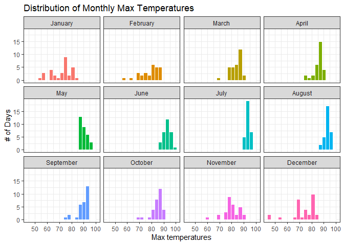
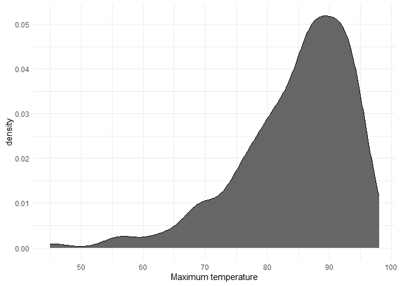
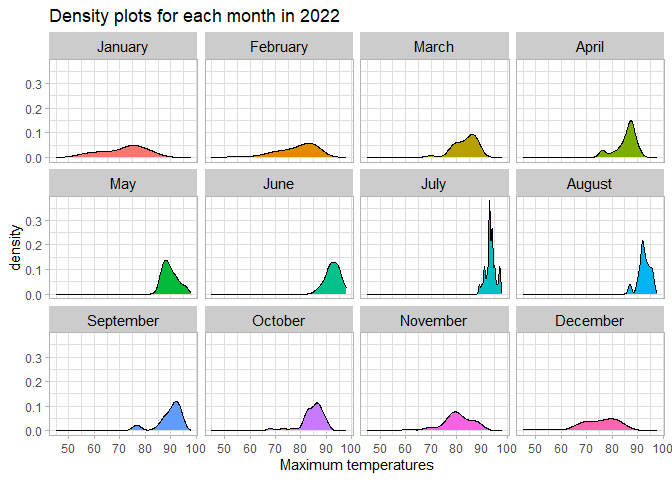
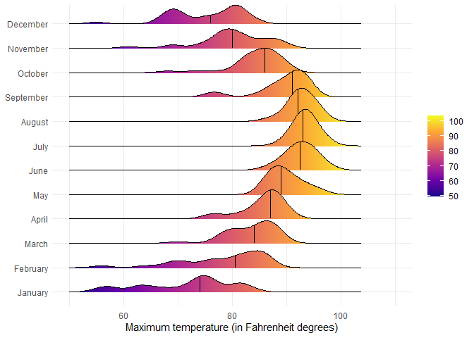
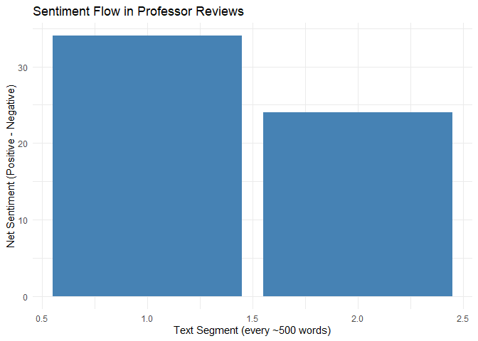

# Data Visualization Project 03


In this exercise you will explore methods to create different types of data visualizations (such as plotting text data, or exploring the distributions of continuous variables).


## PART 1: Density Plots

Using the dataset obtained from FSU's [Florida Climate Center](https://climatecenter.fsu.edu/climate-data-access-tools/downloadable-data), for a station at Tampa International Airport (TPA) for 2022, attempt to recreate the charts shown below which were generated using data from 2016. You can read the 2022 dataset using the code below: 


``` r
library(tidyverse)
weather_tpa <- read_csv("https://raw.githubusercontent.com/aalhamadani/datasets/master/tpa_weather_2022.csv")
# random sample 
sample_n(weather_tpa, 4)
```

```
## # A tibble: 4 × 7
##    year month   day precipitation max_temp min_temp ave_temp
##   <dbl> <dbl> <dbl>         <dbl>    <dbl>    <dbl>    <dbl>
## 1  2022     5    24          0.01       94       79     86.5
## 2  2022     8     6          0.04       95       80     87.5
## 3  2022    12     1          0          77       63     70  
## 4  2022    12    19          0          74       46     60
```

See Slides from Week 4 of Visualizing Relationships and Models (slide 10) for a reminder on how to use this type of dataset with the `lubridate` package for dates and times (example included in the slides uses data from 2016).

Using the 2022 data: 

(a) Create a plot like the one below:


Hint: the option `binwidth = 3` was used with the `geom_histogram()` function.


``` r
library(ggplot2)
library(dplyr)

weather_tpa %>%
  
  mutate(month_name = factor(month.name[month], levels = month.name)) %>% # turn month numbers into ordered month names
  ggplot(aes(x = max_temp, fill = month_name)) + # max temp on x, fill by month
  geom_histogram(binwidth = 3, color = "white", show.legend = FALSE) + # histogram with 3-degree bins
  facet_wrap(~ month_name, ncol = 4) + # split into separate plots for each month
  scale_x_continuous(n.breaks = 6) + # make x-axis a bit less cluttered
  theme_bw() + # simple black and white theme
  labs(
    title = "Distribution of Monthly Max Temperatures",
    x = "Max temperatures",
    y = "# of Days"
  )
```

<!-- -->


(b) Create a plot like the one below:


``` r
weather_tpa %>%
  ggplot(aes(x = max_temp)) + # max temp on x-axis
  geom_density(fill = "gray40", color = "black") + # density curve with gray fill and black outline
  theme_minimal() + # simple clean theme
  labs(
    x = "Maximum temperature", # x-axis label
    y = "density" # y-axis label
  )
```

<!-- -->

Hint: check the `kernel` parameter of the `geom_density()` function, and use `bw = 0.5`.

(c) Create a plot like the one below:


Hint: default options for `geom_density()` were used. 


``` r
weather_tpa %>%
  mutate(month_name = factor(month.name[month], levels = month.name)) %>% # turn month numbers into ordered month names
  ggplot(aes(x = max_temp, fill = month_name)) + # max temp on x, fill by month
  geom_density(color = "black", show.legend = FALSE) + # density plot with black outline
  facet_wrap(~ month_name, ncol = 4) + # separate plot for each month
  theme_light() + # light theme instead of default
  theme(
    strip.background = element_rect(fill = "gray80"), # gray background for facet labels
    strip.text = element_text(color = "black", size = 11) # format facet label text
  ) +
  labs(
    title = "Density plots for each month in 2022", # main title
    x = "Maximum temperatures", 
    y = "density" )
```

<!-- -->


(d) Generate a plot like the chart below:


Hint: use the`{ggridges}` package, and the `geom_density_ridges()` function paying close attention to the `quantile_lines` and `quantiles` parameters. The plot above uses the `plasma` option (color scale) for the _viridis_ palette.


``` r
library(ggridges)
```

```
## Warning: package 'ggridges' was built under R version 4.5.3
```

``` r
weather_tpa %>%
  mutate(month_name = factor(month.name[month], levels = month.name)) %>% # make month names ordered Jan to Dec
  ggplot(aes(x = max_temp, y = month_name, fill = after_stat(x))) + # temp on x, month on y, fill based on temp values
  geom_density_ridges_gradient(
    quantile_lines = TRUE, # show median line inside each ridge
    quantiles = 2, # just median 
    color = "black", # outline color
    scale = 1.5 # controls how spaced out the ridges are
  ) +
  scale_fill_viridis_c(option = "plasma") + # color gradient for fill
  scale_x_continuous(limits = c(50, 110)) + # limit x-axis range
  theme_minimal() + # clean minimal theme
  theme(legend.position = "right") + # move legend to the right side
  labs(
    x = "Maximum temperature (in Fahrenheit degrees)", 
    y = NULL, # no y-axis label
    fill = NULL # no legend title
  )
```

```
## Picking joint bandwidth of 1.87
```

<!-- -->


(e) Create a plot of your choice that uses the attribute for precipitation _(values of -99.9 for temperature or -99.99 for precipitation represent missing data)_.


``` r
library(plotly)
```

```
## Warning: package 'plotly' was built under R version 4.5.3
```

```
## 
## Attaching package: 'plotly'
```

```
## The following object is masked from 'package:ggplot2':
## 
##     last_plot
```

```
## The following object is masked from 'package:stats':
## 
##     filter
```

```
## The following object is masked from 'package:graphics':
## 
##     layout
```

``` r
p <- weather_tpa %>%
  mutate(precipitation = na_if(precipitation, -99.99)) %>% # replace fake missing values with NA
  ggplot(aes(x = ave_temp, y = precipitation)) + # average temp on x, precipitation on y
  geom_point(alpha = 0.4) + # scatterplot with lighter points so overlap is easier to see
  geom_smooth(method = "loess", color = "red", se = FALSE) + # smooth trend line in red
  theme_minimal() + # clean minimal theme
  labs(
    title = "Relationship Between Temperature and Precipitation", 
    x = "Average Temperature",
    y = "Precipitation" 
  )

ggplotly(p) # turn static ggplot into interactive plotly chart
```

```
## `geom_smooth()` using formula = 'y ~ x'
```

```{=html}
<div class="plotly html-widget html-fill-item" id="htmlwidget-465b87562ecd72d41060" style="width:672px;height:480px;"></div>
<script type="application/json" data-for="htmlwidget-465b87562ecd72d41060">{"x":{"data":[{"x":[74.5,76.5,65,63,67,65,72,69.5,74.5,72.5,63.5,65.5,66.5,63.5,62.5,66.5,61,53,61,65.5,68,54.5,51.5,51.5,53.5,58.5,66.5,60.5,48,47,54,62.5,69.5,75.5,75,63,59,62,54.5,59,59.5,65,67.5,66,57,61,71.5,76.5,74.5,68.5,68,74.5,77,78,77,76,76,75.5,72,69.5,68,71,77,76,77.5,79.5,80,80.5,78,79,63.5,55.5,67.5,75.5,74,72,76,77.5,74.5,71,77,80,70,71,70.5,72,75,75,78.5,79.5,75.5,74,74,75,80,82,76,71,67,66.5,73.5,77,78,80.5,80,80.5,81.5,82,75,73,77,77,78,79.5,80.5,79.5,77,79,79,77,77.5,79,79.5,80.5,83,82.5,80.5,82,80.5,76,75,76.5,78,80,80,80,82,83.5,83.5,81.5,82,85,85.5,86.5,86,85,83.5,84.5,82,84.5,83,82,82,81,81.5,83,84,84.5,86.5,83.5,85.5,82.5,83.5,86.5,87,86.5,87,88.5,89.5,87,86.5,85.5,84.5,86,87,85,87,84.5,86,86,85,84.5,85.5,85,86,87.5,88,87,86.5,86.5,85.5,84,87.5,87,82.5,83.5,84.5,83.5,87,88,88,86.5,86,85.5,87,87.5,85,85,88,89.5,89,89,88.5,88.5,84,85.5,87,87.5,87,85.5,84.5,85,84.5,86,86,83.5,83,86,86,85.5,84,87.5,85.5,86.5,86,86,85,84,85.5,84.5,84,85.5,86.5,84.5,82,84.5,86.5,87,87,84.5,80.5,81.5,81.5,83.5,84,84,81.5,83,81,83.5,81,83.5,84,85,85.5,85,84,82.5,84.5,80,74.5,71,71,75,76.5,75,73,73.5,75.5,77,76.5,78,82,81.5,79.5,77.5,79.5,81,80.5,80.5,72.5,60.5,61,65.5,68.5,74.5,76,76,76,79.5,79.5,79,79,78,80,83,79.5,76.5,77.5,81,78.5,77,71.5,70.5,74.5,74,71.5,70.5,74.5,70.5,61,60.5,64,56.5,66.5,71.5,72,73,75,76.5,74,71,72,74.5,70,71.5,72.5,70.5,72,73.5,75.5,74.5,71,71,67,67.5,70,73.5,70,62,62,60,60,62.5,64.5,64,56,38,38.5,46.5,54,61.5,68,71,68.5],"y":[0,0,0.02,0,0,1.0000000000000001e-05,1.0000000000000001e-05,0,0,0,0,0,0,0,0,0.68000000000000005,0,0,0,0,0,0.01,1.0000000000000001e-05,0,0.67000000000000004,0.080000000000000002,0,1.0000000000000001e-05,0,0,0,0,0,0,0,0.02,0.02,0,0.34999999999999998,1.0000000000000001e-05,0,0,1.0000000000000001e-05,0.10000000000000001,0,0,0,0,0,0.13,0,0,0,0,0,0,0,0,0,0,0,0,0,0,0,0,0,0,1.0000000000000001e-05,0,0.40999999999999998,0,0,1.04,1.0000000000000001e-05,0,0,0,0,0,0,0,1.4199999999999999,0,0,0,0,0,0,0.040000000000000001,1.3700000000000001,1.1100000000000001,0,0,0,0,1.3400000000000001,0,0,0,0,0,0,0,0.02,0,0,0,0,0,0,0,0,0,0,0,0,0.14000000000000001,1.22,1.5600000000000001,0.029999999999999999,0,0.62,0,0,0,0.14999999999999999,0,0,0,0,0,0,0,0,0,0,0,0,0.17000000000000001,1.0000000000000001e-05,0,1.0000000000000001e-05,0.01,0,0,0,0,0,1.6499999999999999,0.080000000000000002,1.0000000000000001e-05,1.6000000000000001,1.0000000000000001e-05,0.46999999999999997,0,0,0.16,0,0.10000000000000001,0.01,2.8100000000000001,0,0,0,0.11,1.0000000000000001e-05,0,0,0.040000000000000001,0.10000000000000001,0,0,0,0.19,0,0,1.28,0.089999999999999997,0.040000000000000001,1.0700000000000001,1.0000000000000001e-05,1.0000000000000001e-05,0,1.0000000000000001e-05,0.01,0.050000000000000003,0.029999999999999999,0.19,0,0.87,0.63,0,0,2.0800000000000001,0,2.8599999999999999,0.78000000000000003,0,0.02,0,0,1.6399999999999999,1.6899999999999999,0,0.02,1.1200000000000001,0,0,0,0,0,0,1.0000000000000001e-05,0.97999999999999998,1.24,1.0000000000000001e-05,0.040000000000000001,0.23999999999999999,0.059999999999999998,1.28,0,0,0,0,1.0000000000000001e-05,1.0000000000000001e-05,0,0.64000000000000001,0,0,0.46999999999999997,0.45000000000000001,0,0,0.60999999999999999,0.31,1.0000000000000001e-05,0.02,0.16,0,0,0.01,2.7400000000000002,1.4099999999999999,0.40000000000000002,0,0,0,0.10000000000000001,1.6399999999999999,0.13,1.0900000000000001,0.02,0.029999999999999999,0.029999999999999999,0.059999999999999998,0,0.87,0.059999999999999998,0,0.02,0.070000000000000007,1.0000000000000001e-05,0,1.0700000000000001,0,0,1.0000000000000001e-05,0.080000000000000002,2.4700000000000002,0,0,0,0,0,0,0,0,0,0,0,1.0000000000000001e-05,1.0000000000000001e-05,0.02,0.29999999999999999,0,0,0,1.0000000000000001e-05,0.01,0,0,0,0,0,0,0,0,0.059999999999999998,0.70999999999999996,0,0,0,0,0,0.90000000000000002,0,1.0000000000000001e-05,1.0000000000000001e-05,0,0.059999999999999998,0.089999999999999997,2.46,0.76000000000000001,0.01,0.01,0,0,0.14000000000000001,0,0,0,0.39000000000000001,1.0000000000000001e-05,0,0.050000000000000003,0,1.0000000000000001e-05,0,0.27000000000000002,0,0,0.040000000000000001,0,0,0,0,0,0,0,0,0,0,0,0,0,0,1.0900000000000001,0.050000000000000003,0.02,0.040000000000000001,0,0.11,0.59999999999999998,0.14999999999999999,1.0000000000000001e-05,0,0,0,0,0,0,0,0.28999999999999998],"text":["ave_temp: 74.5<br />precipitation: 0.00000","ave_temp: 76.5<br />precipitation: 0.00000","ave_temp: 65.0<br />precipitation: 0.02000","ave_temp: 63.0<br />precipitation: 0.00000","ave_temp: 67.0<br />precipitation: 0.00000","ave_temp: 65.0<br />precipitation: 0.00001","ave_temp: 72.0<br />precipitation: 0.00001","ave_temp: 69.5<br />precipitation: 0.00000","ave_temp: 74.5<br />precipitation: 0.00000","ave_temp: 72.5<br />precipitation: 0.00000","ave_temp: 63.5<br />precipitation: 0.00000","ave_temp: 65.5<br />precipitation: 0.00000","ave_temp: 66.5<br />precipitation: 0.00000","ave_temp: 63.5<br />precipitation: 0.00000","ave_temp: 62.5<br />precipitation: 0.00000","ave_temp: 66.5<br />precipitation: 0.68000","ave_temp: 61.0<br />precipitation: 0.00000","ave_temp: 53.0<br />precipitation: 0.00000","ave_temp: 61.0<br />precipitation: 0.00000","ave_temp: 65.5<br />precipitation: 0.00000","ave_temp: 68.0<br />precipitation: 0.00000","ave_temp: 54.5<br />precipitation: 0.01000","ave_temp: 51.5<br />precipitation: 0.00001","ave_temp: 51.5<br />precipitation: 0.00000","ave_temp: 53.5<br />precipitation: 0.67000","ave_temp: 58.5<br />precipitation: 0.08000","ave_temp: 66.5<br />precipitation: 0.00000","ave_temp: 60.5<br />precipitation: 0.00001","ave_temp: 48.0<br />precipitation: 0.00000","ave_temp: 47.0<br />precipitation: 0.00000","ave_temp: 54.0<br />precipitation: 0.00000","ave_temp: 62.5<br />precipitation: 0.00000","ave_temp: 69.5<br />precipitation: 0.00000","ave_temp: 75.5<br />precipitation: 0.00000","ave_temp: 75.0<br />precipitation: 0.00000","ave_temp: 63.0<br />precipitation: 0.02000","ave_temp: 59.0<br />precipitation: 0.02000","ave_temp: 62.0<br />precipitation: 0.00000","ave_temp: 54.5<br />precipitation: 0.35000","ave_temp: 59.0<br />precipitation: 0.00001","ave_temp: 59.5<br />precipitation: 0.00000","ave_temp: 65.0<br />precipitation: 0.00000","ave_temp: 67.5<br />precipitation: 0.00001","ave_temp: 66.0<br />precipitation: 0.10000","ave_temp: 57.0<br />precipitation: 0.00000","ave_temp: 61.0<br />precipitation: 0.00000","ave_temp: 71.5<br />precipitation: 0.00000","ave_temp: 76.5<br />precipitation: 0.00000","ave_temp: 74.5<br />precipitation: 0.00000","ave_temp: 68.5<br />precipitation: 0.13000","ave_temp: 68.0<br />precipitation: 0.00000","ave_temp: 74.5<br />precipitation: 0.00000","ave_temp: 77.0<br />precipitation: 0.00000","ave_temp: 78.0<br />precipitation: 0.00000","ave_temp: 77.0<br />precipitation: 0.00000","ave_temp: 76.0<br />precipitation: 0.00000","ave_temp: 76.0<br />precipitation: 0.00000","ave_temp: 75.5<br />precipitation: 0.00000","ave_temp: 72.0<br />precipitation: 0.00000","ave_temp: 69.5<br />precipitation: 0.00000","ave_temp: 68.0<br />precipitation: 0.00000","ave_temp: 71.0<br />precipitation: 0.00000","ave_temp: 77.0<br />precipitation: 0.00000","ave_temp: 76.0<br />precipitation: 0.00000","ave_temp: 77.5<br />precipitation: 0.00000","ave_temp: 79.5<br />precipitation: 0.00000","ave_temp: 80.0<br />precipitation: 0.00000","ave_temp: 80.5<br />precipitation: 0.00000","ave_temp: 78.0<br />precipitation: 0.00001","ave_temp: 79.0<br />precipitation: 0.00000","ave_temp: 63.5<br />precipitation: 0.41000","ave_temp: 55.5<br />precipitation: 0.00000","ave_temp: 67.5<br />precipitation: 0.00000","ave_temp: 75.5<br />precipitation: 1.04000","ave_temp: 74.0<br />precipitation: 0.00001","ave_temp: 72.0<br />precipitation: 0.00000","ave_temp: 76.0<br />precipitation: 0.00000","ave_temp: 77.5<br />precipitation: 0.00000","ave_temp: 74.5<br />precipitation: 0.00000","ave_temp: 71.0<br />precipitation: 0.00000","ave_temp: 77.0<br />precipitation: 0.00000","ave_temp: 80.0<br />precipitation: 0.00000","ave_temp: 70.0<br />precipitation: 1.42000","ave_temp: 71.0<br />precipitation: 0.00000","ave_temp: 70.5<br />precipitation: 0.00000","ave_temp: 72.0<br />precipitation: 0.00000","ave_temp: 75.0<br />precipitation: 0.00000","ave_temp: 75.0<br />precipitation: 0.00000","ave_temp: 78.5<br />precipitation: 0.00000","ave_temp: 79.5<br />precipitation: 0.04000","ave_temp: 75.5<br />precipitation: 1.37000","ave_temp: 74.0<br />precipitation: 1.11000","ave_temp: 74.0<br />precipitation: 0.00000","ave_temp: 75.0<br />precipitation: 0.00000","ave_temp: 80.0<br />precipitation: 0.00000","ave_temp: 82.0<br />precipitation: 0.00000","ave_temp: 76.0<br />precipitation: 1.34000","ave_temp: 71.0<br />precipitation: 0.00000","ave_temp: 67.0<br />precipitation: 0.00000","ave_temp: 66.5<br />precipitation: 0.00000","ave_temp: 73.5<br />precipitation: 0.00000","ave_temp: 77.0<br />precipitation: 0.00000","ave_temp: 78.0<br />precipitation: 0.00000","ave_temp: 80.5<br />precipitation: 0.00000","ave_temp: 80.0<br />precipitation: 0.02000","ave_temp: 80.5<br />precipitation: 0.00000","ave_temp: 81.5<br />precipitation: 0.00000","ave_temp: 82.0<br />precipitation: 0.00000","ave_temp: 75.0<br />precipitation: 0.00000","ave_temp: 73.0<br />precipitation: 0.00000","ave_temp: 77.0<br />precipitation: 0.00000","ave_temp: 77.0<br />precipitation: 0.00000","ave_temp: 78.0<br />precipitation: 0.00000","ave_temp: 79.5<br />precipitation: 0.00000","ave_temp: 80.5<br />precipitation: 0.00000","ave_temp: 79.5<br />precipitation: 0.00000","ave_temp: 77.0<br />precipitation: 0.00000","ave_temp: 79.0<br />precipitation: 0.14000","ave_temp: 79.0<br />precipitation: 1.22000","ave_temp: 77.0<br />precipitation: 1.56000","ave_temp: 77.5<br />precipitation: 0.03000","ave_temp: 79.0<br />precipitation: 0.00000","ave_temp: 79.5<br />precipitation: 0.62000","ave_temp: 80.5<br />precipitation: 0.00000","ave_temp: 83.0<br />precipitation: 0.00000","ave_temp: 82.5<br />precipitation: 0.00000","ave_temp: 80.5<br />precipitation: 0.15000","ave_temp: 82.0<br />precipitation: 0.00000","ave_temp: 80.5<br />precipitation: 0.00000","ave_temp: 76.0<br />precipitation: 0.00000","ave_temp: 75.0<br />precipitation: 0.00000","ave_temp: 76.5<br />precipitation: 0.00000","ave_temp: 78.0<br />precipitation: 0.00000","ave_temp: 80.0<br />precipitation: 0.00000","ave_temp: 80.0<br />precipitation: 0.00000","ave_temp: 80.0<br />precipitation: 0.00000","ave_temp: 82.0<br />precipitation: 0.00000","ave_temp: 83.5<br />precipitation: 0.00000","ave_temp: 83.5<br />precipitation: 0.00000","ave_temp: 81.5<br />precipitation: 0.17000","ave_temp: 82.0<br />precipitation: 0.00001","ave_temp: 85.0<br />precipitation: 0.00000","ave_temp: 85.5<br />precipitation: 0.00001","ave_temp: 86.5<br />precipitation: 0.01000","ave_temp: 86.0<br />precipitation: 0.00000","ave_temp: 85.0<br />precipitation: 0.00000","ave_temp: 83.5<br />precipitation: 0.00000","ave_temp: 84.5<br />precipitation: 0.00000","ave_temp: 82.0<br />precipitation: 0.00000","ave_temp: 84.5<br />precipitation: 1.65000","ave_temp: 83.0<br />precipitation: 0.08000","ave_temp: 82.0<br />precipitation: 0.00001","ave_temp: 82.0<br />precipitation: 1.60000","ave_temp: 81.0<br />precipitation: 0.00001","ave_temp: 81.5<br />precipitation: 0.47000","ave_temp: 83.0<br />precipitation: 0.00000","ave_temp: 84.0<br />precipitation: 0.00000","ave_temp: 84.5<br />precipitation: 0.16000","ave_temp: 86.5<br />precipitation: 0.00000","ave_temp: 83.5<br />precipitation: 0.10000","ave_temp: 85.5<br />precipitation: 0.01000","ave_temp: 82.5<br />precipitation: 2.81000","ave_temp: 83.5<br />precipitation: 0.00000","ave_temp: 86.5<br />precipitation: 0.00000","ave_temp: 87.0<br />precipitation: 0.00000","ave_temp: 86.5<br />precipitation: 0.11000","ave_temp: 87.0<br />precipitation: 0.00001","ave_temp: 88.5<br />precipitation: 0.00000","ave_temp: 89.5<br />precipitation: 0.00000","ave_temp: 87.0<br />precipitation: 0.04000","ave_temp: 86.5<br />precipitation: 0.10000","ave_temp: 85.5<br />precipitation: 0.00000","ave_temp: 84.5<br />precipitation: 0.00000","ave_temp: 86.0<br />precipitation: 0.00000","ave_temp: 87.0<br />precipitation: 0.19000","ave_temp: 85.0<br />precipitation: 0.00000","ave_temp: 87.0<br />precipitation: 0.00000","ave_temp: 84.5<br />precipitation: 1.28000","ave_temp: 86.0<br />precipitation: 0.09000","ave_temp: 86.0<br />precipitation: 0.04000","ave_temp: 85.0<br />precipitation: 1.07000","ave_temp: 84.5<br />precipitation: 0.00001","ave_temp: 85.5<br />precipitation: 0.00001","ave_temp: 85.0<br />precipitation: 0.00000","ave_temp: 86.0<br />precipitation: 0.00001","ave_temp: 87.5<br />precipitation: 0.01000","ave_temp: 88.0<br />precipitation: 0.05000","ave_temp: 87.0<br />precipitation: 0.03000","ave_temp: 86.5<br />precipitation: 0.19000","ave_temp: 86.5<br />precipitation: 0.00000","ave_temp: 85.5<br />precipitation: 0.87000","ave_temp: 84.0<br />precipitation: 0.63000","ave_temp: 87.5<br />precipitation: 0.00000","ave_temp: 87.0<br />precipitation: 0.00000","ave_temp: 82.5<br />precipitation: 2.08000","ave_temp: 83.5<br />precipitation: 0.00000","ave_temp: 84.5<br />precipitation: 2.86000","ave_temp: 83.5<br />precipitation: 0.78000","ave_temp: 87.0<br />precipitation: 0.00000","ave_temp: 88.0<br />precipitation: 0.02000","ave_temp: 88.0<br />precipitation: 0.00000","ave_temp: 86.5<br />precipitation: 0.00000","ave_temp: 86.0<br />precipitation: 1.64000","ave_temp: 85.5<br />precipitation: 1.69000","ave_temp: 87.0<br />precipitation: 0.00000","ave_temp: 87.5<br />precipitation: 0.02000","ave_temp: 85.0<br />precipitation: 1.12000","ave_temp: 85.0<br />precipitation: 0.00000","ave_temp: 88.0<br />precipitation: 0.00000","ave_temp: 89.5<br />precipitation: 0.00000","ave_temp: 89.0<br />precipitation: 0.00000","ave_temp: 89.0<br />precipitation: 0.00000","ave_temp: 88.5<br />precipitation: 0.00000","ave_temp: 88.5<br />precipitation: 0.00001","ave_temp: 84.0<br />precipitation: 0.98000","ave_temp: 85.5<br />precipitation: 1.24000","ave_temp: 87.0<br />precipitation: 0.00001","ave_temp: 87.5<br />precipitation: 0.04000","ave_temp: 87.0<br />precipitation: 0.24000","ave_temp: 85.5<br />precipitation: 0.06000","ave_temp: 84.5<br />precipitation: 1.28000","ave_temp: 85.0<br />precipitation: 0.00000","ave_temp: 84.5<br />precipitation: 0.00000","ave_temp: 86.0<br />precipitation: 0.00000","ave_temp: 86.0<br />precipitation: 0.00000","ave_temp: 83.5<br />precipitation: 0.00001","ave_temp: 83.0<br />precipitation: 0.00001","ave_temp: 86.0<br />precipitation: 0.00000","ave_temp: 86.0<br />precipitation: 0.64000","ave_temp: 85.5<br />precipitation: 0.00000","ave_temp: 84.0<br />precipitation: 0.00000","ave_temp: 87.5<br />precipitation: 0.47000","ave_temp: 85.5<br />precipitation: 0.45000","ave_temp: 86.5<br />precipitation: 0.00000","ave_temp: 86.0<br />precipitation: 0.00000","ave_temp: 86.0<br />precipitation: 0.61000","ave_temp: 85.0<br />precipitation: 0.31000","ave_temp: 84.0<br />precipitation: 0.00001","ave_temp: 85.5<br />precipitation: 0.02000","ave_temp: 84.5<br />precipitation: 0.16000","ave_temp: 84.0<br />precipitation: 0.00000","ave_temp: 85.5<br />precipitation: 0.00000","ave_temp: 86.5<br />precipitation: 0.01000","ave_temp: 84.5<br />precipitation: 2.74000","ave_temp: 82.0<br />precipitation: 1.41000","ave_temp: 84.5<br />precipitation: 0.40000","ave_temp: 86.5<br />precipitation: 0.00000","ave_temp: 87.0<br />precipitation: 0.00000","ave_temp: 87.0<br />precipitation: 0.00000","ave_temp: 84.5<br />precipitation: 0.10000","ave_temp: 80.5<br />precipitation: 1.64000","ave_temp: 81.5<br />precipitation: 0.13000","ave_temp: 81.5<br />precipitation: 1.09000","ave_temp: 83.5<br />precipitation: 0.02000","ave_temp: 84.0<br />precipitation: 0.03000","ave_temp: 84.0<br />precipitation: 0.03000","ave_temp: 81.5<br />precipitation: 0.06000","ave_temp: 83.0<br />precipitation: 0.00000","ave_temp: 81.0<br />precipitation: 0.87000","ave_temp: 83.5<br />precipitation: 0.06000","ave_temp: 81.0<br />precipitation: 0.00000","ave_temp: 83.5<br />precipitation: 0.02000","ave_temp: 84.0<br />precipitation: 0.07000","ave_temp: 85.0<br />precipitation: 0.00001","ave_temp: 85.5<br />precipitation: 0.00000","ave_temp: 85.0<br />precipitation: 1.07000","ave_temp: 84.0<br />precipitation: 0.00000","ave_temp: 82.5<br />precipitation: 0.00000","ave_temp: 84.5<br />precipitation: 0.00001","ave_temp: 80.0<br />precipitation: 0.08000","ave_temp: 74.5<br />precipitation: 2.47000","ave_temp: 71.0<br />precipitation: 0.00000","ave_temp: 71.0<br />precipitation: 0.00000","ave_temp: 75.0<br />precipitation: 0.00000","ave_temp: 76.5<br />precipitation: 0.00000","ave_temp: 75.0<br />precipitation: 0.00000","ave_temp: 73.0<br />precipitation: 0.00000","ave_temp: 73.5<br />precipitation: 0.00000","ave_temp: 75.5<br />precipitation: 0.00000","ave_temp: 77.0<br />precipitation: 0.00000","ave_temp: 76.5<br />precipitation: 0.00000","ave_temp: 78.0<br />precipitation: 0.00000","ave_temp: 82.0<br />precipitation: 0.00001","ave_temp: 81.5<br />precipitation: 0.00001","ave_temp: 79.5<br />precipitation: 0.02000","ave_temp: 77.5<br />precipitation: 0.30000","ave_temp: 79.5<br />precipitation: 0.00000","ave_temp: 81.0<br />precipitation: 0.00000","ave_temp: 80.5<br />precipitation: 0.00000","ave_temp: 80.5<br />precipitation: 0.00001","ave_temp: 72.5<br />precipitation: 0.01000","ave_temp: 60.5<br />precipitation: 0.00000","ave_temp: 61.0<br />precipitation: 0.00000","ave_temp: 65.5<br />precipitation: 0.00000","ave_temp: 68.5<br />precipitation: 0.00000","ave_temp: 74.5<br />precipitation: 0.00000","ave_temp: 76.0<br />precipitation: 0.00000","ave_temp: 76.0<br />precipitation: 0.00000","ave_temp: 76.0<br />precipitation: 0.00000","ave_temp: 79.5<br />precipitation: 0.06000","ave_temp: 79.5<br />precipitation: 0.71000","ave_temp: 79.0<br />precipitation: 0.00000","ave_temp: 79.0<br />precipitation: 0.00000","ave_temp: 78.0<br />precipitation: 0.00000","ave_temp: 80.0<br />precipitation: 0.00000","ave_temp: 83.0<br />precipitation: 0.00000","ave_temp: 79.5<br />precipitation: 0.90000","ave_temp: 76.5<br />precipitation: 0.00000","ave_temp: 77.5<br />precipitation: 0.00001","ave_temp: 81.0<br />precipitation: 0.00001","ave_temp: 78.5<br />precipitation: 0.00000","ave_temp: 77.0<br />precipitation: 0.06000","ave_temp: 71.5<br />precipitation: 0.09000","ave_temp: 70.5<br />precipitation: 2.46000","ave_temp: 74.5<br />precipitation: 0.76000","ave_temp: 74.0<br />precipitation: 0.01000","ave_temp: 71.5<br />precipitation: 0.01000","ave_temp: 70.5<br />precipitation: 0.00000","ave_temp: 74.5<br />precipitation: 0.00000","ave_temp: 70.5<br />precipitation: 0.14000","ave_temp: 61.0<br />precipitation: 0.00000","ave_temp: 60.5<br />precipitation: 0.00000","ave_temp: 64.0<br />precipitation: 0.00000","ave_temp: 56.5<br />precipitation: 0.39000","ave_temp: 66.5<br />precipitation: 0.00001","ave_temp: 71.5<br />precipitation: 0.00000","ave_temp: 72.0<br />precipitation: 0.05000","ave_temp: 73.0<br />precipitation: 0.00000","ave_temp: 75.0<br />precipitation: 0.00001","ave_temp: 76.5<br />precipitation: 0.00000","ave_temp: 74.0<br />precipitation: 0.27000","ave_temp: 71.0<br />precipitation: 0.00000","ave_temp: 72.0<br />precipitation: 0.00000","ave_temp: 74.5<br />precipitation: 0.04000","ave_temp: 70.0<br />precipitation: 0.00000","ave_temp: 71.5<br />precipitation: 0.00000","ave_temp: 72.5<br />precipitation: 0.00000","ave_temp: 70.5<br />precipitation: 0.00000","ave_temp: 72.0<br />precipitation: 0.00000","ave_temp: 73.5<br />precipitation: 0.00000","ave_temp: 75.5<br />precipitation: 0.00000","ave_temp: 74.5<br />precipitation: 0.00000","ave_temp: 71.0<br />precipitation: 0.00000","ave_temp: 71.0<br />precipitation: 0.00000","ave_temp: 67.0<br />precipitation: 0.00000","ave_temp: 67.5<br />precipitation: 0.00000","ave_temp: 70.0<br />precipitation: 0.00000","ave_temp: 73.5<br />precipitation: 0.00000","ave_temp: 70.0<br />precipitation: 1.09000","ave_temp: 62.0<br />precipitation: 0.05000","ave_temp: 62.0<br />precipitation: 0.02000","ave_temp: 60.0<br />precipitation: 0.04000","ave_temp: 60.0<br />precipitation: 0.00000","ave_temp: 62.5<br />precipitation: 0.11000","ave_temp: 64.5<br />precipitation: 0.60000","ave_temp: 64.0<br />precipitation: 0.15000","ave_temp: 56.0<br />precipitation: 0.00001","ave_temp: 38.0<br />precipitation: 0.00000","ave_temp: 38.5<br />precipitation: 0.00000","ave_temp: 46.5<br />precipitation: 0.00000","ave_temp: 54.0<br />precipitation: 0.00000","ave_temp: 61.5<br />precipitation: 0.00000","ave_temp: 68.0<br />precipitation: 0.00000","ave_temp: 71.0<br />precipitation: 0.00000","ave_temp: 68.5<br />precipitation: 0.29000"],"type":"scatter","mode":"markers","marker":{"autocolorscale":false,"color":"rgba(0,0,0,1)","opacity":0.40000000000000002,"size":5.6692913385826778,"symbol":"circle","line":{"width":1.8897637795275593,"color":"rgba(0,0,0,1)"}},"hoveron":"points","showlegend":false,"xaxis":"x","yaxis":"y","hoverinfo":"text","frame":null},{"x":[38,38.651898734177216,39.303797468354432,39.955696202531648,40.607594936708864,41.259493670886073,41.911392405063289,42.563291139240505,43.215189873417721,43.867088607594937,44.518987341772153,45.170886075949369,45.822784810126585,46.474683544303801,47.12658227848101,47.778481012658226,48.430379746835442,49.082278481012658,49.734177215189874,50.38607594936709,51.037974683544306,51.689873417721522,52.341772151898738,52.993670886075947,53.64556962025317,54.297468354430379,54.949367088607595,55.601265822784811,56.253164556962027,56.905063291139243,57.556962025316452,58.208860759493675,58.860759493670884,59.512658227848107,60.164556962025316,60.816455696202532,61.468354430379748,62.120253164556964,62.77215189873418,63.424050632911388,64.075949367088612,64.72784810126582,65.379746835443044,66.031645569620252,66.683544303797476,67.335443037974684,67.987341772151893,68.639240506329116,69.29113924050634,69.943037974683548,70.594936708860757,71.24683544303798,71.898734177215189,72.550632911392398,73.202531645569621,73.854430379746844,74.506329113924053,75.158227848101262,75.810126582278485,76.462025316455708,77.113924050632903,77.765822784810126,78.417721518987349,79.069620253164558,79.721518987341767,80.37341772151899,81.025316455696213,81.677215189873422,82.329113924050631,82.981012658227854,83.632911392405063,84.284810126582272,84.936708860759495,85.588607594936718,86.240506329113927,86.892405063291136,87.544303797468359,88.196202531645582,88.848101265822777,89.5],"y":[0.022829972498230641,0.023227379505908745,0.023679681007822317,0.024186907723242349,0.024749090371439859,0.025366259671685827,0.026038446343251268,0.026765681105407186,0.027547994677424577,0.028385417778574444,0.029277981128127784,0.030225715445355593,0.031228651449528903,0.032286819859918672,0.03340025139579593,0.034568976776431656,0.035793026721096875,0.037072431949062588,0.038407223179599791,0.039797431131979463,0.041243086525472636,0.042744220079350297,0.04430086251288344,0.045913044545343069,0.047580796896000227,0.049304150284125839,0.051083135428990976,0.0529177830498666,0.054808123866023725,0.05675418859673334,0.058756007961266433,0.060813612678894111,0.062927033468887214,0.065096301050516892,0.067321446143053992,0.069602499465769657,0.071939491737934819,0.074332453678820479,0.076781416007697681,0.07928640944383733,0.081847464706510581,0.084494549282345344,0.087557233492776596,0.091056705936068891,0.094904200042428111,0.099010949242059679,0.10328818696516928,0.10764714664196275,0.11199906170264562,0.11625516557742337,0.12032669169650181,0.12388678479149949,0.12481866307674377,0.12361544537466101,0.12149552825441415,0.11967730828516632,0.11937918203608067,0.12165749387610722,0.12405378891683919,0.12650798254648027,0.13056906939774987,0.13778604410336778,0.1519371958692656,0.17816689100876115,0.20927422584257824,0.23714995715293699,0.25370199585866127,0.26387427265917196,0.27396858329889684,0.28048908147360441,0.27993992087906261,0.26978796183532316,0.25466964069562853,0.23435915845380534,0.20712264447098094,0.17196167231386028,0.1293957098180511,0.080110589839244378,0.024792145233132765,-0.035873791144598356],"text":["ave_temp: 38.00000<br />precipitation:  0.02282997","ave_temp: 38.65190<br />precipitation:  0.02322738","ave_temp: 39.30380<br />precipitation:  0.02367968","ave_temp: 39.95570<br />precipitation:  0.02418691","ave_temp: 40.60759<br />precipitation:  0.02474909","ave_temp: 41.25949<br />precipitation:  0.02536626","ave_temp: 41.91139<br />precipitation:  0.02603845","ave_temp: 42.56329<br />precipitation:  0.02676568","ave_temp: 43.21519<br />precipitation:  0.02754799","ave_temp: 43.86709<br />precipitation:  0.02838542","ave_temp: 44.51899<br />precipitation:  0.02927798","ave_temp: 45.17089<br />precipitation:  0.03022572","ave_temp: 45.82278<br />precipitation:  0.03122865","ave_temp: 46.47468<br />precipitation:  0.03228682","ave_temp: 47.12658<br />precipitation:  0.03340025","ave_temp: 47.77848<br />precipitation:  0.03456898","ave_temp: 48.43038<br />precipitation:  0.03579303","ave_temp: 49.08228<br />precipitation:  0.03707243","ave_temp: 49.73418<br />precipitation:  0.03840722","ave_temp: 50.38608<br />precipitation:  0.03979743","ave_temp: 51.03797<br />precipitation:  0.04124309","ave_temp: 51.68987<br />precipitation:  0.04274422","ave_temp: 52.34177<br />precipitation:  0.04430086","ave_temp: 52.99367<br />precipitation:  0.04591304","ave_temp: 53.64557<br />precipitation:  0.04758080","ave_temp: 54.29747<br />precipitation:  0.04930415","ave_temp: 54.94937<br />precipitation:  0.05108314","ave_temp: 55.60127<br />precipitation:  0.05291778","ave_temp: 56.25316<br />precipitation:  0.05480812","ave_temp: 56.90506<br />precipitation:  0.05675419","ave_temp: 57.55696<br />precipitation:  0.05875601","ave_temp: 58.20886<br />precipitation:  0.06081361","ave_temp: 58.86076<br />precipitation:  0.06292703","ave_temp: 59.51266<br />precipitation:  0.06509630","ave_temp: 60.16456<br />precipitation:  0.06732145","ave_temp: 60.81646<br />precipitation:  0.06960250","ave_temp: 61.46835<br />precipitation:  0.07193949","ave_temp: 62.12025<br />precipitation:  0.07433245","ave_temp: 62.77215<br />precipitation:  0.07678142","ave_temp: 63.42405<br />precipitation:  0.07928641","ave_temp: 64.07595<br />precipitation:  0.08184746","ave_temp: 64.72785<br />precipitation:  0.08449455","ave_temp: 65.37975<br />precipitation:  0.08755723","ave_temp: 66.03165<br />precipitation:  0.09105671","ave_temp: 66.68354<br />precipitation:  0.09490420","ave_temp: 67.33544<br />precipitation:  0.09901095","ave_temp: 67.98734<br />precipitation:  0.10328819","ave_temp: 68.63924<br />precipitation:  0.10764715","ave_temp: 69.29114<br />precipitation:  0.11199906","ave_temp: 69.94304<br />precipitation:  0.11625517","ave_temp: 70.59494<br />precipitation:  0.12032669","ave_temp: 71.24684<br />precipitation:  0.12388678","ave_temp: 71.89873<br />precipitation:  0.12481866","ave_temp: 72.55063<br />precipitation:  0.12361545","ave_temp: 73.20253<br />precipitation:  0.12149553","ave_temp: 73.85443<br />precipitation:  0.11967731","ave_temp: 74.50633<br />precipitation:  0.11937918","ave_temp: 75.15823<br />precipitation:  0.12165749","ave_temp: 75.81013<br />precipitation:  0.12405379","ave_temp: 76.46203<br />precipitation:  0.12650798","ave_temp: 77.11392<br />precipitation:  0.13056907","ave_temp: 77.76582<br />precipitation:  0.13778604","ave_temp: 78.41772<br />precipitation:  0.15193720","ave_temp: 79.06962<br />precipitation:  0.17816689","ave_temp: 79.72152<br />precipitation:  0.20927423","ave_temp: 80.37342<br />precipitation:  0.23714996","ave_temp: 81.02532<br />precipitation:  0.25370200","ave_temp: 81.67722<br />precipitation:  0.26387427","ave_temp: 82.32911<br />precipitation:  0.27396858","ave_temp: 82.98101<br />precipitation:  0.28048908","ave_temp: 83.63291<br />precipitation:  0.27993992","ave_temp: 84.28481<br />precipitation:  0.26978796","ave_temp: 84.93671<br />precipitation:  0.25466964","ave_temp: 85.58861<br />precipitation:  0.23435916","ave_temp: 86.24051<br />precipitation:  0.20712264","ave_temp: 86.89241<br />precipitation:  0.17196167","ave_temp: 87.54430<br />precipitation:  0.12939571","ave_temp: 88.19620<br />precipitation:  0.08011059","ave_temp: 88.84810<br />precipitation:  0.02479215","ave_temp: 89.50000<br />precipitation: -0.03587379"],"type":"scatter","mode":"lines","name":"fitted values","line":{"width":3.7795275590551185,"color":"rgba(255,0,0,1)","dash":"solid"},"hoveron":"points","showlegend":false,"xaxis":"x","yaxis":"y","hoverinfo":"text","frame":null}],"layout":{"margin":{"t":40.840182648401829,"r":7.3059360730593621,"b":37.260273972602747,"l":31.415525114155255},"paper_bgcolor":"rgba(255,255,255,1)","font":{"color":"rgba(0,0,0,1)","family":"","size":14.611872146118724},"title":{"text":"Relationship Between Temperature and Precipitation","font":{"color":"rgba(0,0,0,1)","family":"","size":17.534246575342465},"x":0,"xref":"paper"},"xaxis":{"domain":[0,1],"automargin":true,"type":"linear","autorange":false,"range":[35.424999999999997,92.075000000000003],"tickmode":"array","ticktext":["40","50","60","70","80","90"],"tickvals":[40,50,60,70,80,90],"categoryorder":"array","categoryarray":["40","50","60","70","80","90"],"nticks":null,"ticks":"","tickcolor":null,"ticklen":3.6529680365296811,"tickwidth":0,"showticklabels":true,"tickfont":{"color":"rgba(77,77,77,1)","family":"","size":11.68949771689498},"tickangle":-0,"showline":false,"linecolor":null,"linewidth":0,"showgrid":true,"gridcolor":"rgba(235,235,235,1)","gridwidth":0.66417600664176002,"zeroline":false,"anchor":"y","title":{"text":"Average Temperature","font":{"color":"rgba(0,0,0,1)","family":"","size":14.611872146118724}},"hoverformat":".2f"},"yaxis":{"domain":[0,1],"automargin":true,"type":"linear","autorange":false,"range":[-0.18066748070182825,3.0047936895572298],"tickmode":"array","ticktext":["0","1","2","3"],"tickvals":[0,1,2,3],"categoryorder":"array","categoryarray":["0","1","2","3"],"nticks":null,"ticks":"","tickcolor":null,"ticklen":3.6529680365296811,"tickwidth":0,"showticklabels":true,"tickfont":{"color":"rgba(77,77,77,1)","family":"","size":11.68949771689498},"tickangle":-0,"showline":false,"linecolor":null,"linewidth":0,"showgrid":true,"gridcolor":"rgba(235,235,235,1)","gridwidth":0.66417600664176002,"zeroline":false,"anchor":"x","title":{"text":"Precipitation","font":{"color":"rgba(0,0,0,1)","family":"","size":14.611872146118724}},"hoverformat":".2f"},"shapes":[],"showlegend":false,"legend":{"bgcolor":null,"bordercolor":null,"borderwidth":0,"font":{"color":"rgba(0,0,0,1)","family":"","size":11.68949771689498}},"hovermode":"closest","barmode":"relative"},"config":{"doubleClick":"reset","modeBarButtonsToAdd":["hoverclosest","hovercompare"],"showSendToCloud":false},"source":"A","attrs":{"6d344a1e5a0a":{"x":{},"y":{},"type":"scatter"},"6d3472391206":{"x":{},"y":{}}},"cur_data":"6d344a1e5a0a","visdat":{"6d344a1e5a0a":["function (y) ","x"],"6d3472391206":["function (y) ","x"]},"highlight":{"on":"plotly_click","persistent":false,"dynamic":false,"selectize":false,"opacityDim":0.20000000000000001,"selected":{"opacity":1},"debounce":0},"shinyEvents":["plotly_hover","plotly_click","plotly_selected","plotly_relayout","plotly_brushed","plotly_brushing","plotly_clickannotation","plotly_doubleclick","plotly_deselect","plotly_afterplot","plotly_sunburstclick"],"base_url":"https://plot.ly"},"evals":[],"jsHooks":[]}</script>
```

Not sure if I am expected to speak to this, but despite the very flat line here suggesting no significant relationship between Average Temperature and Precipitation, there was still an increase of correlation at the end. This initially I thought that this might be Florida data like as I had assumed a relationship like this in my other analysis. I was happy to find out that the "tpa" in the dataset's name actually referred to Tampa. Although it is not a strong relationship, I could still see the confidence interval tightening (when I enable it).


## PART 2 


### Option (A): Visualizing Text Data

Review the set of slides (and additional resources linked in it) for visualizing text data: Week 6 PowerPoint slides of Visualizing Text Data. 

Choose any dataset with text data, and create at least one visualization with it. For example, you can create a frequency count of most used bigrams, a sentiment analysis of the text data, a network visualization of terms commonly used together, and/or a visualization of a topic modeling approach to the problem of identifying words/documents associated to different topics in the text data you decide to use. 

Make sure to include a copy of the dataset in the `data/` folder, and reference your sources if different from the ones listed below:

- [Billboard Top 100 Lyrics](https://raw.githubusercontent.com/aalhamadani/dataviz_final_project/main/data/BB_top100_2015.csv)

- [RateMyProfessors comments](https://raw.githubusercontent.com/aalhamadani/dataviz_final_project/main/data/rmp_wit_comments.csv)

- [FL Poly News Articles](https://raw.githubusercontent.com/aalhamadani/dataviz_final_project/main/data/flpoly_news_SP23.csv)


(to get the "raw" data from any of the links listed above, simply click on the `raw` button of the GitHub page and copy the URL to be able to read it in your computer using the `read_csv()` function)


``` r
prof_rates <- read_csv("https://raw.githubusercontent.com/aalhamadani/dataviz_final_project/main/data/rmp_wit_comments.csv") #called rmp_mit_comments.csv in the data file
```

```
## Rows: 18 Columns: 2
## ── Column specification ────────────────────────────────────────────────────────
## Delimiter: ","
## chr (2): course, comments
## 
## ℹ Use `spec()` to retrieve the full column specification for this data.
## ℹ Specify the column types or set `show_col_types = FALSE` to quiet this message.
```

``` r
prof_rates
```

```
## # A tibble: 18 × 2
##    course   comments                                                            
##    <chr>    <chr>                                                               
##  1 MATH1900 "He is very enthusiastic to help students. His course content is or…
##  2 MATH250  "Great professor, really wants his students to pass. Puts all his n…
##  3 MATH2860 "Lectures are clear and pretty easy to follow. He is always open to…
##  4 MATH2860 "He is a great professor. He mixes humor into all of his lectures, …
##  5 MATH2025 "i found him to be a good professor he keeps the class entertained …
##  6 MATH2025 "He is a great professor. I would take him again in a heartbeat. Hi…
##  7 MATH2860 "Great professor, occasional fun games to help learning, lectures a…
##  8 MATH2025 "He is a great professor. Calculus has always been sort of scary to…
##  9 MATH430  "He is an awesome professor! I'm not one for math at all and frankl…
## 10 MATH430  "Best math teacher you will ever have. He is the man, plain and sim…
## 11 MATH430  "Great Professor,  He is a really nice guy. Wants students to achie…
## 12 MATH890  "Great guy. I loved the class. He has a great way of communicating …
## 13 MATH890  "He is a talented teacher.  Can convey material well and often touc…
## 14 MATH310  "One of my favorite professors, very smart and funny guy! The lectu…
## 15 MATH890  "Easily the best mathematics professor I had at Wentworth. I was re…
## 16 MATH890  "Great class. Relates well to students. Funny. Explains concepts we…
## 17 MATH250  "Great classes, great semester!"                                    
## 18 MATH250  "Had him for pre-calc. I know you guys are thinking pre Calc must b…
```


``` r
library(tidytext)
```

```
## Warning: package 'tidytext' was built under R version 4.5.3
```

``` r
sentiment <- prof_rates %>%
  unnest_tokens(word, comments, token = "ngrams", n = 2) %>% # split comments into 2-word n-grams
  mutate(
    course = str_trunc(course, width = 15) # shorten course names so they fit better in plots/tables
  )
 

sentiment
```

```
## # A tibble: 818 × 2
##    course   word             
##    <chr>    <chr>            
##  1 MATH1900 he is            
##  2 MATH1900 is very          
##  3 MATH1900 very enthusiastic
##  4 MATH1900 enthusiastic to  
##  5 MATH1900 to help          
##  6 MATH1900 help students    
##  7 MATH1900 students his     
##  8 MATH1900 his course       
##  9 MATH1900 course content   
## 10 MATH1900 content is       
## # ℹ 808 more rows
```


``` r
prof_rates_sentiment <- prof_rates %>%
  unnest_tokens(word, comments) %>% # split comments into individual words
  
  mutate(
    word_count = row_number(), # running word count
    index = word_count %/% 500 + 1 # group words into chunks of 500
  ) %>%
  
  inner_join(get_sentiments("bing"), by = "word") %>% # add sentiment labels (positive/negative)
  
  count(index, sentiment) %>% # count sentiment words per chunk
  
  pivot_wider(names_from = sentiment, values_from = n, values_fill = 0) %>% # spread into wide format
  
  mutate(net_sentiment = positive - negative) # calculate overall sentiment score

prof_rates_sentiment
```

```
## # A tibble: 2 × 4
##   index negative positive net_sentiment
##   <dbl>    <int>    <int>         <int>
## 1     1       11       45            34
## 2     2        9       33            24
```


``` r
ggplot(prof_rates_sentiment,
       aes(x = index, y = net_sentiment)) + # segment index on x, net sentiment on y
  geom_col(fill = "steelblue") + # bar chart showing sentiment per segment
  theme_minimal() + # minimal theme
  labs(
    title = "Sentiment Flow in Professor Reviews", # plot title
    x = "Text Segment (every ~500 words)", # x-axis label
    y = "Net Sentiment (Positive - Negative)" # y-axis label
  )
```

<!-- -->


